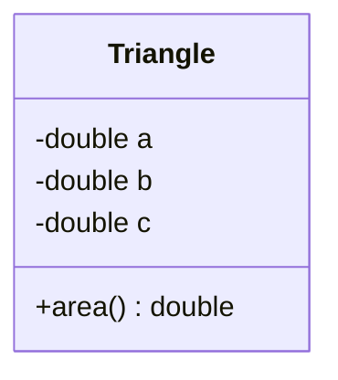
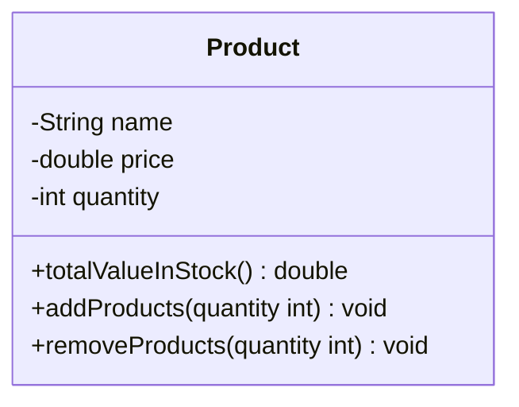
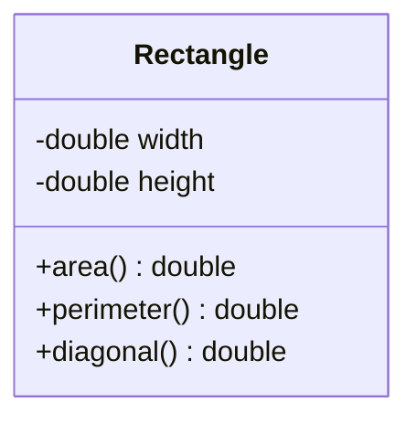
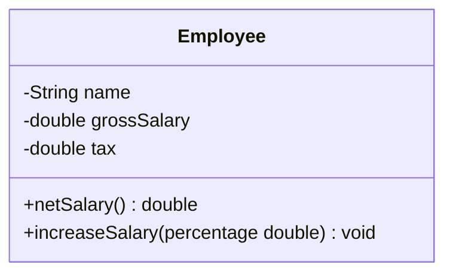
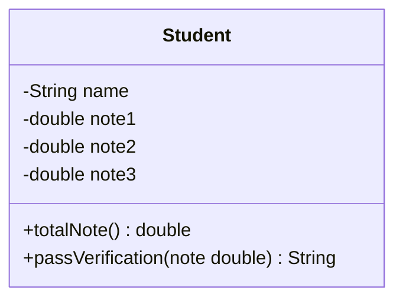
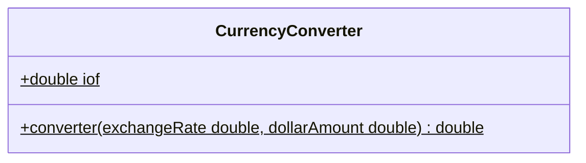

# ☕ Java — Anotações de Estudo

> Repositório de consulta pessoal com a teoria de Java organizada, explicada com analogias e acompanhada de exemplos de código. Serve como material de referência rápida para revisar conceitos sempre que necessário.

---

## 📑 Sumário

1. [Introdução sobre Programação](#1-introdução-sobre-programação)
   - [1.1 Algoritmo, Automação e Programa de Computador](#11-algoritmo-automação-e-programa-de-computador)
   - [1.2 O que é preciso para fazer um programa de computador](#12-o-que-é-preciso-para-fazer-um-programa-de-computador)
   - [1.3 Compilação, Interpretação e Máquina Virtual](#13-compilação-interpretação-e-máquina-virtual)
2. [Introdução à Linguagem Java](#2-introdução-à-linguagem-java)
   - [2.1 Versões do Java e LTS](#21-versões-do-java-e-lts)
   - [2.2 O que é o Java](#22-o-que-é-o-java)
   - [2.3 Edições do Java](#23-edições-do-java)
3. [Estrutura Sequencial](#3-estrutura-sequencial)
   - [3.1 Anatomia de um programa Java](#31-anatomia-de-um-programa-java)
   - [3.2 Variáveis e tipos primitivos](#32-variáveis-e-tipos-primitivos)
   - [3.3 Expressões aritméticas e operadores](#33-expressões-aritméticas-e-operadores)
   - [3.4 As três operações básicas: Entrada, Processamento e Saída](#34-as-três-operações-básicas-entrada-processamento-e-saída)
   - [3.5 Saída de dados (`System.out`)](#35-saída-de-dados-systemout)
   - [3.6 Processamento de dados e Casting](#36-processamento-de-dados-e-casting)
   - [3.7 Entrada de dados (`Scanner`)](#37-entrada-de-dados-scanner)
   - [3.8 Funções matemáticas (`Math`)](#38-funções-matemáticas-math)
4. [Estruturas Condicionais](#4-estruturas-condicionais)
   - [4.1 Expressões comparativas](#41-expressões-comparativas)
   - [4.2 Expressões lógicas](#42-expressões-lógicas)
   - [4.3 Estruturas condicionais (if / else / else if)](#43-estruturas-condicionais-if--else--else-if)
   - [4.4 Operadores de atribuição cumulativa](#44-operadores-de-atribuição-cumulativa)
   - [4.5 Estrutura switch-case](#45-estrutura-switch-case)
   - [4.6 Expressão condicional ternária](#46-expressão-condicional-ternária)
   - [4.7 Escopo e inicialização de variáveis](#47-escopo-e-inicialização-de-variáveis)
5. [Estruturas de Repetição](#5-estruturas-de-repetição)
   - [5.1 Estrutura de repetição `while`](#51-estrutura-de-repetição-while)
   - [5.2 Estrutura de repetição `for`](#52-estrutura-de-repetição-for)
   - [5.3 Estrutura de repetição `do-while`](#53-estrutura-de-repetição-do-while)
6. [Outros Tópicos Básicos em Java](#6-outros-tópicos-básicos-em-java)
   - [6.1 Funções interessantes para String](#61-funções-interessantes-para-string)
   - [6.2 Funções](#62-funções)
7. [Orientação a Objetos](#7-orientação-a-objetos)
   - [7.1 Motivação: o problema sem Orientação a Objetos](#71-motivação-o-problema-sem-orientação-a-objetos)
   - [7.2 O que é uma classe](#72-o-que-é-uma-classe)
   - [7.3 Pacotes: organizando classes em pastas](#73-pacotes-organizando-classes-em-pastas)
   - [7.4 Instanciando objetos](#74-instanciando-objetos)
   - [7.5 Como objetos vivem na memória: Stack e Heap](#75-como-objetos-vivem-na-memória-stack-e-heap)
   - [7.6 Criando métodos: reaproveitamento e delegação](#76-criando-métodos-reaproveitamento-e-delegação)
   - [7.7 Anatomia de um método](#77-anatomia-de-um-método)
   - [7.8 Representando classes em UML](#78-representando-classes-em-uml)
   - [7.9 Outro exemplo prático: a classe Product](#79-outro-exemplo-prático-a-classe-product)
   - [7.10 A superclasse Object e o método toString()](#710-a-superclasse-object-e-o-método-tostring)
   - [7.11 Membros estáticos](#711-membros-estáticos)
   - [7.12 Construtores](#712-construtores)
   - [7.13 A palavra-chave this](#713-a-palavra-chave-this)
   - [7.14 Sobrecarga](#714-sobrecarga)
   - [7.15 Encapsulamento](#715-encapsulamento)
10. [Exercícios Resolvidos](#10-exercícios-resolvidos)

---

## 1. Introdução sobre Programação

### 1.1 Algoritmo, Automação e Programa de Computador

**Algoritmo** é uma sequência finita de instruções, bem definidas e ordenadas, que resolve um problema. Não é exclusivo da computação — uma receita de bolo é um algoritmo: passos finitos, em ordem, que levam a um resultado.

**Automação** é o uso de máquina(s) para executar esse procedimento de forma automática ou semiautomática, sem depender integralmente da ação humana a cada passo.

**Programa de computador** é um algoritmo escrito de forma que o computador consiga executá-lo. O computador, por sua vez, é a máquina que automatiza a execução de algoritmos — mas **não qualquer algoritmo**, apenas os *algoritmos computacionais*, ou seja, aqueles resolvíveis por:
- Processamento de dados
- Cálculos

> 💡 **Analogia:** pense no algoritmo como a *receita* e no programa como a receita *traduzida para uma língua que o forno (computador) entende e consegue seguir sozinho*.

### 1.2 O que é preciso para fazer um programa de computador

Para transformar um algoritmo em um programa funcional, quatro peças entram em jogo:

| Peça | Função |
|---|---|
| **Linguagem de programação** | Conjunto de regras léxicas e sintáticas para escrever o código (o "idioma"). |
| **IDE** | Software para editar e testar o programa (o "ambiente de trabalho"). |
| **Compilador** | Software que transforma código-fonte em código objeto (o "tradutor"). |
| **Gerador de código / Máquina Virtual** | Software que efetivamente executa o programa (o "motor"). |

### 1.3 Compilação, Interpretação e Máquina Virtual

- **Código-fonte**: o código exatamente como o programador escreve, em uma linguagem de programação (ex.: `.java`).
- **Compilação**: o código-fonte inteiro é traduzido de uma vez para código de máquina (ou bytecode) *antes* da execução. É como traduzir um livro inteiro antes de entregá-lo ao leitor.
- **Interpretação**: o código é lido e executado linha a linha, em tempo real, por um interpretador. É como um intérprete simultâneo traduzindo uma fala ao vivo.
- **Abordagem híbrida**: combina as duas — o código-fonte é primeiro **compilado** para um formato intermediário (bytecode) e depois esse bytecode é **interpretado/executado** por uma máquina virtual. **É exatamente o modelo do Java** (veja a seção 2.2).

> 💡 **Analogia:** a abordagem híbrida é como traduzir um livro para um "idioma universal simplificado" (bytecode) uma única vez, e depois qualquer pessoa em qualquer país (qualquer sistema operacional com JVM instalada) consegue interpretar esse idioma universal sem precisar de uma nova tradução completa.

---

## 2. Introdução à Linguagem Java

### 2.1 Versões do Java e LTS

Java lança novas versões periodicamente, mas nem todas são recomendadas para projetos reais. As versões **LTS (Long Term Support)** são as que recebem suporte e atualizações de segurança por um longo período, e são **sempre a escolha correta** ao iniciar um projeto novo.

> Resumo de cada versão: [devsuperior/curso-java — 04-versoes-do-java.md](https://github.com/devsuperior/curso-java/blob/main/04-versoes-do-java.md)

Entre as versões LTS existem **versões intermediárias** (não-LTS), lançadas apenas para que a comunidade teste e valide novas funcionalidades. Assim que a próxima LTS é lançada, essas versões intermediárias deixam de receber suporte. Por isso, **nunca se deve basear um projeto em uma versão não-LTS**.

> 💡 **Analogia:** LTS é como a edição de um software "estável" que recebe correções por anos; as versões intermediárias são como *betas* — ótimas para experimentar, arriscadas para colocar em produção.

### 2.2 O que é o Java

O Java é, ao mesmo tempo:
- **Uma linguagem de programação**: um conjunto de regras sintáticas.
- **Uma plataforma de desenvolvimento e execução**: dá acesso a um ecossistema de bibliotecas e a um ambiente de execução próprio (a JVM).

**Aspectos notáveis:**
- O código-fonte (`.java`) é **compilado para bytecode** (`.class`) e executado pela **JVM (Java Virtual Machine)** — o modelo híbrido descrito na seção 1.3.
- É **portável**: o mesmo bytecode roda em qualquer sistema operacional que tenha uma JVM ("*Write Once, Run Anywhere*").
- É **seguro e robusto** (tipagem forte, gerenciamento automático de memória via Garbage Collector).
- Roda em diversos tipos de dispositivo — de servidores corporativos a dispositivos embarcados.
- Domina o mercado corporativo desde o fim do século 20, sendo hoje uma das linguagens mais usadas no mundo.

```
Código-fonte (.java) --[compilador javac]--> Bytecode (.class) --[JVM]--> Execução
```

### 2.3 Edições do Java

| Edição | Sigla | Indicada para |
|---|---|---|
| **Java Micro Edition** | Java ME | Dispositivos embarcados e móveis (IoT) |
| **Java Standard Edition** | Java SE | *Core* da linguagem — desktop e servidores. **É a base estudada neste repositório.** |
| **Java Enterprise Edition** | Java EE (hoje Jakarta EE) | Aplicações corporativas de grande porte |

---

## 3. Estrutura Sequencial

A **estrutura sequencial** é o tipo de algoritmo mais simples: as instruções são executadas *uma após a outra*, na ordem em que aparecem, sem desvios (sem decisões ou repetições — isso vem depois, com estruturas condicionais e de repetição).

### 3.1 Anatomia de um programa Java

```java
public class Main {
    public static void main(String[] args) {
        // Todo programa Java começa a ser executado aqui
        System.out.println("Olá, mundo!");
    }
}
```

- `public class Main`: toda lógica em Java mora dentro de uma **classe**. O nome do arquivo (`Main.java`) deve ser igual ao nome da classe pública.
- `public static void main(String[] args)`: é o **método principal** — o ponto de entrada que a JVM procura e executa primeiro.
- `System.out.println(...)`: instrução de saída, imprime uma linha no console.

### 3.2 Variáveis e tipos primitivos

Uma **variável** é uma porção de memória RAM usada para armazenar um dado durante a execução do programa.

> 💡 **Analogia:** uma variável é uma **caixa com etiqueta** (o nome) guardada em uma prateleira (a memória). O **tipo** da variável define o tamanho e o formato dessa caixa — uma caixa de `int` não guarda o mesmo tipo de conteúdo que uma caixa de `String`.

| Tipo | Armazena | Exemplo |
|---|---|---|
| `int` | Número inteiro | `int idade = 30;` |
| `double` | Número decimal (ponto flutuante, precisão dupla) | `double preco = 19.90;` |
| `float` | Número decimal (precisão simples) | `float peso = 72.5f;` |
| `char` | Um único caractere | `char genero = 'F';` |
| `boolean` | Verdadeiro ou falso | `boolean ativo = true;` |
| `String` | Cadeia de caracteres (texto) | `String nome = "Vinicius";` |
| `long` | Número inteiro (faixa maior que `int`) | `long populacao = 8000000000L;` |

```java
String nome = "Vinicius";
int idade = 31;
double renda = 4000.0;

System.out.println("Bom dia! - " + nome);
System.out.printf("%s tem %d anos e ganha R$ %.2f reais%n", nome, idade, renda);
```

> ⚠️ **Cuidado com o separador decimal:** por padrão, a JVM pode usar a vírgula (`,`) como separador decimal dependendo do `Locale` do sistema operacional. Para garantir o padrão internacional com ponto (`.`), define-se o `Locale` logo no início do `main`:
> ```java
> Locale.setDefault(Locale.US); // Mantém o separador decimal como ponto '.'
> ```

### 3.3 Expressões aritméticas e operadores

Uma **expressão aritmética** é uma combinação de números unidos por operadores matemáticos, resolvida seguindo uma ordem específica de prioridade (a mesma da matemática básica: parênteses → multiplicação/divisão → soma/subtração).

| Operador | Significado | Exemplo | Resultado |
|---|---|---|---|
| `+` | Adição | `5 + 2` | `7` |
| `-` | Subtração | `5 - 2` | `3` |
| `*` | Multiplicação | `5 * 2` | `10` |
| `/` | Divisão | `5 / 2` | `2` (divisão inteira!) |
| `%` | Módulo (resto da divisão) | `5 % 2` | `1` |

> ⚠️ **Divisão entre inteiros trunca o resultado.** `5 / 2` em Java resulta em `2`, não `2.5`, porque os dois operandos são `int`. Para obter o resultado decimal, é necessário *casting* (seção 3.6).

### 3.4 As três operações básicas: Entrada, Processamento e Saída

Todo programa sequencial pode ser resumido em três operações fundamentais:

```
ENTRADA  ──▶  PROCESSAMENTO  ──▶  SAÍDA
(ler dado)    (calcular/transformar)   (exibir resultado)
```

> 💡 **Analogia:** pense em uma **fábrica**: a *entrada* é a matéria-prima que chega, o *processamento* é a linha de produção que transforma essa matéria-prima, e a *saída* é o produto final que sai pela porta.

Essas três operações aparecem em praticamente todo exercício de lógica de programação — inclusive nos [exercícios resolvidos](#5-exercícios-resolvidos) deste repositório.

### 3.5 Saída de dados (`System.out`)

Java oferece três formas principais de exibir dados no console:

| Método | Comportamento |
|---|---|
| `System.out.print(x)` | Imprime sem quebrar linha ao final |
| `System.out.println(x)` | Imprime e quebra a linha ao final |
| `System.out.printf(formato, args...)` | Imprime com **formatação controlada** (como um "molde" para o texto) |

Principais especificadores de formatação usados com `printf`/`String.format`:

| Especificador | Uso | Exemplo |
|---|---|---|
| `%d` | Número inteiro | `printf("%d", 10)` → `10` |
| `%f` | Número decimal | `printf("%.2f", 3.14159)` → `3.14` |
| `%s` | Texto (String) | `printf("%s", "Vinicius")` → `Vinicius` |
| `%c` | Caractere | `printf("%c", 'A')` → `A` |
| `%n` | Quebra de linha (portável entre SOs) | — |

```java
String product1 = "Computer";
double price1 = 2100.0;
double measure = 53.234567;

System.out.printf("Produto: %s, preço: $ %.2f%n", product1, price1);
System.out.printf("Medida com 8 casas decimais: %.8f%n", measure);
System.out.printf("Medida arredondada (3 casas): %.3f%n", measure);
```

### 3.6 Processamento de dados e Casting

**Processar dados**, em sua forma mais simples, é o ato de **atribuir o resultado de uma expressão a uma variável**.

```java
int w, y;
w = 5;
y = 2 * w; // processamento: calcula e atribui
```

#### Casting

**Casting** é a **conversão explícita** de um tipo de dado para outro. É necessário sempre que o compilador não consegue "adivinhar" sozinho que o resultado de uma expressão deveria ser de um tipo diferente do esperado pelos operandos.

> 💡 **Analogia:** é como despejar o conteúdo de um copo pequeno (`int`) dentro de um copo maior (`double`) — fisicamente cabe, mas você precisa **avisar explicitamente** ao Java que está fazendo essa conversão, senão ele assume o tipo mais "estreito" dos operandos envolvidos.

```java
// ❌ Exemplo com erro de raciocínio:
int a, b;
double resultado;
a = 5;
b = 2;
resultado = a / b; // a divisão inteira acontece ANTES da atribuição!
System.out.println(resultado); // imprime 2.0, e não 2.5

// ✅ Exemplo corrigido com casting:
int a, b;
double resultado;
a = 5;
b = 2;
resultado = (double) a / b; // converte 'a' para double ANTES da divisão
System.out.println(resultado); // imprime 2.5
```

O ponto-chave: `(double) a / b` converte apenas `a` para `double` **antes** da divisão ser realizada — e como um dos operandos já é `double`, o Java promove a divisão inteira para uma divisão de ponto flutuante.

### 3.7 Entrada de dados (`Scanner`)

A classe `Scanner` (pacote `java.util`) é a forma padrão de ler dados digitados pelo usuário no console.

```java
Scanner sc = new Scanner(System.in);

int h = sc.nextInt();       // lê um número inteiro
double d = sc.nextDouble(); // lê um número decimal
char c = sc.next().charAt(0); // lê a primeira letra de uma palavra
String linha = sc.nextLine(); // lê uma linha inteira de texto

sc.close(); // libera o recurso ao final
```

| Método | Lê |
|---|---|
| `sc.nextInt()` | Um valor `int` |
| `sc.nextDouble()` | Um valor `double` |
| `sc.next().charAt(0)` | O primeiro caractere de uma palavra |
| `sc.nextLine()` | Uma linha inteira de texto |

> ⚠️ **A pegadinha clássica do buffer:** quando se usa `sc.nextInt()` (ou `nextDouble()`) e, na sequência, `sc.nextLine()`, o `nextLine()` "captura" apenas a quebra de linha (`\n`) que ficou pendente no buffer de entrada — pulando a leitura real de texto. Isso é conhecido como **"limpar o buffer de leitura"**.
>
> ```java
> int h = sc.nextInt();
> sc.nextLine(); // consome a quebra de linha deixada pelo Enter do nextInt()
> String descricao = sc.nextLine(); // agora lê a linha corretamente
> ```
> 💡 **Analogia:** é como apertar Enter duas vezes sem perceber — o primeiro Enter "sobra" na fila e é consumido silenciosamente pela próxima leitura, a não ser que você o descarte de propósito antes.

### 3.8 Funções matemáticas (`Math`)

A classe `Math` (pacote `java.lang`, não precisa de `import`) concentra as funções matemáticas prontas da linguagem.

| Método | Faz | Exemplo |
|---|---|---|
| `Math.sqrt(x)` | Raiz quadrada | `Math.sqrt(25.0)` → `5.0` |
| `Math.pow(x, y)` | `x` elevado a `y` | `Math.pow(2.0, 3.0)` → `8.0` |
| `Math.abs(x)` | Valor absoluto | `Math.abs(-5.0)` → `5.0` |

```java
double x = 3.0, y = 4.0, z = -5.0;

System.out.println("Raiz quadrada de " + x + " = " + Math.sqrt(x));
System.out.println(x + " elevado a " + y + " = " + Math.pow(x, y));
System.out.println("Valor absoluto de " + z + " = " + Math.abs(z));
```

---

## 4. Estruturas Condicionais

Estruturas condicionais permitem que o programa **desvie** o fluxo de execução com base em uma condição — deixando de lado a execução puramente sequencial da seção 3 para tomar decisões.

### 4.1 Expressões comparativas

Uma **expressão comparativa** é uma expressão que compara dois valores e produz um resultado **booleano** (`true` ou `false`), em vez de um número.

```java
5 > 10   // resultado: false
```

> 💡 **Analogia:** uma expressão comparativa é uma **pergunta de sim/não** feita ao programa — "esse valor é maior que aquele?" — e a resposta (`true`/`false`) é o que as estruturas condicionais (próximo tópico) usam para decidir qual caminho seguir.

| Operador | Significado |
|---|---|
| `>` | Maior que |
| `<` | Menor que |
| `>=` | Maior ou igual a |
| `<=` | Menor ou igual a |
| `==` | Igual a |
| `!=` | Diferente de |

```java
int a = 5;
int b = 10;

System.out.println(a > b);  // false
System.out.println(a < b);  // true
System.out.println(a == 5); // true
System.out.println(a != b); // true
```

> ⚠️ **Não confunda `==` com `=`.** O operador `=` **atribui** um valor a uma variável; o operador `==` **compara** dois valores. Trocar um pelo outro é um dos erros mais comuns de quem está começando.

### 4.2 Expressões lógicas

Assim como as expressões comparativas, uma **expressão lógica** também resulta em `true` ou `false` — mas, em vez de comparar dois valores diretamente, ela **combina o resultado de outras expressões** (geralmente comparativas) usando os operadores lógicos.

| Operador | Nome | Ideia |
|---|---|---|
| `&&` | E (AND) | **Todas** as comparações precisam ser verdadeiras |
| \|\| | OU (OR) | **Pelo menos uma** das comparações precisa ser verdadeira |
| `!` | Não (NOT) | **Inverte** o resultado da expressão |

> 💡 **Analogia:** pense em `&&` como uma dupla exigência — "preciso do CPF **e** do endereço para liberar o cadastro" (falta um, já não libera). `||` é uma exigência flexível — "aceito CPF **ou** RG" (qualquer um dos dois já resolve). E `!` é simplesmente virar a resposta ao contrário — se a resposta era "sim", `!` faz virar "não".

#### `&&` (E) — todas precisam ser verdadeiras

```java
int x = 5;

x <= 20 && x == 10   // false -> a segunda comparação (x == 10) é falsa, então tudo vira false
x > 0   && x != 3    // true  -> as duas comparações são verdadeiras
```

**Tabela-verdade do `&&`:**

| A | B | A `&&` B |
|---|---|---|
| F | F | F |
| F | V | F |
| V | F | F |
| V | V | V |

#### `||` (OU) — basta uma ser verdadeira

```java
int x = 5;

x == 10 || x <= 20   // true  -> a segunda comparação (x <= 20) já é verdadeira, então tudo vira true
x >= 10 || x != 5    // false -> as duas comparações são falsas
```

**Tabela-verdade do `||`:**

| A | B | A \|\| B |
|---|---|---|
| F | F | F |
| F | V | V |
| V | F | V |
| V | V | V |

#### `!` (NÃO) — inverte o resultado

```java
int x = 5;

!(x == 10)              // true  -> "x == 10" é false, o '!' inverte para true
!(x <= 20 && x == 10)   // true  -> "x <= 20 && x == 10" é false, o '!' inverte para true
```

> 💡 **Analogia:** `!(x == 10)` é como perguntar **"5 não é igual a 10, né?"** — e a resposta é **"sim, é verdade, 5 não é igual a 10"** (`true`). O `!` transforma a pergunta em sua negativa e avalia se essa negativa é verdadeira.

**Tabela-verdade do `!`:**

| A | `!`A |
|---|---|
| F | V |
| V | F |

### 4.3 Estruturas condicionais (if / else / else if)

Uma **estrutura condicional** é uma estrutura de controle que permite definir que um determinado bloco de comandos só será executado dependendo do resultado de uma condição (uma expressão comparativa e/ou lógica, como as vistas em [4.1](#41-expressões-comparativas) e [4.2](#42-expressões-lógicas)).

#### `if` simples

```java
if (condicao) {
    comando1;
    comando2;
}
```

Os comandos dentro das chaves só são executados caso `condicao` seja `true`. Caso contrário, o bloco inteiro é simplesmente ignorado e a execução segue em frente.

#### `if` / `else` — estrutura composta

```java
if (condicao) {
    comando1;
    comando2;
} else {
    comando3;
    comando4;
}
```

Aqui a lógica muda um pouco: se `condicao` for falsa, o bloco executado é exatamente o que está dentro do `else`. É como dizer **"se tal condição for verdadeira, execute X; caso contrário, execute Y"** — sempre um dos dois blocos roda, nunca os dois nem nenhum.

> 💡 **Analogia:** pense num guarda-chuva — "se estiver chovendo, eu levo o guarda-chuva; senão, eu deixo em casa". Não existe meio-termo: uma das duas ações sempre acontece.

#### E quando há mais de duas possibilidades?

Uma forma (pouco elegante) de resolver seria aninhar um `if`/`else` dentro do `else`:

```java
if (condicao) {
    comando1;
    comando2;
} else {
    if (condicao) {
        comando3;
    } else {
        comando4;
    }
}
```

Isso funciona, mas cada nova possibilidade cria mais um nível de aninhamento, o que deixa o código cada vez mais difícil de ler. Na prática, o dia a dia usa uma forma mais simples e organizada para o mesmo caso: o `else if`.

#### `if` / `else if` / `else`

```java
if (condicao) {
    comando1;
    comando2;
} else if (condicao) {
    comando3;
} else {
    comando4;
}
```

Continuamos lidando com mais de duas condições, só que agora de forma linear e mais legível — cada `else if` é testado em sequência, na ordem em que aparece, até que uma condição seja verdadeira (ou até cair no `else` final, se nenhuma for).

### 4.4 Operadores de atribuição cumulativa

Repare no trecho abaixo, que calcula o valor de uma conta cobrando R$ 2,00 por minuto excedente após os 100 minutos:

```java
Scanner sc = new Scanner(System.in);

System.out.println("Informe o numero de minutos:");
int minutes = sc.nextInt();

double accountValue = 50.0;

if (minutes > 100) {
    accountValue = accountValue + (minutes - 100) * 2;
    System.out.printf("O valor da sua conta fechou em: R$ %.2f%n", accountValue);
} else {
    System.out.printf("O valor da sua conta fechou em: R$ %.2f%n", accountValue);
}

sc.close();
```

No cálculo do novo valor da conta, foi preciso pegar a própria variável `accountValue` e somá-la ao resultado de uma operação:

```java
accountValue = accountValue + (minutes - 100) * 2;
```

Esse padrão — "pega a variável, aplica uma operação nela mesma, e guarda o resultado de volta nela" — é tão comum que Java oferece uma forma mais curta para escrevê-lo: o **operador de atribuição cumulativa**. Em vez de `accountValue = accountValue + ...`, basta escrever:

```java
accountValue += (minutes - 100) * 2; // "accountValue passa a valer ele mesmo + (minutes - 100) * 2"
```

> 💡 **Analogia:** é como dizer "acrescenta isso ao que eu já tinha", em vez de "pega o que eu já tinha, soma com isso, e guarda de novo no mesmo lugar" — o resultado é idêntico, só que mais direto.

Existe um operador cumulativo para cada operador aritmético:

| Forma cumulativa | Equivale a |
|---|---|
| `a += b` | `a = a + b` |
| `a -= b` | `a = a - b` |
| `a *= b` | `a = a * b` |
| `a /= b` | `a = a / b` |
| `a %= b` | `a = a % b` |

O mesmo programa, agora usando o operador cumulativo:

```java
Scanner sc = new Scanner(System.in);

System.out.println("Informe o numero de minutos:");
int minutes = sc.nextInt();

double accountValue = 50.0;

if (minutes > 100) {
    accountValue += (minutes - 100) * 2;
    System.out.printf("O valor da sua conta fechou em: R$ %.2f%n", accountValue);
} else {
    System.out.printf("O valor da sua conta fechou em: R$ %.2f%n", accountValue);
}

sc.close();
```

### 4.5 Estrutura switch-case

Quando existem várias opções de fluxo diferentes a serem tratadas com base no valor de **uma única variável**, encadear vários `if`/`else if` pode deixar o código repetitivo. Nesses casos, uma alternativa é a estrutura `switch-case`:

```java
switch (expressao) {
    case valor1:
        comando1;
        comando2;
        break;
    case valor2:
        comando3;
        comando4;
        break;
    default:
        comando5;
        comando6;
        break;
}
```

`expressao` é avaliada uma única vez, e o Java compara o resultado com cada `case`, executando o bloco correspondente ao valor que bater. Se nenhum `case` corresponder, o bloco `default` é executado (funciona como o `else` final de uma cadeia de `if`/`else if`).

> 💡 **Analogia:** pense num `switch` como um recepcionista com uma lista de senhas — ele olha a sua senha (`expressao`) e te encaminha direto para o guichê (`case`) correspondente, sem precisar perguntar "é a senha 1? não? é a 2? não?..." uma por uma como um `if`/`else if` faria.

> ⚠️ **Atenção ao `break`:** cada `case` deve terminar com `break`, senão a execução "cai" para o próximo `case` (comportamento chamado de *fall-through*) e continua executando os comandos seguintes, mesmo que o valor não bata.

**Exemplo — convertendo um número em dia da semana:**

```java
Scanner sc = new Scanner(System.in);
int x = sc.nextInt();
String dia;

switch (x) {
    case 1:
        dia = "domingo";
        break;
    case 2:
        dia = "segunda";
        break;
    case 3:
        dia = "terca";
        break;
    case 4:
        dia = "quarta";
        break;
    case 5:
        dia = "quinta";
        break;
    case 6:
        dia = "sexta";
        break;
    case 7:
        dia = "sabado";
        break;
    default:
        dia = "valor invalido";
        break;
}

System.out.println("Dia da semana: " + dia);
sc.close();
```

### 4.6 Expressão condicional ternária

É uma alternativa mais compacta ao `if`/`else` para os casos em que o único objetivo é **decidir o valor de uma variável** com base em uma condição.

**Sintaxe:**

```java
(condicao) ? valor_se_true : valor_se_false;
```

Se `condicao` for `true`, a expressão inteira "vira" `valor_se_true`; se for `false`, "vira" `valor_se_false`. É a mesma decisão de um `if`/`else`, só que expressa como um valor único, direto na linha.

> 💡 **Analogia:** pense nela como uma pergunta de sim/não seguida de duas respostas prontas, separadas por `:` — "está chovendo? leva o guarda-chuva : deixa em casa" — só que tudo isso "vira" o valor de uma variável de uma vez, sem precisar de blocos `{ }`.

**Exemplo — calculando desconto sem a ternária:**

```java
double preco = 34.5;
double desconto;

if (preco < 20.0) {
    desconto = preco * 0.1;
} else {
    desconto = preco * 0.05;
}
```

**O mesmo exemplo, agora com a condicional ternária:**

```java
double preco = 34.5;
double desconto = (preco < 20.0) ? preco * 0.1 : preco * 0.05;
```

O resultado é exatamente o mesmo, mas em uma única linha — ideal quando a única coisa que o `if`/`else` faz é atribuir um valor a uma variável.

### 4.7 Escopo e inicialização de variáveis

O **escopo** de uma variável é a região do programa onde ela é válida — ou seja, onde ela pode ser referenciada. Em Java, esse limite é sempre um bloco `{ }`: uma variável declarada dentro de um bloco só existe (e só pode ser usada) dentro dele; fora disso, ela simplesmente não é enxergada.

> 💡 **Analogia:** pense no escopo como o cômodo de uma casa — o que você guarda dentro do quarto só está acessível enquanto você está naquele quarto. Saindo dele (fechando a chave `}`), o que estava lá dentro deixa de existir para o resto da casa.

**Exemplo com erro de escopo:**

```java
double preco = 400.0;

if (preco < 200) {
    double desconto = preco * 0.05;
}

System.out.println(desconto); // ERRO de compilação: 'desconto' não existe aqui
```

Esse código não compila porque `desconto` foi declarada **dentro** do bloco do `if` — seu escopo termina na chave `}` que fecha o `if`. O `System.out.println`, estando fora desse bloco, simplesmente não tem acesso a ela.

**Correção — declarar (e inicializar) a variável antes do `if`:**

```java
double preco = 400.0;
double desconto = 0;

if (preco < 200) {
    desconto = preco * 0.05;
}

System.out.println(desconto);
```

Agora `desconto` é declarada num escopo mais amplo (fora do `if`), e o bloco do `if` apenas **atribui** um novo valor a ela — sem redeclará-la. Assim ela continua acessível no `System.out.println`, valendo `0` caso a condição do `if` seja falsa, ou o valor calculado caso seja verdadeira.

> ⚠️ **Por que inicializar com `0`?** o compilador não sabe, em tempo de compilação, se a condição do `if` vai ser verdadeira ou falsa em tempo de execução. Se `desconto` fosse apenas declarada (`double desconto;`, sem valor) e o `if` não fosse executado, a variável chegaria "vazia" até o `println` — e o Java não permite usar uma variável local que pode não ter sido inicializada. Dar um valor inicial (mesmo que `0`) garante que ela sempre tenha algo válido, independente do caminho que o programa seguir.

Esse mesmo princípio vale de forma geral: **uma variável não pode ser usada — nem mesmo impressa — antes de ser inicializada.** Referenciá-la em qualquer expressão sem antes atribuir um valor é erro de compilação em Java.

---

## 5. Estruturas de Repetição

### 5.1 Estrutura de repetição `while`

O `while` é uma estrutura de controle que **repete a execução de um bloco de código enquanto uma condição for verdadeira**. Assim que a condição avaliar `false`, o laço para e a execução segue para o que vem depois do bloco.

**Sintaxe:**

```java
while (condicao) {
    comando1;
    comando2;
}
```

A regra é simples: se `condicao` for `true`, executa o bloco e volta a testar a condição de novo; se for `false`, pula o bloco inteiro e segue em frente.

O uso mais comum do `while` é justamente quando **não se sabe de antemão quantas repetições serão necessárias** — diferente de, por exemplo, percorrer um intervalo fixo de números.

> 💡 **Analogia:** pense no `while` como alguém servindo café enquanto a xícara não estiver cheia — ninguém sabe de antemão quantos "goles" de café serão necessários; a única regra é continuar servindo enquanto a condição ("xícara não está cheia") for verdadeira.

**Exemplo — somando números até o usuário digitar 0:**

O cenário: o programa deve receber números inteiros do usuário até que o valor digitado seja `0`. Quando isso acontecer, deve exibir a soma de todos os números diferentes de zero informados. Como não se sabe quantos números o usuário vai digitar, esse é exatamente o tipo de caso que pede um `while`:

```java
import java.util.Locale;
import java.util.Scanner;

public class Main {
    public static void main(String[] args) {
        Locale.setDefault(Locale.US);
        Scanner sc = new Scanner(System.in);

        int x = sc.nextInt();
        int soma = 0;

        while (x != 0) {
            soma += x;
            x = sc.nextInt();
        }

        System.out.println("A soma dos valores informados é: " + soma);

        sc.close();
    }
}
```

A cada volta do laço, o valor lido é somado a `soma`, e um novo número é lido em seguida. Quando o usuário finalmente digitar `0`, a condição `x != 0` se torna `false` e o `while` é encerrado.

### 5.2 Estrutura de repetição `for`

O `for` é uma estrutura de controle que repete um bloco de comandos para um determinado intervalo de valores. Ao contrário do [`while`](#51-estrutura-de-repetição-while), ele é a escolha natural **quando já se sabe de antemão a quantidade de repetições** (ou o intervalo de valores a percorrer).

**Sintaxe:**

```java
for (inicio; condicao; incremento) {
    comando1;
    comando2;
}
```

O `for` é dividido em três partes, separadas por `;`:

- **`inicio`** — executado **uma única vez**, logo no começo, geralmente criando a variável de controle do laço (a mesma usada na condição e no incremento).
- **`condicao`** — testada a cada volta, igual ao `while`: se `true`, o bloco executa e o laço continua; se `false`, o `for` é encerrado.
- **`incremento`** — executado **ao final de cada volta**, depois do bloco rodar, e é o responsável por "andar" em direção à condição de parada.

> 💡 **Analogia:** pense no `for` como configurar um contador regressivo de forno — você define o ponto de partida (`inicio`), até onde ele deve contar (`condicao`), e de quanto em quanto ele avança a cada segundo (`incremento`). Tudo isso já fica combinado de uma vez, na própria "cabeça" do loop.

**Exemplo — somando N números lidos do usuário:**

O cenário: ler um valor inteiro `N` e, em seguida, ler `N` números inteiros, exibindo ao final a soma de todos eles. Como a quantidade de repetições (`N`) é conhecida antes do laço começar, esse é um caso perfeito para o `for`:

```java
import java.util.Locale;
import java.util.Scanner;

public class Main {
    public static void main(String[] args) {
        Locale.setDefault(Locale.US);
        Scanner sc = new Scanner(System.in);

        int n = sc.nextInt();
        int soma = 0;

        for (int i = 0; i < n; i++) {
            int x = sc.nextInt();
            soma += x;
        }

        System.out.println("A soma dos numeros é: " + soma);

        sc.close();
    }
}
```

Aqui, `int i = 0` é o `inicio` (criado só na primeira vez), `i < n` é a `condicao` (testada a cada volta) e `i++` é o `incremento` (executado ao final de cada volta, somando 1 a `i`). Esse `i++` também poderia ser escrito como `i += 1` — o efeito é o mesmo.

**Contando para cima:**

```java
for (int i = 5; i <= 10; i++) {
    System.out.println("I vale: " + i);
}
```

**Contando para baixo (decrementando):**

Basta inverter a lógica: começar de um valor maior, testar até um valor menor, e decrementar em vez de incrementar (`i--`, equivalente a `i -= 1`):

```java
for (int i = 5; i >= 0; i--) {
    System.out.println("I vale: " + i);
}
```

### 5.3 Estrutura de repetição `do-while`

É uma variação menos usada que o [`while`](#51-estrutura-de-repetição-while) e o [`for`](#52-estrutura-de-repetição-for), mas que se encaixa melhor em alguns cenários específicos.

A diferença está em **quando** a condição é verificada: no `while` e no `for`, a condição é testada **antes** de cada execução do bloco — se ela já começar `false`, o bloco pode nunca rodar. No `do-while`, a condição só é verificada **ao final** do loop, o que garante que o bloco **sempre executa pelo menos uma vez**, independente do resultado da condição.

**Sintaxe:**

```java
do {
    comando1;
    comando2;
} while (condicao);
```

> 💡 **Analogia:** pense no `do-while` como provar um prato antes de decidir se repete — você primeiro come (executa o bloco), e só depois pergunta "quero mais?" (testa a condição). No `while`/`for` é o contrário: primeiro se pergunta "tem mais no prato?" para então decidir se come.

**Exemplo — conversor de Celsius para Fahrenheit com repetição controlada pelo usuário:**

```java
import java.util.Locale;
import java.util.Scanner;

public class Main {
    public static void main(String[] args) {
        Locale.setDefault(Locale.US);
        Scanner sc = new Scanner(System.in);

        char resp;

        do {
            System.out.print("Digite a temperatura em Celsius: ");
            double c = sc.nextDouble();
            double f = 9 * c / 5 + 32;
            System.out.printf("Equivalente em Fahrenheit: %.1f%n", f);
            System.out.print("Deseja repetir (s/n)? ");
            resp = sc.next().charAt(0);
        } while (resp != 'n');

        sc.close();
    }
}
```

Tudo dentro do `do { ... }` é executado pelo menos uma vez — o programa sempre pede ao menos uma temperatura antes mesmo de perguntar se o usuário quer repetir. O loop só volta a executar caso a condição do `while` final (`resp != 'n'`) seja `true`; assim que o usuário digitar `n`, a condição vira `false` e o laço termina.

---

## 6. Outros Tópicos Básicos em Java

### 6.1 Funções interessantes para String

`String` é uma classe do Java (não um tipo primitivo) e, como tal, oferece vários **métodos prontos** para manipular texto sem precisar reimplementar essas operações na mão. Algumas das mais úteis no dia a dia:

| Categoria | Método | O que faz |
|---|---|---|
| Formatar | `toLowerCase()` | Converte todos os caracteres para minúsculo |
| Formatar | `toUpperCase()` | Converte todos os caracteres para maiúsculo |
| Formatar | `trim()` | Remove espaços em branco do início e do fim da string |
| Recortar | `substring(inicio)` | Retorna a substring a partir da posição `inicio` até o fim |
| Recortar | `substring(inicio, fim)` | Retorna a substring entre as posições `inicio` (incluso) e `fim` (exclusivo) |
| Substituir | `replace(char, char)` | Troca todas as ocorrências de um caractere por outro |
| Substituir | `replace(String, String)` | Troca todas as ocorrências de uma substring por outra |
| Buscar | `indexOf(String)` | Retorna a posição da **primeira** ocorrência de uma substring (ou `-1` se não encontrar) |
| Buscar | `lastIndexOf(String)` | Retorna a posição da **última** ocorrência de uma substring (ou `-1` se não encontrar) |
| Dividir | `split(String)` | Quebra a string em pedaços, usando o argumento como separador |

> 💡 **Analogia:** pense numa `String` como uma fita de texto: `substring` recorta um pedaço da fita, `replace` troca trechos por outros, `indexOf`/`lastIndexOf` procuram em que ponto da fita algo aparece, e `split` corta a fita inteira em vários pedaços menores, um para cada palavra.

**Exemplo — testando cada método:**

```java
String original = "abcde FGHIJ ABC abc DEFG ";

String s01 = original.toLowerCase();
String s02 = original.toUpperCase();
String s03 = original.trim();
String s04 = original.substring(2);
String s05 = original.substring(2, 9);
String s06 = original.replace('a', 'x');
String s07 = original.replace("abc", "xy");
int i = original.indexOf("bc");
int j = original.lastIndexOf("bc");

System.out.println("Original: -" + original + "-");
System.out.println("toLowerCase: -" + s01 + "-");
System.out.println("toUpperCase: -" + s02 + "-");
System.out.println("trim: -" + s03 + "-");
System.out.println("substring(2): -" + s04 + "-");
System.out.println("substring(2, 9): -" + s05 + "-");
System.out.println("replace('a', 'x'): -" + s06 + "-");
System.out.println("replace(\"abc\", \"xy\"): -" + s07 + "-");
System.out.println("Index of 'bc': " + i);
System.out.println("Last index of 'bc': " + j);
```

> ⚠️ **Strings são imutáveis:** nenhum desses métodos altera `original` — todos retornam uma **nova** string com o resultado. É por isso que cada exemplo guarda o retorno numa variável nova (`s01`, `s02`, ...) em vez de reatribuir `original`.

**A operação `split`:**

```java
String s = "potato apple lemon";
String[] vect = s.split(" ");

String word1 = vect[0];
String word2 = vect[1];
String word3 = vect[2];
```

Quando a declaração é `String[]` (com colchetes), o resultado é um **vetor** (array) — um conjunto de valores indexados, ainda não estudado em detalhe até aqui. No caso do `split`, o vetor resultante é a frase original dividida em partes, uma palavra por posição: `vect[0]` é `"potato"`, `vect[1]` é `"apple"`, e assim por diante.

---

### 6.2 Funções

Uma **função** representa um processamento que tem um significado próprio — um pedaço de lógica com nome, que pode ser chamado sempre que aquele processamento for necessário. Exemplos de funções que já vínhamos usando sem chamar assim: `Math.sqrt(double)` e `System.out.println(string)`.

**Principais vantagens de usar funções:**

- **Modularização** — divide um programa grande em pedaços menores e mais fáceis de entender.
- **Delegação** — quem chama a função não precisa saber *como* ela resolve o problema, só *o que* ela faz.
- **Reaproveitamento** — a mesma lógica pode ser chamada várias vezes, em vários pontos do programa, sem duplicar código.

**Entrada e saída de dados:**

- Uma função pode **receber dados de entrada**, chamados de **parâmetros** (na definição da função) ou **argumentos** (quando ela é chamada com valores concretos).
- Uma função pode **ou não retornar uma saída** — algumas apenas executam uma ação (como `showResult`, abaixo) e outras devolvem um valor para quem as chamou (como `max`, abaixo).

> 💡 **Nota:** em orientação a objetos, funções definidas dentro de uma classe recebem o nome de **métodos** — é o mesmo conceito, apenas um nome mais específico para o contexto.

**Exemplo — encontrando o maior entre três números:**

```java
import java.util.Scanner;

public class Main {
    public static void main(String[] args) {
        Scanner sc = new Scanner(System.in);
        System.out.println("Enter three numbers:");

        int a = sc.nextInt();
        int b = sc.nextInt();
        int c = sc.nextInt();

        int higher = max(a, b, c);
        showResult(higher);

        sc.close();
    }

    public static int max(int x, int y, int z) {
        int aux;
        if (x > y && x > z) {
            aux = x;
        } else if (y > z) {
            aux = y;
        } else {
            aux = z;
        }
        return aux;
    }

    public static void showResult(int value) {
        System.out.println("Higher = " + value);
    }
}
```

```
Enter three numbers:
5
8
3
Higher = 8
```

Aqui, `max` é uma função que **recebe três parâmetros** (`x`, `y`, `z`) e **retorna** (`return`) o maior deles como `int`. Já `showResult` **recebe um parâmetro** (`value`) mas **não retorna nada** (`void`) — sua única função é imprimir o resultado na tela. Repare também no reaproveitamento: toda a lógica de "achar o maior" fica isolada em `max`, podendo ser chamada de qualquer lugar do programa sem reescrever o `if`/`else if`/`else`.

> 💬 Os modificadores `public` e `static` que aparecem antes de cada função ainda serão vistos em mais detalhe adiante no curso.

---

## 7. Orientação a Objetos

> 🧭 **Mapa mental desta seção:** este módulo introduz várias peças que só fazem sentido juntas. A ordem abaixo foi pensada para encaixá-las progressivamente: primeiro sentimos a **dor** de programar sem classes (7.1), depois vemos **o que é** uma classe (7.2), como ela é **organizada em pastas** dentro do projeto (7.3), como ela **ganha vida** como objeto (7.4) e, por fim, **onde** esse objeto realmente mora na memória do computador (7.5). Sempre que uma peça parecer solta, volte a este mapa.

### 7.1 Motivação: o problema sem Orientação a Objetos

**Problema:** ler as medidas dos lados de dois triângulos, X e Y, e mostrar qual dos dois tem a maior área. A área de um triângulo a partir dos lados `a`, `b`, `c` é dada pela **fórmula de Heron**:

```
p = (a + b + c) / 2
area = raiz_quadrada( p * (p-a) * (p-b) * (p-c) )
```

Sem usar classes, cada triângulo precisa de **três variáveis soltas** — uma para cada lado — e como temos dois triângulos, isso vira seis variáveis independentes disputando espaço no mesmo método:

```java
package application;

import java.util.Locale;
import java.util.Scanner;

public class Program {
    public static void main(String[] args) {
        Locale.setDefault(Locale.US);
        Scanner sc = new Scanner(System.in);

        double xA, xB, xC, yA, yB, yC;

        System.out.println("Enter the measures of triangle X: ");
        xA = sc.nextDouble();
        xB = sc.nextDouble();
        xC = sc.nextDouble();

        System.out.println("Enter the measures of triangle Y: ");
        yA = sc.nextDouble();
        yB = sc.nextDouble();
        yC = sc.nextDouble();

        double p = (xA + xB + xC) / 2.0;
        double areaX = Math.sqrt(p * (p - xA) * (p - xB) * (p - xC));

        p = (yA + yB + yC) / 2.0;
        double areaY = Math.sqrt(p * (p - yA) * (p - yB) * (p - yC));

        System.out.printf("Triangle X area: %.4f%n", areaX);
        System.out.printf("Triangle Y area: %.4f%n", areaY);

        if (areaX > areaY) {
            System.out.println("Larger area: X");
        } else {
            System.out.println("Larger area: Y");
        }

        sc.close();
    }
}
```

O código funciona, mas o problema não é rodar — é **escalar**. `xA`, `xB`, `xC` não têm, aos olhos do Java, nenhuma relação entre si: são três variáveis avulsas que *nós* sabemos que representam "o triângulo X", mas o código não expressa isso em lugar nenhum. Se amanhã precisássemos de um terceiro triângulo, ou de um perímetro, ou de mandar "um triângulo" inteiro para outro método, teríamos que arrastar três variáveis por vez, sempre na mão.

> 💡 **Analogia:** é como guardar os documentos de uma pessoa (RG, CPF, comprovante de endereço) soltos em três gavetas diferentes da casa, em vez de dentro de uma única pasta com o nome da pessoa. Funciona para uma pessoa, mas vira bagunça rapidinho conforme mais pessoas (ou mais triângulos) entram na história.

A saída para isso é **agrupar** os dados que pertencem ao mesmo conceito — os três lados de *um* triângulo — dentro de uma única estrutura. É exatamente para isso que serve uma **classe**.

### 7.2 O que é uma classe

Uma **classe** é um tipo estruturado que agrupa dois tipos de membros:

| Membro | Também chamado de | O que representa |
|---|---|---|
| **Atributo** | dado / campo / característica | o que o objeto **é** ou **tem** |
| **Método** | função / operação / ação | o que o objeto **faz** |

> 💡 **Analogia:** pense numa classe como uma **planta baixa** (blueprint) — a planta de uma casa não é uma casa, é o *molde* que descreve quantos quartos, portas e janelas uma casa vai ter. Cada casa construída a partir dessa planta é um objeto: elas seguem a mesma estrutura, mas cada uma existe fisicamente por conta própria, com seus próprios móveis (valores) dentro.

**Sintaxe básica — classe com atributos:**

```java
public class <nome_da_classe> {
    public <tipo> <nome_atributo>;
    public <tipo> <nome_atributo>;
    public <tipo> <nome_atributo>;
}
```

Aplicando ao nosso problema, o triângulo vira uma classe com três atributos (os três lados):

```java
public class Triangle {
    public double a;
    public double b;
    public double c;
}
```

Com isso, em vez de seis variáveis soltas para dois triângulos, passamos a ter **duas variáveis do tipo `Triangle`** — cada uma carregando seus próprios `a`, `b` e `c` agrupados.

Além de atributos e métodos, uma classe pode oferecer outros recursos que ainda serão vistos mais à frente no curso — só para não estranhar quando aparecerem: **construtores**, **sobrecarga**, **encapsulamento**, **herança** e **polimorfismo**.

Na prática, classes costumam se encaixar em algumas categorias comuns, que ajudam a entender a intenção de uma classe só pelo nome:

| Categoria | Exemplos |
|---|---|
| Entidades | `Product`, `Client`, `Triangle` |
| Serviços | `ProductService`, `ClientService`, `EmailService`, `StorageService` |
| Controladores | `ProductController`, `ClientController` |
| Utilitários | `Calculadora`, `Compactador` |
| Outros | *views*, repositórios, gerenciadores, etc. |

### 7.3 Pacotes: organizando classes em pastas

Conforme um projeto cresce, faz sentido agrupar classes relacionadas dentro de **pacotes** — que, na prática, são pastas dentro de `src/main/java`. A regra de ouro: **o nome do pacote declarado no código precisa bater exatamente com o caminho da pasta onde o arquivo está.**

> 💡 **Analogia:** se uma classe é um documento, um pacote é a gaveta do arquivo onde documentos do mesmo assunto ficam guardados juntos — uma gaveta para "entidades", outra para "aplicação", evitando que tudo fique solto misturado numa pasta só.

No nosso problema, usamos dois pacotes:

```
src/main/java/
├── entities/
│   └── Triangle.java     → package entities;
└── application/
    └── Program.java      → package application;
```

- **`entities`** guarda a entidade principal do problema, o `Triangle`:

  ```java
  package entities;

  public class Triangle {
      public double a;
      public double b;
      public double c;
  }
  ```

- **`application`** guarda o `Program`, que é onde o programa de fato roda (o `main`). Para o `Program` conseguir usar a classe `Triangle` — que mora em outro pacote —, é preciso **importá-la**:

  ```java
  import entities.Triangle;
  ```

Só depois desse `import` é que o `Program` passa a enxergar e conseguir usar `Triangle` no seu código.

### 7.4 Instanciando objetos

Agora vem um ponto que costuma confundir quem está começando: **declarar uma variável do tipo `Triangle` não é suficiente** para acessar os atributos dela.

```java
Triangle x, y;
```

Essa linha apenas diz "existem duas variáveis chamadas `x` e `y`, e ambas são do tipo `Triangle`" — mas nenhum triângulo de verdade foi criado ainda. Se você tentasse usar `x.a` agora, o programa não teria a quem se referir.

O que falta é **instanciar** — criar de fato um objeto do tipo `Triangle` usando a palavra-chave `new`:

```java
x = new Triangle();
y = new Triangle();
```

Só a partir do `new Triangle()` é que `x` (e depois `y`) passam a apontar para um objeto de verdade, com `a`, `b` e `c` de fato existindo e prontos para receber valores.

> 💡 **Analogia:** declarar `Triangle x;` é como reservar uma etiqueta de nome vazia numa festa — o nome existe, mas ninguém foi cadastrado ainda. O `new Triangle()` é o exato momento em que uma pessoa real chega e é registrada sob aquela etiqueta. Antes disso, a etiqueta não representa ninguém.

**A resolução completa do problema, agora usando a classe `Triangle`:**

```java
package application;

import java.util.Scanner;
import java.util.Locale;

import entities.Triangle;

public class Program {

    public static void main(String[] args) {
        Locale.setDefault(Locale.US);
        Scanner sc = new Scanner(System.in);

        Triangle x, y;
        x = new Triangle();
        y = new Triangle();

        IO.println("Enter the measures of triangle X:");
        x.a = sc.nextDouble();
        x.b = sc.nextDouble();
        x.c = sc.nextDouble();

        IO.println("Enter the measures of triangle Y:");
        y.a = sc.nextDouble();
        y.b = sc.nextDouble();
        y.c = sc.nextDouble();

        double p = (x.a + x.b + x.c) / 2;
        double areaX = Math.sqrt(p * (p - x.a) * (p - x.b) * (p - x.c));

        p = (y.a + y.b + y.c) / 2;
        double areaY = Math.sqrt(p * (p - y.a) * (p - y.b) * (p - y.c));

        System.out.printf("Triangle X area: %.4f%n", areaX);
        System.out.printf("Triangle Y area: %.4f%n", areaY);

        if (areaX > areaY) {
            System.out.println("Larger area: X");
        } else {
            System.out.println("Larger area: Y");
        }
    }
}
```

Repare que `Program` continua com apenas **duas** variáveis (`x` e `y`), mas cada uma carrega três atributos dentro de si — o ganho de organização em relação à versão da seção 7.1 já fica evidente aqui: acessar `x.a`, `x.b`, `x.c` deixa claro, só de olhar o código, que esses três valores pertencem ao mesmo triângulo.

> 💬 O `IO.println(...)` que aparece acima é um recurso mais recente do Java (a mesma classe `IO` do Java 25 que já apareceu antes no projeto) — funciona exatamente como `System.out.println(...)`, só que mais enxuto.

### 7.5 Como objetos vivem na memória: Stack e Heap

Essa é a peça que costuma fechar o mapa mental: **onde**, exatamente, o objeto criado com `new` fica guardado?

Quando o Java executa `Triangle x, y;`, ele reserva dois espacinhos numa área de memória chamada **Stack** — a mesma área usada para guardar variáveis locais de um método enquanto ele está em execução. Até aqui, nada muda em relação a uma variável comum, como um `int` ou `double`.

A diferença aparece quando instanciamos: `x = new Triangle()` cria o objeto de verdade em uma área de memória **diferente**, chamada **Heap** — uma região reservada especificamente para objetos criados dinamicamente durante a execução do programa (por isso "alocação dinâmica de memória": isso só acontece em tempo de execução, e não é algo que o compilador já sabe de antemão).

> ⚠️ Vale registrar aqui um pequeno ajuste de terminologia: fica fácil confundir "**Stack**" com "**Static**" de ouvido — mas são conceitos diferentes. **Stack** é a memória de variáveis locais e chamadas de método (o que vale aqui); memória "estática" é outra área, reservada para atributos/variáveis marcados com a palavra-chave `static`, um assunto que ainda vamos ver mais à frente.

O ponto mais importante de todos: **a variável `x`, na Stack, não guarda os três atributos do triângulo dentro dela.** Ela guarda apenas uma **referência** — um "endereço" que aponta para onde, lá no Heap, o objeto de verdade (com `a`, `b` e `c`) está armazenado.

```
Stack                              Heap
┌─────────────┐                    ┌──────────────────────┐
│ x  ●────────┼───────────────────▶│ Triangle              │
├─────────────┤                    │ a = 3.0               │
│ y  ●────────┼──────────┐         │ b = 4.0                │
└─────────────┘          │         │ c = 5.0                │
                          │         └──────────────────────┘
                          │
                          │         ┌──────────────────────┐
                          └────────▶│ Triangle              │
                                    │ a = 6.0               │
                                    │ b = 6.0                │
                                    │ c = 6.0                │
                                    └──────────────────────┘
```

> 💡 **Analogia:** pense na Stack como um chaveiro e no Heap como um depósito de armários. A variável `x` não é o armário em si — ela é a **chave** pendurada no seu chaveiro, que aponta para um armário específico lá no depósito. Quando você escreve `x.a`, o Java usa essa chave para ir até o armário certo no depósito e pegar o valor guardado dentro dele. Duas chaves diferentes (`x` e `y`) podem, inclusive, abrir armários completamente distintos — cada instância (`new Triangle()`) cria um armário novo no Heap.

Essa distinção entre "onde está a referência" (Stack) e "onde está o objeto de verdade" (Heap) é a base para entender, mais adiante, por que copiar uma variável de objeto não copia o objeto em si — mas isso é assunto para uma próxima aula.

---

### 7.6 Criando métodos: reaproveitamento e delegação

Relembrando a seção [7.2](#72-o-que-é-uma-classe): uma classe é composta por **atributos** e **métodos**. Até agora, a classe `Triangle` só tinha atributos (`a`, `b`, `c`) — todo o cálculo de área continuava sendo feito "de fora", dentro do `Program`. Isso gera dois problemas, ambos resolvidos ao criar um **método** dentro da própria classe `Triangle`:

- **Delegação de responsabilidade:** calcular a área é uma responsabilidade do próprio triângulo, não do programa principal. O `Program` não deveria precisar saber *como* uma área é calculada — só deveria poder *pedir* essa área a quem sabe calculá-la.
- **Repetição de código:** além de estar no lugar errado, o cálculo da fórmula de Heron estava duplicado — uma vez para `x`, outra para `y`. Com dois triângulos isso ainda é tolerável, mas imagine precisar da área de dezenas de triângulos: copiar e colar a mesma fórmula repetidamente não é escalável.

> 💡 **Analogia:** pense num restaurante. O cliente (`Program`) não entra na cozinha para preparar o próprio prato — ele **delega** essa responsabilidade ao chef (`Triangle`), que é quem sabe a receita. O cliente só pede "me dá a área desse triângulo" e recebe o resultado pronto, sem precisar conhecer a fórmula por trás.

**Solução — adicionando o método `area()` à classe `Triangle`:**

```java
package entities;

public class Triangle {
    public double a;
    public double b;
    public double c;

    public double area() {
        double p = (a + b + c) / 2;
        return Math.sqrt(p * (p - a) * (p - b) * (p - c));
    }
}
```

**O `Program` agora só precisa pedir a área a cada objeto:**

```java
package application;

import java.util.Scanner;
import java.util.Locale;

import entities.Triangle;

public class Program {

    public static void main(String[] args) {
        Locale.setDefault(Locale.US);
        Scanner sc = new Scanner(System.in);

        Triangle x, y;
        x = new Triangle();
        y = new Triangle();

        IO.println("Enter the measures of triangle X:");
        x.a = sc.nextDouble();
        x.b = sc.nextDouble();
        x.c = sc.nextDouble();

        IO.println("Enter the measures of triangle Y:");
        y.a = sc.nextDouble();
        y.b = sc.nextDouble();
        y.c = sc.nextDouble();

        double areaX = x.area();
        double areaY = y.area();

        System.out.printf("Triangle X area: %.4f%n", areaX);
        System.out.printf("Triangle Y area: %.4f%n", areaY);

        if (areaX > areaY) {
            System.out.println("Larger area: X");
        } else {
            System.out.println("Larger area: Y");
        }
    }
}
```

**Discussão — quais os benefícios de calcular a área através de um método da classe `Triangle`?**

1. **Reaproveitamento de código:** o código repetido (calcular a área de X e de Y) desaparece do programa principal — a fórmula existe em um único lugar, dentro do próprio `Triangle`.
2. **Delegação de responsabilidades:** quem sabe calcular a área de um triângulo é o próprio triângulo. A lógica do cálculo não deveria estar em nenhum outro lugar.

> 🎯 Vale grifar esse segundo ponto: **delegação de responsabilidade** é um dos princípios mais cobrados na hora de escrever código limpo e escalável — cada classe deve cuidar daquilo que é de sua própria responsabilidade, e nada além disso. É uma mentalidade que vale a pena carregar para todo o resto do curso.

### 7.7 Anatomia de um método

Voltando ao código de `Triangle`, dá pra abrir cada peça da classe e do método `area()` em detalhe:

```java
package entities;                                    // pacote da classe

public class Triangle {                              // nome da classe
    public double a;                                  // atributos da classe
    public double b;                                  // (o "public" indica que o atributo
    public double c;                                  //  pode ser usado em outros arquivos)

    public double area() {                            // ver quebra abaixo
        double p = (a + b + c) / 2.0;                 // corpo do método
        return Math.sqrt(p * (p - a) * (p - b) * (p - c));  // corpo do método
    }
}
```

A assinatura `public double area() { ... }` sozinha já concentra várias informações — a mesma estrutura de método vista lá em [6.2 (Funções)](#62-funções), agora dentro de uma classe:

| Peça | Neste método | O que significa |
|---|---|---|
| `public` | `public` | Modificador de acesso — permite que o método seja chamado a partir de outros arquivos/classes |
| `double` | `double` | Tipo do dado que o método **retorna** (se o método não retornasse nada, seria `void`) |
| `area` | `area` | Nome do método |
| `()` | `()` (vazio) | Lista de parâmetros do método — aqui está vazia porque `area()` não recebe nenhum dado de fora; ele já tem tudo que precisa (`a`, `b`, `c`) nos próprios atributos da classe |
| `{ ... }` | corpo do método | O bloco de código que efetivamente executa quando o método é chamado |

> 💡 Note a diferença para `max(int x, int y, int z)`, visto em [6.2](#62-funções): aquele método *precisava* de parâmetros porque não pertencia a nenhuma classe com esses dados já guardados. Já `area()` não precisa de parâmetros porque **já está dentro do objeto** cujos atributos ele usa — outro reflexo direto da delegação de responsabilidade vista em [7.6](#76-criando-métodos-reaproveitamento-e-delegação).

### 7.8 Representando classes em UML

**UML** (*Unified Modeling Language*) é uma linguagem visual usada para representar a estrutura de um sistema — uma forma de desenhar/planejar classes num diagrama, antes ou junto da escrita do código propriamente dito. Ainda não é o foco do curso agora, mas vale já ir se acostumando com a notação, porque ela aparece com frequência em documentação e discussões de projeto.

Um diagrama de classe em UML é representado como uma caixa dividida em três compartimentos:

```
┌─────────────────────────┐
│      Nome da Classe      │
├─────────────────────────┤
│      Atributos            │
├─────────────────────────┤
│      Métodos              │
└─────────────────────────┘
```

Para os atributos e métodos, a UML usa símbolos no lugar de palavras como `public`/`private` para indicar visibilidade:

| Símbolo | Equivalente em Java | Significado |
|---|---|---|
| `-` | `private` | Privado — só acessível de dentro da própria classe |
| `+` | `public` | Público — acessível de qualquer lugar |
| `#` | `protected` | Protegido — assunto para quando virmos herança |

- Um **atributo** é escrito como `- nome : tipo` — por exemplo, `- a : double`.
- Um **método** é escrito como `+ nome() : tipoDeRetorno` — por exemplo, `+ area() : double`.

**O projeto da classe `Triangle` em UML:**



Comparando com o código Java: o compartimento do meio (`- a : double`, `- b : double`, `- c : double`) corresponde aos três atributos da classe, e o compartimento de baixo (`+ area() : double`) corresponde ao método `area()`, que é público e retorna um `double`. O professor mencionou que vamos explorar bem mais esse tipo de projeto em UML ao longo do curso — por enquanto, o importante é reconhecer que é só **outra forma de representar a mesma estrutura** já vista em código.

---

### 7.9 Outro exemplo prático: a classe Product

**Problema:** fazer um programa que leia os dados de um produto em estoque (nome, preço e quantidade) e, em seguida:

- mostre os dados do produto (nome, preço, quantidade e valor total em estoque);
- realize uma **entrada** no estoque e mostre novamente os dados;
- realize uma **saída** no estoque e mostre novamente os dados.

Seguindo o mesmo raciocínio da seção [7.2](#72-o-que-é-uma-classe), o primeiro passo é projetar a classe que representa a entidade do problema — aqui, `Product` — antes de escrever o programa principal:



Traduzindo o projeto UML para Java:

```java
package entities;

public class Product {
    public String name;
    public double price;
    public int quantity;

    public double totalValueInStock() {
        return quantity * price;
    }

    public void addProducts(int quantity) {
        this.quantity += quantity;
    }

    public void removeProducts(int quantity) {
        this.quantity -= quantity;
    }
}
```

**A palavra-chave `this`:** repare em `addProducts` e `removeProducts` — ambos recebem um parâmetro chamado `quantity`, só que a classe **já tem** um atributo com esse mesmo nome. Dentro do método, `quantity` sozinho passaria a se referir ao **parâmetro**, escondendo o atributo. `this` é a palavra reservada que representa uma **autorreferência ao próprio objeto** onde ela é usada — `this.quantity` diz explicitamente "o atributo `quantity` deste objeto", desambiguando o atributo do parâmetro de mesmo nome.

> 💡 **Analogia:** imagine duas pessoas conversando e ambas se chamam "Alex". Se alguém disser apenas "Alex fez isso", fica ambíguo qual dos dois. Dizer "**eu**, Alex, fiz isso" (o equivalente a `this.quantity`) deixa claro que você está falando de si mesmo, e não da outra pessoa com o mesmo nome (o parâmetro).

**O programa principal, numa primeira versão:**

```java
package application;

import java.util.Scanner;
import java.util.Locale;

import entities.Product;

public class Program {

    public static void main(String[] args) {
        Locale.setDefault(Locale.US);
        Scanner sc = new Scanner(System.in);

        Product product = new Product();

        IO.println("Enter product data:");
        IO.print("Name: ");
        product.name = sc.nextLine();

        IO.print("Price: ");
        product.price = sc.nextDouble();

        IO.print("Quantity: ");
        product.quantity = sc.nextInt();

        IO.println(product.toString());
    }
}
```

Só que, ao rodar esse código, a última linha imprime algo bem inesperado, em vez dos dados do produto:

```
entities.Product@4554617c
```

Por que isso acontece — e como resolver — é o assunto da próxima seção.

### 7.10 A superclasse Object e o método toString()

Em Java, **toda classe é, por baixo dos panos, uma subclasse de `Object`** — mesmo que você nunca escreva isso explicitamente. É por isso que qualquer objeto, mesmo um `Product` criado do zero, já "nasce" com alguns métodos prontos, herdados de `Object`:

| Método | O que faz |
|---|---|
| `getClass()` | Retorna o tipo (a classe) do objeto |
| `equals(Object)` | Compara se o objeto é igual a outro |
| `hashCode()` | Retorna um código hash do objeto |
| `toString()` | Converte o objeto para uma representação em `String` |

Por enquanto, o foco é só no `toString()`. O texto estranho `entities.Product@4554617c` visto na seção anterior é exatamente a implementação **padrão** de `toString()` herdada de `Object`: por padrão, ela não sabe nada sobre o que faz sentido mostrar de um `Product` — ela só devolve o nome do pacote + classe (`entities.Product`) seguido do endereço do objeto no Heap, em hexadecimal (`@4554617c`). É técnica, mas não é útil para ler.

> 💡 **Analogia:** é como se toda pessoa, ao nascer, já ganhasse um crachá padrão só com um número de identificação genérico. Esse crachá funciona, mas não diz nada de útil sobre a pessoa. Para o crachá realmente representar alguém (mostrar nome, preço, quantidade...), é preciso **personalizá-lo** — e é exatamente isso que "sobrescrever" o `toString()` faz.

A solução é **sobrescrever** (*override*) o `toString()` dentro da própria classe `Product`, dizendo explicitamente como ela deve se converter em texto:

```java
package entities;

public class Product {
    public String name;
    public double price;
    public int quantity;

    public double totalValueInStock() {
        return quantity * price;
    }

    public void addProducts(int quantity) {
        this.quantity += quantity;
    }

    public void removeProducts(int quantity) {
        this.quantity -= quantity;
    }

    public String toString() {
        return name
            + ", $ "
            + String.format("%.2f", price)
            + ", "
            + quantity
            + " units, Total: $ "
            + String.format("%.2f", totalValueInStock());
    }
}
```

Repare que o retorno já vem formatado — inclusive as casas decimais dos valores `double`, usando `String.format("%.2f", ...)` (o mesmo `%.2f` visto lá em [3.5](#35-saída-de-dados-systemout), só que aqui aplicado a uma string em vez de impresso direto).

Com o `toString()` sobrescrito, `IO.println(product.toString())` passa a imprimir a saída formatada corretamente. Mais que isso: **não é nem preciso chamar `toString()` explicitamente** — `IO.println(product)` sozinho já produz o mesmo resultado, porque o Java chama `toString()` automaticamente sempre que um objeto precisa virar texto (por exemplo, ao ser impresso ou concatenado com `+`):

```
Enter product data:
Name: TV
Price: 900.00
Quantity: 10
TV, $ 900.00, 10 units, Total: $ 9000.00
```

**O programa completo, já usando `addProducts`/`removeProducts` para simular entrada e saída de estoque:**

```java
package application;

import java.util.Locale;
import java.util.Scanner;

import entities.Product;

public class Program {
    public static void main(String[] args) {
        Locale.setDefault(Locale.US);
        Scanner sc = new Scanner(System.in);

        Product product = new Product();

        IO.println("Enter product data: ");

        IO.print("Name: ");
        product.name = sc.nextLine();

        IO.print("Price: ");
        product.price = sc.nextDouble();

        IO.print("Quantity in stock: ");
        product.quantity = sc.nextInt();

        IO.println();
        IO.println("Product data: " + product);

        IO.println();
        IO.print("Enter the number of products to be added in stock: ");
        int quantity = sc.nextInt();
        product.addProducts(quantity);

        IO.println();
        IO.println("Updated data: " + product);

        IO.println();
        IO.print("Enter the number of products to be removed from stock: ");
        quantity = sc.nextInt();
        product.removeProducts(quantity);

        IO.println();
        IO.println("Updated data: " + product);

        sc.close();
    }
}
```

**Saída:**

```
Enter product data:
Name: Tv
Price: 900.00
Quantity in stock: 10

Product data: Tv, $ 900.00, 10 units, Total: $ 9000.00

Enter the number of products to be added in stock: 5

Updated data: Tv, $ 900.00, 15 units, Total: $ 13500.00

Enter the number of products to be removed from stock: 2

Updated data: Tv, $ 900.00, 13 units, Total: $ 11700.00
```

Note como `product + string` (a concatenação em `"Product data: " + product`) também aciona o `toString()` sobrescrito automaticamente — reforçando por que sobrescrever esse método é tão útil: qualquer lugar do código que precisar "mostrar" o objeto já se beneficia, sem esforço extra.

### 7.11 Membros estáticos

Este é o tópico que mais gera confusão no início — então antes de qualquer código, vale fixar a **pergunta-chave** que resolve 90% da dúvida:

> ❓ **Essa informação (ou comportamento) pertence a UM objeto específico, ou é a mesma coisa não importa quem pergunte?**
>
> - Se depende de **qual objeto** você está olhando → é um **membro de instância** (o que já vínhamos usando: `x.a`, `product.price`, `employee.grossSalary`...).
> - Se é igual **independente de qualquer objeto** → é um **membro estático** (também chamado de **membro de classe**).

**Definição:** um membro estático (atributo ou método marcado com `static`) pertence **à classe em si**, não a nenhuma instância dela. Por isso, ele não precisa — e nem pede — que você crie um objeto (`new`) para usá-lo: ele é chamado diretamente pelo **nome da classe**.

> 💡 **Analogias do dia a dia:**
> - **Uma constante universal**, tipo a velocidade da luz ou o valor de PI: não faz sentido perguntar "qual é o PI *deste* círculo" — PI é o mesmo para todo círculo que existe. Ele não é uma característica de *um* objeto, é um fato compartilhado por todos.
> - **Uma calculadora de bolso**: quando você aperta `√` (raiz quadrada), o resultado não depende de "qual calculadora" fez a conta — é sempre o mesmo cálculo, universal. É por isso que `Math.sqrt(9)` não exige `new Math()`: a operação matemática não pertence a nenhum objeto específico, ela só *existe*.
> - **Um contador de senha de atendimento**: o painel eletrônico que mostra "última senha chamada: 042" não pertence a nenhum cliente — pertence ao sistema da fila como um todo. Todo cliente que olha vê o mesmo número, e ele é atualizado independente de qual cliente está sendo atendido.

**Onde isso aparece na prática (as duas aplicações mais comuns):**

| Uso comum | Exemplo |
|---|---|
| Classes utilitárias — funções que não dependem do estado de nenhum objeto | `Math.sqrt(x)`, `Math.pow(x, y)` |
| Declaração de constantes — valores fixos, iguais para todo mundo que usa a classe | `public static final double PI = 3.14159;` |

> 💡 **Sobre o `final`:** o modificador `final` (visto pela primeira vez aqui) significa "não pode ser reatribuído depois de inicializado" — ou seja, declara uma **constante**. Sozinho, `final` já impede que o valor mude; combinado com `static`, você ganha um valor **único, compartilhado e imutável** para toda a classe — exatamente o que uma constante como `PI` precisa ser.

**Um esclarecimento importante:** uma classe pode ter **quantos membros estáticos quiser**, livremente misturados com membros de instância — não existe limite de "só um". O que é verdade é o oposto: **basta um único membro estático** para que ele, individualmente, já possa ser chamado sem depender de instância — os demais membros da classe (estáticos ou não) não são afetados por isso.

#### O problema exemplo: circunferência e volume a partir do raio

**Enunciado:** ler um valor numérico (raio) e mostrar a circunferência e o volume de uma esfera daquele raio, além do valor de PI com duas casas decimais.

```
Enter radius: 3.0
Circumference: 18.85
Volume: 113.10
PI value: 3.14
```

O professor resolveu esse problema em **três versões**, e é exatamente essa progressão que revela onde o `static` se encaixa de verdade.

**Versão 1 — tudo dentro do `Program` (funciona, mas no lugar errado):**

```java
package application;

import java.util.Locale;
import java.util.Scanner;

public class Program {
    public static final double PI = 3.14159;

    public static void main(String[] args) {
        Locale.setDefault(Locale.US);
        Scanner sc = new Scanner(System.in);

        System.out.print("Enter radius: ");
        double radius = sc.nextDouble();

        double c = circumference(radius);
        double v = volume(radius);

        System.out.printf("Circumference: %.2f%n", c);
        System.out.printf("Volume: %.2f%n", v);
        System.out.printf("PI value: %.2f%n", PI);

        sc.close();
    }

    public static double circumference(double radius) {
        return 2.0 * PI * radius;
    }

    public static double volume(double radius) {
        return 4.0 * PI * radius * radius * radius / 3.0;
    }
}
```

> ⚠️ **Por que `circumference` e `volume` também precisam ser `static` aqui?** Porque `main` é `static`, e um método estático **não consegue chamar membros de instância da própria classe diretamente** — só consegue chamar outros membros estáticos. Faz sentido: um método estático roda sem nenhum objeto "dono" em mãos, então ele não tem como saber *de qual instância* pegar um atributo ou método de instância. Ele só enxerga o que pertence à classe como um todo.

Essa versão funciona, mas mistura, na mesma classe `Program`, a lógica de "rodar o programa" com a lógica de "calcular fórmulas geométricas" — o mesmo problema de domínio errado já visto lá em [7.1](#71-motivação-o-problema-sem-orientação-a-objetos) e [7.6](#76-criando-métodos-reaproveitamento-e-delegação): quem deveria saber calcular circunferência e volume não é o `Program`.

**Versão 2 — delegando para uma classe `Calculator`, com membros de instância:**

```java
package util;

public class Calculator {
    public final double PI = 3.14159;

    public double circumference(double radius) {
        return 2.0 * PI * radius;
    }

    public double volume(double radius) {
        return 4.0 * PI * radius * radius * radius / 3.0;
    }
}
```

```java
Calculator calc = new Calculator();

System.out.print("Enter radius: ");
double radius = sc.nextDouble();

double c = calc.circumference(radius);
double v = calc.volume(radius);

System.out.printf("Circumference: %.2f%n", c);
System.out.printf("Volume: %.2f%n", v);
System.out.printf("PI value: %.2f%n", calc.PI);
```

Agora a responsabilidade está no lugar certo (delegação, igual seção [7.6](#76-criando-métodos-reaproveitamento-e-delegação)) — mas repare que precisamos criar `calc = new Calculator()` mesmo sem nenhum motivo real para isso: `PI`, `circumference()` e `volume()` **nunca variam de uma instância de `Calculator` para outra**. Criar dez objetos `Calculator` diferentes não muda em nada o resultado de `circumference(3.0)`. Esse é exatamente o sinal de alerta de que esses membros deveriam ser **estáticos**, não de instância.

**Versão 3 — `Calculator` com membros estáticos (a versão "correta"):**

```java
package util;

public class Calculator {
    public static final double PI = 3.14159;

    public static double circumference(double radius) {
        return 2.0 * PI * radius;
    }

    public static double volume(double radius) {
        return 4.0 * PI * radius * radius * radius / 3.0;
    }
}
```

```java
System.out.print("Enter radius: ");
double radius = sc.nextDouble();

double c = Calculator.circumference(radius);
double v = Calculator.volume(radius);

System.out.printf("Circumference: %.2f%n", c);
System.out.printf("Volume: %.2f%n", v);
System.out.printf("PI value: %.2f%n", Calculator.PI);
```

Essa é a melhor combinação das duas versões anteriores: a lógica continua **delegada** para `Calculator` (não mistura com `Program`), mas agora é chamada direto por `Calculator.circumference(radius)` — sem a cerimônia de `new Calculator()` para algo que nunca dependeu de estado nenhum de objeto.

| | Instância (`x.metodo()`) | Estático (`Classe.metodo()`) |
|---|---|---|
| Precisa de `new`? | Sim | Não |
| Faz sentido quando... | o resultado depende dos dados **daquele objeto específico** (`triangle.area()` depende de `a`, `b`, `c` *daquele* triângulo) | o resultado é **sempre igual**, para qualquer chamada, e não depende de estado nenhum guardado num objeto |

> 💬 **Sobre "classe estática":** as anotações mencionam que uma classe só com membros estáticos "pode ser uma classe estática, que não pode ser instanciada". Vale um ajuste fino: em Java, `static` não é uma palavra-chave válida para uma classe de nível superior como `Calculator` (isso existe para classes *aninhadas*, um assunto futuro) — o que existe, na prática, é um **padrão de projeto** chamado **classe utilitária**: uma classe que, por convenção, só tem membros estáticos e nunca é pensada para ser instanciada (exatamente o papel que `Calculator` e a própria `Math` do Java cumprem).

### 7.12 Construtores

> 🧭 Entramos aqui num novo bloco dentro de Orientação a Objetos — **construtores, `this`, sobrecarga e encapsulamento** — que aprofunda o que uma classe pode fazer além de atributos e métodos simples (voltando ao teaser da seção [7.2](#72-o-que-é-uma-classe)). Este tópico cobre o primeiro deles: o **construtor**.

Um **construtor** é uma operação especial da classe que executa automaticamente **no exato momento em que o objeto é instanciado** (no `new`). Os dois usos mais comuns:

- **Inicializar os atributos** do objeto já na criação, em vez de precisar setá-los um por um depois.
- **Obrigar (ou permitir) que o objeto receba dados/dependências logo na instanciação** — um mecanismo conhecido como *injeção de dependência*, que veremos melhor mais adiante.

> 💡 **Analogia:** pense num formulário de admissão de funcionário — a empresa **exige** nome e CPF já no ato do cadastro; não existe "funcionário cadastrado sem nome". O construtor faz exatamente isso com um objeto: define quais dados são obrigatórios *já no nascimento* dele, em vez de deixar o objeto existir num estado incompleto para só depois preencher os campos.

**Retomando o exemplo do `Product`** (visto em [7.9](#79-outro-exemplo-prático-a-classe-product)/[7.10](#710-a-superclasse-object-e-o-método-tostring)): até agora, criar um produto exigia três passos separados — `new Product()` e depois `product.name = ...`, `product.price = ...`, `product.quantity = ...`, um de cada vez. Nada impedia esquecer de preencher um deles. Com um construtor, os três valores passam a ser exigidos **juntos**, no próprio `new`:

```java
package entities;

public class Product {
    public String name;
    public double price;
    public int quantity;

    public Product(String name, double price, int quantity) {
        this.name = name;
        this.price = price;
        this.quantity = quantity;
    }

    public double totalValueInStock() {
        return quantity * price;
    }

    public void addProducts(int quantity) {
        this.quantity += quantity;
    }

    public void removeProducts(int quantity) {
        this.quantity -= quantity;
    }

    public String toString() {
        return name
            + ", $ "
            + String.format("%.2f", price)
            + ", "
            + quantity
            + " units, Total: $ "
            + String.format("%.2f", totalValueInStock());
    }
}
```

Repare que o construtor usa **`this`** exatamente pelo mesmo motivo já visto em [7.9](#79-outro-exemplo-prático-a-classe-product): os parâmetros (`name`, `price`, `quantity`) têm o mesmo nome dos atributos da classe, e `this.name` desambigua "o atributo deste objeto" do parâmetro recebido.

**O `Program` agora cria o produto já com os dados prontos:**

```java
package application;

import java.util.Locale;
import java.util.Scanner;

import entities.Product;

public class Program {
    public static void main(String[] args) {
        Locale.setDefault(Locale.US);
        Scanner sc = new Scanner(System.in);

        IO.println("Enter product data: ");

        IO.print("Name: ");
        String name = sc.nextLine();

        IO.print("Price: ");
        double price = sc.nextDouble();

        IO.print("Quantity in stock: ");
        int quantity = sc.nextInt();

        Product product = new Product(name, price, quantity);

        IO.println();
        IO.println("Product data: " + product);

        IO.println();
        IO.print("Enter the number of products to be added in stock: ");
        quantity = sc.nextInt();
        product.addProducts(quantity);

        IO.println();
        IO.println("Updated data: " + product);

        IO.println();
        IO.print("Enter the number of products to be removed from stock: ");
        quantity = sc.nextInt();
        product.removeProducts(quantity);

        IO.println();
        IO.println("Updated data: " + product);

        sc.close();
    }
}
```

A saída é idêntica à da versão anterior (seção [7.10](#710-a-superclasse-object-e-o-método-tostring)) — o que mudou foi **como** o objeto nasce, não o que ele faz depois.

**O construtor padrão:** se uma classe não declara nenhum construtor próprio, o Java disponibiliza automaticamente um **construtor padrão** sem parâmetros — é o que permitia escrever `Product p = new Product();` nas versões anteriores deste material. Mas atenção a uma pegadinha comum: **assim que você declara qualquer construtor próprio** (como o `Product(String name, double price, int quantity)` acima), **o construtor padrão deixa de existir** — `new Product()` sem argumentos passaria a dar erro de compilação, porque agora o único construtor disponível exige os três parâmetros.

> 💡 É por isso que a linha `Product p = new Product();` citada nas anotações só é válida enquanto a classe **não tiver** nenhum construtor customizado — no momento em que `Product` ganhou o construtor de três parâmetros, essa forma "vazia" deixou de compilar.

**Prévia — sobrecarga de construtores:** as anotações também adiantam que é possível declarar **mais de um construtor na mesma classe** (por exemplo, um `Product()` sem parâmetros convivendo com o `Product(String, double, int)`), desde que cada um tenha uma lista de parâmetros diferente. Isso se chama **sobrecarga** e é o próximo tópico do módulo — por enquanto, fica só o mapa de que essa porta existe.

### 7.13 A palavra-chave this

Essa aula não mexeu em código novo — o `this` já vinha aparecendo desde [7.9](#79-outro-exemplo-prático-a-classe-product) e [7.12](#712-construtores); o objetivo aqui foi **parar e consolidar o conceito** por trás do que já estávamos usando na prática.

**Definição:** `this` é a palavra reservada que **referencia o próprio objeto** — o objeto dentro do qual o código que contém o `this` está executando no momento.

**Os dois usos comuns:**

1. **Diferenciar atributos de variáveis locais** — já visto em [7.9](#79-outro-exemplo-prático-a-classe-product) e [7.12](#712-construtores): quando um parâmetro (ou variável local) tem o mesmo nome de um atributo, `this.atributo` deixa explícito que você está falando do atributo do objeto, e não do parâmetro que está "por cima" dele naquele escopo.

2. **Passar o próprio objeto como argumento** numa chamada de método ou construtor — um uso novo, que ainda não tínhamos precisado. Serve para um objeto "se entregar" (passar uma referência de si mesmo) para outro método ou objeto usar:

   ```java
   public class Pessoa {
       private String nome;

       public Pessoa(String nome) {
           this.nome = nome;
       }

       public void cumprimentar(Recepcionista recepcionista) {
           recepcionista.registrarVisita(this); // "this" = esta própria Pessoa
       }
   }

   public class Recepcionista {
       public void registrarVisita(Pessoa visitante) {
           System.out.println("Visitante registrado: " + visitante);
       }
   }
   ```

   > 💡 **Analogia:** é como um visitante, ao chegar na recepção, entregar seu próprio crachá para ser registrado — `this` é literalmente "eu mesmo", entregue como argumento para quem precisa de uma referência ao objeto que está chamando o método.

**Por baixo dos panos — o que `this` tem a ver com a memória (revendo [7.5](#75-como-objetos-vivem-na-memória-stack-e-heap)):**

Quando instanciamos `Product product = new Product("TV", 1500.0, 0);`, os valores `"TV"`, `1500.0` e `0` são recebidos pelos **parâmetros do construtor** — que, assim como os parâmetros de qualquer método, existem apenas **temporariamente**, no escopo do construtor (Stack), enquanto ele está executando.

É a linha `this.name = name;` (e as equivalentes para os outros atributos) que faz esses valores **saírem** desse espaço temporário do construtor e **entrarem de fato** no espaço de armazenamento permanente do objeto, lá no Heap. Sem esse `this.atributo = parametro`, os valores recebidos existiriam só durante a execução do construtor e desapareceriam assim que ele terminasse — o objeto ficaria com seus atributos vazios (nos valores padrão do tipo).

> 💡 **Analogia:** retomando o chaveiro/depósito de [7.5](#75-como-objetos-vivem-na-memória-stack-e-heap) — os parâmetros do construtor são como itens que um visitante traz na mão até o balcão (temporário, na Stack). `this.atributo = parametro` é o ato de efetivamente guardar esses itens dentro do armário do objeto no depósito (Heap). Se ninguém guardar, os itens ficam na mão do visitante e somem quando ele for embora (quando o construtor terminar de executar).

### 7.14 Sobrecarga

**Sobrecarga** (*overload*) é o recurso que permite uma classe oferecer **mais de uma operação — método ou construtor — com o mesmo nome**, desde que cada uma tenha uma **lista de parâmetros diferente** (em quantidade e/ou tipo). Já tínhamos deixado essa porta aberta lá na prévia da seção [7.12](#712-construtores) — agora é a vez de usá-la de verdade.

> 💡 **Analogia:** pense num mesmo formulário de cadastro que existe em duas versões — uma completa (nome, preço e quantidade) e uma simplificada (só nome e preço, pra quando ainda não se sabe o estoque inicial). É o mesmo "formulário `Product`", só que com campos obrigatórios diferentes. Quem preenche escolhe a versão que tem os dados disponíveis no momento — e o Java decide automaticamente qual construtor usar, olhando para quantos (e quais tipos de) argumentos foram passados no `new`.

**Proposta de melhoria para o `Product`:** criar um construtor **opcional**, que recebe apenas nome e preço — deixando a quantidade em estoque inicializada em `0` por padrão:

```java
package entities;

public class Product {
    public String name;
    public double price;
    public int quantity;

    public Product(String name, double price, int quantity) {
        this.name = name;
        this.price = price;
        this.quantity = quantity;
    }

    public Product(String name, double price) {
        this.name = name;
        this.price = price;
    }

    public double totalValueInStock() {
        return quantity * price;
    }

    public void addProducts(int quantity) {
        this.quantity += quantity;
    }

    public void removeProducts(int quantity) {
        this.quantity -= quantity;
    }

    public String toString() {
        return name
            + ", $ "
            + String.format("%.2f", price)
            + ", "
            + quantity
            + " units, Total: $ "
            + String.format("%.2f", totalValueInStock());
    }
}
```

Repare que o segundo construtor **não atribui nada a `this.quantity`** — e mesmo assim o atributo não fica "quebrado" ou indefinido. Isso funciona porque, em Java, todo atributo numérico que não recebe valor explícito já nasce com um **valor padrão** (`int` começa em `0`, `double` em `0.0`, `boolean` em `false`, referências como `String` em `null`). Como `quantity` é `int`, ele simplesmente começa em `0` quando esse construtor de dois parâmetros é usado.

**No `Program`, basta chamar o construtor com a quantidade de argumentos que se tem disponível:**

```java
package application;

import java.util.Locale;
import java.util.Scanner;

import entities.Product;

public class Program {
    public static void main(String[] args) {
        Locale.setDefault(Locale.US);
        Scanner sc = new Scanner(System.in);

        IO.println("Enter product data: ");

        IO.print("Name: ");
        String name = sc.nextLine();

        IO.print("Price: ");
        double price = sc.nextDouble();

        Product product = new Product(name, price);

        IO.println();
        IO.println("Product data: " + product);

        IO.println();
        IO.print("Enter the number of products to be added in stock: ");
        int quantity = sc.nextInt();
        product.addProducts(quantity);

        IO.println();
        IO.println("Updated data: " + product);

        IO.println();
        IO.print("Enter the number of products to be removed from stock: ");
        quantity = sc.nextInt();
        product.removeProducts(quantity);

        IO.println();
        IO.println("Updated data: " + product);

        sc.close();
    }
}
```

**Saída:**

```
Enter product data:
Name: Tv
Price: 900.00

Product data: Tv, $ 900.00, 0 units, Total: $ 0.00

Enter the number of products to be added in stock: 5

Updated data: Tv, $ 900.00, 5 units, Total: $ 4500.00

Enter the number of products to be removed from stock: 2

Updated data: Tv, $ 900.00, 3 units, Total: $ 2700.00
```

`new Product(name, price)` usa automaticamente o construtor de dois parâmetros — o Java escolhe qual dos dois construtores chamar **só de olhar quantos argumentos foram passados**, sem precisar de nenhuma indicação extra. Note também que, mesmo com `quantity` começando em `0`, `totalValueInStock()` continua funcionando normalmente (`0 * price = 0.00`) — nenhum outro método precisou saber que esse produto foi criado "sem estoque inicial".

### 7.15 Encapsulamento

**Encapsulamento** é o princípio de **esconder os detalhes de implementação** de uma classe, expondo para fora apenas operações seguras — operações que garantem que o objeto permaneça sempre num **estado consistente**.

> 🎯 **Regra de ouro:** o objeto deve sempre estar em um estado consistente, e é **a própria classe** — não quem a usa — a responsável por garantir isso.

A regra geral básica que coloca essa ideia em prática tem duas partes:

1. Um objeto **não deve expor nenhum atributo diretamente** — todos os atributos passam a ser `private`.
2. O acesso a esses atributos, quando necessário, acontece por meio de métodos **get** (para ler) e **set** (para alterar).

**Sintaxe geral de um get/set:**

```java
public <retorno> <nome> (<parâmetro ou não>) {
    <operação>
}
```

Get e set costumam ficar logo após os construtores, na classe. O ponto de atenção principal na hora de criá-los é o **nome**, que sempre segue o padrão *CamelCase*:

- `getName()` — sem parâmetro, retorna o valor do atributo.
- `setName(String name)` — recebe um parâmetro, altera o valor do atributo.

Nada impede de colocar alguma lógica extra dentro de um get/set, mas o padrão de mercado mais comum é eles apenas **lerem ou alterarem** o valor de um atributo, sem regra de negócio embutida — a regra de negócio (como veremos já já) fica melhor em métodos próprios, com nome que descreva a ação.

**Aplicando ao `Product`:** os três atributos passam a ser `private`, e ganham `get`/`set` (quando fizer sentido):

```java
package entities;

public class Product {
    private String name;
    private double price;
    private int quantity;

    public Product(String name, double price, int quantity) {
        this.name = name;
        this.price = price;
        this.quantity = quantity;
    }

    public Product(String name, double price) {
        this.name = name;
        this.price = price;
    }

    public String getName() {
        return name;
    }

    public void setName(String name) {
        this.name = name;
    }

    public double getPrice() {
        return price;
    }

    public void setPrice(double price) {
        this.price = price;
    }

    public int getQuantity() {
        return quantity;
    }

    public double totalValueInStock() {
        return quantity * price;
    }

    public void addProducts(int quantity) {
        this.quantity += quantity;
    }

    public void removeProducts(int quantity) {
        this.quantity -= quantity;
    }

    public String toString() {
        return name
            + ", $ "
            + String.format("%.2f", price)
            + ", "
            + quantity
            + " units, Total: $ "
            + String.format("%.2f", totalValueInStock());
    }
}
```

> 🔍 **Reparou em algo que falta?** Existe `getQuantity()`, mas **não existe** `setQuantity(int quantity)`. Isso não é esquecimento — é a "regra de ouro" do encapsulamento em ação: se qualquer código externo pudesse simplesmente fazer `product.setQuantity(-50)`, nada garantiria que o estoque continuasse fazendo sentido. Em vez disso, a *única* forma de alterar a quantidade é através de `addProducts(...)` e `removeProducts(...)` — métodos que **descrevem a intenção da mudança**, e é a própria classe `Product` quem decide como a quantidade pode variar. Expor um `get` para ler não custa nada; expor um `set` "livre" para um dado que precisa de regras é abrir mão do controle que o encapsulamento existe para proteger.
>
> 💡 **Analogia:** pense num estoque físico de verdade — ninguém entra no depósito e simplesmente risca um novo número no papel de contagem (`setQuantity`). Toda mudança passa por um processo formal: uma nota de **entrada** ou uma nota de **saída** (`addProducts`/`removeProducts`), que fica registrado e faz sentido. O encapsulamento é isso: a classe decide **quais portas de entrada** existem para mexer nos seus dados, em vez de deixar todo mundo mexer diretamente em qualquer coisa.

Um detalhe que vale comemorar: o `Program` **não precisou mudar nada** depois dessa refatoração — ele já vinha usando o construtor e os métodos `addProducts`/`removeProducts` desde as seções [7.12](#712-construtores) e [7.9](#79-outro-exemplo-prático-a-classe-product), nunca acessando `product.name` ou `product.quantity` diretamente. Isso é a delegação de responsabilidade (seção [7.6](#76-criando-métodos-reaproveitamento-e-delegação)) e o encapsulamento andando juntos: quando a classe já expõe as operações certas desde o início, torná-la mais rígida por dentro (`private`) não quebra quem já a estava usando corretamente por fora.

> 💬 O professor adiantou que, na próxima aula, o próprio ambiente de desenvolvimento (IDE) vai **gerar automaticamente** esses `get`/`set` (e até os construtores) — sem precisar digitá-los à mão como foi feito aqui.

---

## 10. Exercícios Resolvidos

### Estrutura Sequencial

Exercícios práticos de fixação da **estrutura sequencial**, escritos no repositório de prática `java-estudos` (código-fonte à parte deste material teórico):

<details>
<summary><strong>Exercício — Soma de dois valores inteiros</strong></summary>

```java
int value1 = sc.nextInt();
int value2 = sc.nextInt();
int soma = value1 + value2;
System.out.printf("SOMA = %d", soma);
```
</details>

<details>
<summary><strong>Exercício — Área do círculo</strong></summary>

```java
double raio = sc.nextDouble();
double pi = 3.14159;
double area = pi * Math.pow(raio, 2.0);
System.out.printf("Value = %.4f", area);
```
</details>

<details>
<summary><strong>Exercício — Diferença entre produtos de pares</strong></summary>

```java
int value1 = sc.nextInt();
int value2 = sc.nextInt();
int value3 = sc.nextInt();
int value4 = sc.nextInt();
int diferenca = value1 * value2 - value3 * value4;
System.out.println("DIFERENCA = " + diferenca);
```
</details>

<details>
<summary><strong>Exercício — Cálculo de salário</strong></summary>

```java
int horasTrabalhadas = sc.nextInt();
double valorHora = sc.nextDouble();
double salario = horasTrabalhadas * valorHora;

System.out.printf("HORAS = %d%n", horasTrabalhadas);
System.out.printf("SALARIO = %.2f", salario);
```
</details>

<details>
<summary><strong>Exercício — Nota fiscal de dois produtos</strong></summary>

Combina **entrada** (código, quantidade e valor de duas peças), **processamento** (cálculo do total) e **saída** (valor formatado como moeda) — o ciclo completo da seção 3.4.

```java
System.out.println("Informe os valores do produto 01");
int pecaCode1 = sc.nextInt();
int pecaNumber1 = sc.nextInt();
double pecaValue1 = sc.nextDouble();

System.out.println("Informe os valores do produto 02");
int pecaCode2 = sc.nextInt();
int pecaNumber2 = sc.nextInt();
double pecaValue2 = sc.nextDouble();

double total = pecaNumber1 * pecaValue1 + pecaNumber2 * pecaValue2;

System.out.printf("VALOR A PAGAR: R$ %.2f", total);
```
</details>

### Orientação a Objetos

Exercícios práticos do módulo de **Orientação a Objetos** (seção [7](#7-orientação-a-objetos)), escritos e mantidos diretamente neste projeto Maven local (`entities/` + `application/Program.java`).

<details>
<summary><strong>Exercício 1 — Área, perímetro e diagonal de um retângulo</strong></summary>

**Enunciado:** ler os valores da largura e altura de um retângulo. Em seguida, mostrar na tela o valor de sua área, perímetro e diagonal.



```java
package entities;

public class Rectangle {
    public double width;
    public double height;

    public double area() {
        return width * height;
    }

    public double perimeter() {
        return 2 * (width + height);
    }

    public double diagonal() {
        return Math.sqrt(Math.pow(width, 2.0) + Math.pow(height, 2.0));
    }

    public String toString() {
        String quebra = System.lineSeparator();
        return "AREA = "
                + String.format("%.2f", area())
                + quebra
                + "PERIMETER = "
                + String.format("%.2f", perimeter())
                + quebra
                + "DIAGONAL = "
                + String.format("%.2f", diagonal());
    }
}
```

```java
package application;

import java.util.Locale;
import java.util.Scanner;

import entities.Rectangle;

public class Program {
    public static void main(String[] args) {
        Locale.setDefault(Locale.US);
        Scanner sc = new Scanner(System.in);

        Rectangle rectangle = new Rectangle();

        IO.println("Enter rectangle width and height:");
        rectangle.width = sc.nextDouble();
        rectangle.height = sc.nextDouble();

        IO.println(rectangle);

        sc.close();
    }
}
```

**Saída:**

```
Enter rectangle width and height:
3.00
4.00
AREA = 12.00
PERIMETER = 14.00
DIAGONAL = 5.00
```

> 💡 **Método novo — `System.lineSeparator()`:** dentro do `toString()`, a quebra de linha entre `AREA`, `PERIMETER` e `DIAGONAL` usa `System.lineSeparator()` em vez de simplesmente `"\n"`. A diferença é que `"\n"` é sempre o caractere de nova linha do estilo Unix, enquanto `System.lineSeparator()` retorna **o separador de linha correto do sistema operacional onde o programa está rodando** (`\n` no Linux/Mac, `\r\n` no Windows) — deixando o código portável entre sistemas, em vez de fixar um único padrão.
</details>

<details>
<summary><strong>Exercício 2 — Salário líquido e reajuste de funcionário</strong></summary>

**Enunciado:** ler os dados de um funcionário (nome, salário bruto e imposto). Em seguida, mostrar os dados do funcionário (nome e salário líquido). Em seguida, aumentar o salário do funcionário com base em uma porcentagem dada (somente o salário bruto é afetado pela porcentagem) e mostrar novamente os dados do funcionário.



```java
package entities;

public class Employee {
    public String name;
    public double grossSalary;
    public double tax;

    public double netSalary() {
        return grossSalary - tax;
    }

    public void increaseSalary(double percentage) {
        double increaseValue = this.grossSalary * percentage / 100;
        this.grossSalary += increaseValue;
    }

    public String toString() {
        return name
                + ", $ "
                + String.format("%.2f", netSalary());
    }
}
```

```java
package application;

import java.util.Locale;
import java.util.Scanner;

import entities.Employee;

public class Program {
    public static void main(String[] args) {
        Locale.setDefault(Locale.US);
        Scanner sc = new Scanner(System.in);

        Employee employee = new Employee();

        IO.print("Name: ");
        employee.name = sc.nextLine();

        IO.print("Gross salary: ");
        employee.grossSalary = sc.nextDouble();

        IO.print("Tax: ");
        employee.tax = sc.nextDouble();

        IO.println();
        IO.println("Employee: " + employee);

        IO.println();
        IO.print("Which percentage to increase salary? ");
        double percentage = sc.nextDouble();
        employee.increaseSalary(percentage);

        IO.println();
        IO.println("Updated data: " + employee);

        sc.close();
    }
}
```

**Saída:**

```
Name: Joao Silva
Gross salary: 6000.00
Tax: 1000.00

Employee: Joao Silva, $ 5000.00

Which percentage to increase salary? 10.0

Updated data: Joao Silva, $ 5600.00
```

> 💡 **Ponto de atenção:** a porcentagem afeta somente `grossSalary` (o bruto) — o `tax` permanece fixo. Por isso, ao recalcular `netSalary()` (`grossSalary - tax`) depois do reajuste, o líquido sobe de `5000.00` para `5600.00`: o aumento de 10% incidiu sobre os `6000.00` originais (`+600.00`), e não sobre o líquido já calculado.
</details>

<details>
<summary><strong>Exercício 3 — Nota final e situação de aprovação de um aluno</strong></summary>

**Enunciado:** ler o nome de um aluno e as três notas que ele obteve nos três trimestres do ano (primeiro trimestre vale 30 e o segundo e terceiro valem 35 cada). Ao final, mostrar qual a nota final do aluno no ano. Dizer também se o aluno está aprovado (`PASS`) ou não (`FAILED`) e, em caso negativo, quantos pontos faltam para o aluno obter o mínimo para ser aprovado (que é 60% da nota).



```java
package entities;

public class Student {
    public String name;
    public double note1;
    public double note2;
    public double note3;

    public double totalNote() {
        return note1 + note2 + note3;
    }

    public String passVerification(double note) {
        if (note >= 60) {
            return "PASS";
        } else {
            double missing = 60 - note;
            return "FAILED"
                    + System.lineSeparator()
                    + "MISSING "
                    + String.format("%.2f", missing)
                    + " POINTS";
        }
    }
}
```

```java
package application;

import java.util.Locale;
import java.util.Scanner;

import entities.Student;

public class Program {
    public static void main(String[] args) {
        Locale.setDefault(Locale.US);
        Scanner sc = new Scanner(System.in);

        Student student = new Student();

        IO.println("Entrada:");
        student.name = sc.nextLine();
        student.note1 = sc.nextDouble();
        student.note2 = sc.nextDouble();
        student.note3 = sc.nextDouble();

        IO.println("Saida:");
        IO.println("FINAL GRADE = " + String.format("%.2f", student.totalNote()));
        IO.println(student.passVerification(student.totalNote()));

        sc.close();
    }
}
```

**Saída (exemplo 1 — aprovado):**

```
Entrada:
Alex Green
27.00
31.00
32.00
Saida:
FINAL GRADE = 90.00
PASS
```

**Saída (exemplo 2 — reprovado):**

```
Entrada:
Alex Green
17.00
20.00
15.00
Saida:
FINAL GRADE = 52.00
FAILED
MISSING 8.00 POINTS
```

> 💡 **Por que `totalNote()` só soma as três notas, sem multiplicar pelos pesos?** Porque os pesos (30/35/35) já definem a **pontuação máxima de cada trimestre**, e não um multiplicador — ou seja, cada nota digitada já é o número de pontos conquistados naquele trimestre (de um total de 30 ou 35 possíveis). Somando os três valores diretamente, o resultado já cai naturalmente numa escala de 0 a 100, que é o que os exemplos confirmam (`27 + 31 + 32 = 90`).
</details>

<details>
<summary><strong>Exercício 4 — Conversão de dólar para real, com IOF</strong></summary>

**Enunciado:** ler a cotação do dólar e um valor em dólares a ser comprado por uma pessoa em reais. Informar quantos reais a pessoa vai pagar pelos dólares, considerando ainda que a pessoa terá que pagar 6% de IOF sobre o valor em dólar. Criar uma classe `CurrencyConverter` para ser responsável pelos cálculos.



```java
package entities;

public class CurrencyConverter {
    public static double iof = 1.06;

    public static double converter(double exchangeRate, double dollarAmount) {
        return (exchangeRate * dollarAmount * iof);
    }
}
```

```java
package application;

import entities.CurrencyConverter;

import java.util.Locale;
import java.util.Scanner;

public class Program {
    public static void main(String[] args) {
        Locale.setDefault(Locale.US);
        Scanner sc = new Scanner(System.in);

        IO.print("What is the dollar price? ");
        double exchangeRate = sc.nextDouble();

        IO.print("How many dollars will be bought? ");
        double dollarAmount = sc.nextDouble();

        System.out.printf("Amount to be paid in reais = %.2f", CurrencyConverter.converter(exchangeRate, dollarAmount));

        sc.close();
    }
}
```

**Saída:**

```
What is the dollar price? 3.10
How many dollars will be bought? 200.00
Amount to be paid in reais = 657.20
```

> 💡 Esse exercício também é uma boa reafirmação da seção [7.11 (Membros estáticos)](#711-membros-estáticos): nem `iof` nem `converter()` dependem de qual "conversor" está sendo usado — o resultado é sempre o mesmo para os mesmos números —, por isso fazem sentido como `static`, chamados direto por `CurrencyConverter.converter(...)`, sem precisar de `new`.
</details>
