# ☕ Java — Anotações de Estudo

> Repositório de consulta pessoal com a teoria de Java organizada, explicada com analogias e acompanhada de exemplos de código. Serve como material de referência rápida para revisar conceitos sempre que necessário.

---

## 📑 Sumário

1. [Introdução sobre Programação](#1-introdução-sobre-programação)
   - [1.1 Algoritmo, Automação e Programa de Computador](#11-algoritmo-automação-e-programa-de-computador)
   - [1.2 O que é preciso para fazer um programa de computador](#12-o-que-é-preciso-para-fazer-um-programa-de-computador)
   - [1.3 Compilação, Interpretação e Máquina Virtual](#13-compilação-interpretação-e-máquina-virtual)
2. [Introdução à Linguagem Java](#2-introdução-à-linguagem-java)
   - [2.1 Versões do Java e LTS](#21-versões-do-java-e-lts)
   - [2.2 O que é o Java](#22-o-que-é-o-java)
   - [2.3 Edições do Java](#23-edições-do-java)
3. [Estrutura Sequencial](#3-estrutura-sequencial)
   - [3.1 Anatomia de um programa Java](#31-anatomia-de-um-programa-java)
   - [3.2 Variáveis e tipos primitivos](#32-variáveis-e-tipos-primitivos)
   - [3.3 Expressões aritméticas e operadores](#33-expressões-aritméticas-e-operadores)
   - [3.4 As três operações básicas: Entrada, Processamento e Saída](#34-as-três-operações-básicas-entrada-processamento-e-saída)
   - [3.5 Saída de dados (`System.out`)](#35-saída-de-dados-systemout)
   - [3.6 Processamento de dados e Casting](#36-processamento-de-dados-e-casting)
   - [3.7 Entrada de dados (`Scanner`)](#37-entrada-de-dados-scanner)
   - [3.8 Funções matemáticas (`Math`)](#38-funções-matemáticas-math)
4. [Estruturas Condicionais](#4-estruturas-condicionais)
   - [4.1 Expressões comparativas](#41-expressões-comparativas)
   - [4.2 Expressões lógicas](#42-expressões-lógicas)
   - [4.3 Estruturas condicionais (if / else / else if)](#43-estruturas-condicionais-if--else--else-if)
   - [4.4 Operadores de atribuição cumulativa](#44-operadores-de-atribuição-cumulativa)
   - [4.5 Estrutura switch-case](#45-estrutura-switch-case)
   - [4.6 Expressão condicional ternária](#46-expressão-condicional-ternária)
   - [4.7 Escopo e inicialização de variáveis](#47-escopo-e-inicialização-de-variáveis)
5. [Estruturas de Repetição](#5-estruturas-de-repetição)
   - [5.1 Estrutura de repetição `while`](#51-estrutura-de-repetição-while)
   - [5.2 Estrutura de repetição `for`](#52-estrutura-de-repetição-for)
   - [5.3 Estrutura de repetição `do-while`](#53-estrutura-de-repetição-do-while)
6. [Outros Tópicos Básicos em Java](#6-outros-tópicos-básicos-em-java)
   - [6.1 Funções interessantes para String](#61-funções-interessantes-para-string)
   - [6.2 Funções](#62-funções)
7. [Orientação a Objetos](#7-orientação-a-objetos)
   - [7.1 Motivação: o problema sem Orientação a Objetos](#71-motivação-o-problema-sem-orientação-a-objetos)
   - [7.2 O que é uma classe](#72-o-que-é-uma-classe)
   - [7.3 Pacotes: organizando classes em pastas](#73-pacotes-organizando-classes-em-pastas)
   - [7.4 Instanciando objetos](#74-instanciando-objetos)
   - [7.5 Como objetos vivem na memória: Stack e Heap](#75-como-objetos-vivem-na-memória-stack-e-heap)
   - [7.6 Criando métodos: reaproveitamento e delegação](#76-criando-métodos-reaproveitamento-e-delegação)
   - [7.7 Anatomia de um método](#77-anatomia-de-um-método)
   - [7.8 Representando classes em UML](#78-representando-classes-em-uml)
   - [7.9 Outro exemplo prático: a classe Product](#79-outro-exemplo-prático-a-classe-product)
   - [7.10 A superclasse Object e o método toString()](#710-a-superclasse-object-e-o-método-tostring)
   - [7.11 Membros estáticos](#711-membros-estáticos)
   - [7.12 Construtores](#712-construtores)
   - [7.13 A palavra-chave this](#713-a-palavra-chave-this)
   - [7.14 Sobrecarga](#714-sobrecarga)
   - [7.15 Encapsulamento](#715-encapsulamento)
   - [7.16 Modificadores de acesso](#716-modificadores-de-acesso)
8. [Comportamento de Memória, Arrays e Listas](#8-comportamento-de-memória-arrays-e-listas)
   - [8.1 Tipos referência vs. tipos valor](#81-tipos-referência-vs-tipos-valor)
   - [8.2 Desalocação de memória: garbage collector e escopo local](#82-desalocação-de-memória-garbage-collector-e-escopo-local)
   - [8.3 Vetores — Parte 1](#83-vetores--parte-1)
   - [8.4 Vetores — Parte 2 (vetor de tipos referência)](#84-vetores--parte-2-vetor-de-tipos-referência)
   - [8.5 Boxing, unboxing e wrapper classes](#85-boxing-unboxing-e-wrapper-classes)
   - [8.6 Laço `for each`](#86-laço-for-each)
   - [8.7 Listas — Parte 1](#87-listas--parte-1)
   - [8.8 Listas — Parte 2 (operações, predicados e expressões lambda)](#88-listas--parte-2-operações-predicados-e-expressões-lambda)
   - [8.9 Matrizes (teoria)](#89-matrizes-teoria)
   - [8.10 Matrizes na prática: linhas, colunas e um exemplo simples](#810-matrizes-na-prática-linhas-colunas-e-um-exemplo-simples)
10. [Tópicos Especiais em Java](#10-tópicos-especiais-em-java)
    - [10.1 Data-Hora — Introdução: local, global e duração](#101-data-hora--introdução-local-global-e-duração)
    - [10.2 Entendendo timezone (fuso horário)](#102-entendendo-timezone-fuso-horário)
    - [10.3 Padrão ISO 8601](#103-padrão-iso-8601)
    - [10.4 Instanciando data-hora em Java](#104-instanciando-data-hora-em-java)
    - [10.5 Convertendo data-hora para texto](#105-convertendo-data-hora-para-texto)
    - [10.6 Convertendo data-hora global para local, e obtendo componentes](#106-convertendo-data-hora-global-para-local-e-obtendo-componentes)
    - [10.7 Calculando com data-hora](#107-calculando-com-data-hora)
12. [Enumerações e Composição](#12-enumerações-e-composição)
    - [12.1 Enumerações](#121-enumerações)
    - [12.2 Composição](#122-composição)
14. [Herança e Polimorfismo](#14-herança-e-polimorfismo)
    - [14.1 Herança](#141-herança)
    - [14.2 Upcasting e downcasting](#142-upcasting-e-downcasting)
    - [14.3 Sobreposição, a palavra `super`, e `@Override`](#143-sobreposição-a-palavra-super-e-override)
    - [14.4 Classes e métodos `final`](#144-classes-e-métodos-final)
    - [14.5 Introdução a polimorfismo](#145-introdução-a-polimorfismo)
15. [Exercícios Resolvidos](#15-exercícios-resolvidos)

---

## 1. Introdução sobre Programação

### 1.1 Algoritmo, Automação e Programa de Computador

**Algoritmo** é uma sequência finita de instruções, bem definidas e ordenadas, que resolve um problema. Não é exclusivo da computação — uma receita de bolo é um algoritmo: passos finitos, em ordem, que levam a um resultado.

**Automação** é o uso de máquina(s) para executar esse procedimento de forma automática ou semiautomática, sem depender integralmente da ação humana a cada passo.

**Programa de computador** é um algoritmo escrito de forma que o computador consiga executá-lo. O computador, por sua vez, é a máquina que automatiza a execução de algoritmos — mas **não qualquer algoritmo**, apenas os *algoritmos computacionais*, ou seja, aqueles resolvíveis por:
- Processamento de dados
- Cálculos

> 💡 **Analogia:** pense no algoritmo como a *receita* e no programa como a receita *traduzida para uma língua que o forno (computador) entende e consegue seguir sozinho*.

### 1.2 O que é preciso para fazer um programa de computador

Para transformar um algoritmo em um programa funcional, quatro peças entram em jogo:

| Peça | Função |
|---|---|
| **Linguagem de programação** | Conjunto de regras léxicas e sintáticas para escrever o código (o "idioma"). |
| **IDE** | Software para editar e testar o programa (o "ambiente de trabalho"). |
| **Compilador** | Software que transforma código-fonte em código objeto (o "tradutor"). |
| **Gerador de código / Máquina Virtual** | Software que efetivamente executa o programa (o "motor"). |

### 1.3 Compilação, Interpretação e Máquina Virtual

- **Código-fonte**: o código exatamente como o programador escreve, em uma linguagem de programação (ex.: `.java`).
- **Compilação**: o código-fonte inteiro é traduzido de uma vez para código de máquina (ou bytecode) *antes* da execução. É como traduzir um livro inteiro antes de entregá-lo ao leitor.
- **Interpretação**: o código é lido e executado linha a linha, em tempo real, por um interpretador. É como um intérprete simultâneo traduzindo uma fala ao vivo.
- **Abordagem híbrida**: combina as duas — o código-fonte é primeiro **compilado** para um formato intermediário (bytecode) e depois esse bytecode é **interpretado/executado** por uma máquina virtual. **É exatamente o modelo do Java** (veja a seção 2.2).

> 💡 **Analogia:** a abordagem híbrida é como traduzir um livro para um "idioma universal simplificado" (bytecode) uma única vez, e depois qualquer pessoa em qualquer país (qualquer sistema operacional com JVM instalada) consegue interpretar esse idioma universal sem precisar de uma nova tradução completa.

---

## 2. Introdução à Linguagem Java

### 2.1 Versões do Java e LTS

Java lança novas versões periodicamente, mas nem todas são recomendadas para projetos reais. As versões **LTS (Long Term Support)** são as que recebem suporte e atualizações de segurança por um longo período, e são **sempre a escolha correta** ao iniciar um projeto novo.

> Resumo de cada versão: [devsuperior/curso-java — 04-versoes-do-java.md](https://github.com/devsuperior/curso-java/blob/main/04-versoes-do-java.md)

Entre as versões LTS existem **versões intermediárias** (não-LTS), lançadas apenas para que a comunidade teste e valide novas funcionalidades. Assim que a próxima LTS é lançada, essas versões intermediárias deixam de receber suporte. Por isso, **nunca se deve basear um projeto em uma versão não-LTS**.

> 💡 **Analogia:** LTS é como a edição de um software "estável" que recebe correções por anos; as versões intermediárias são como *betas* — ótimas para experimentar, arriscadas para colocar em produção.

### 2.2 O que é o Java

O Java é, ao mesmo tempo:
- **Uma linguagem de programação**: um conjunto de regras sintáticas.
- **Uma plataforma de desenvolvimento e execução**: dá acesso a um ecossistema de bibliotecas e a um ambiente de execução próprio (a JVM).

**Aspectos notáveis:**
- O código-fonte (`.java`) é **compilado para bytecode** (`.class`) e executado pela **JVM (Java Virtual Machine)** — o modelo híbrido descrito na seção 1.3.
- É **portável**: o mesmo bytecode roda em qualquer sistema operacional que tenha uma JVM ("*Write Once, Run Anywhere*").
- É **seguro e robusto** (tipagem forte, gerenciamento automático de memória via Garbage Collector).
- Roda em diversos tipos de dispositivo — de servidores corporativos a dispositivos embarcados.
- Domina o mercado corporativo desde o fim do século 20, sendo hoje uma das linguagens mais usadas no mundo.

```
Código-fonte (.java) --[compilador javac]--> Bytecode (.class) --[JVM]--> Execução
```

### 2.3 Edições do Java

| Edição | Sigla | Indicada para |
|---|---|---|
| **Java Micro Edition** | Java ME | Dispositivos embarcados e móveis (IoT) |
| **Java Standard Edition** | Java SE | *Core* da linguagem — desktop e servidores. **É a base estudada neste repositório.** |
| **Java Enterprise Edition** | Java EE (hoje Jakarta EE) | Aplicações corporativas de grande porte |

---

## 3. Estrutura Sequencial

A **estrutura sequencial** é o tipo de algoritmo mais simples: as instruções são executadas *uma após a outra*, na ordem em que aparecem, sem desvios (sem decisões ou repetições — isso vem depois, com estruturas condicionais e de repetição).

### 3.1 Anatomia de um programa Java

```java
public class Main {
    public static void main(String[] args) {
        // Todo programa Java começa a ser executado aqui
        System.out.println("Olá, mundo!");
    }
}
```

- `public class Main`: toda lógica em Java mora dentro de uma **classe**. O nome do arquivo (`Main.java`) deve ser igual ao nome da classe pública.
- `public static void main(String[] args)`: é o **método principal** — o ponto de entrada que a JVM procura e executa primeiro.
- `System.out.println(...)`: instrução de saída, imprime uma linha no console.

### 3.2 Variáveis e tipos primitivos

Uma **variável** é uma porção de memória RAM usada para armazenar um dado durante a execução do programa.

> 💡 **Analogia:** uma variável é uma **caixa com etiqueta** (o nome) guardada em uma prateleira (a memória). O **tipo** da variável define o tamanho e o formato dessa caixa — uma caixa de `int` não guarda o mesmo tipo de conteúdo que uma caixa de `String`.

| Tipo | Armazena | Exemplo |
|---|---|---|
| `int` | Número inteiro | `int idade = 30;` |
| `double` | Número decimal (ponto flutuante, precisão dupla) | `double preco = 19.90;` |
| `float` | Número decimal (precisão simples) | `float peso = 72.5f;` |
| `char` | Um único caractere | `char genero = 'F';` |
| `boolean` | Verdadeiro ou falso | `boolean ativo = true;` |
| `String` | Cadeia de caracteres (texto) | `String nome = "Vinicius";` |
| `long` | Número inteiro (faixa maior que `int`) | `long populacao = 8000000000L;` |

```java
String nome = "Vinicius";
int idade = 31;
double renda = 4000.0;

System.out.println("Bom dia! - " + nome);
System.out.printf("%s tem %d anos e ganha R$ %.2f reais%n", nome, idade, renda);
```

> ⚠️ **Cuidado com o separador decimal:** por padrão, a JVM pode usar a vírgula (`,`) como separador decimal dependendo do `Locale` do sistema operacional. Para garantir o padrão internacional com ponto (`.`), define-se o `Locale` logo no início do `main`:
> ```java
> Locale.setDefault(Locale.US); // Mantém o separador decimal como ponto '.'
> ```

### 3.3 Expressões aritméticas e operadores

Uma **expressão aritmética** é uma combinação de números unidos por operadores matemáticos, resolvida seguindo uma ordem específica de prioridade (a mesma da matemática básica: parênteses → multiplicação/divisão → soma/subtração).

| Operador | Significado | Exemplo | Resultado |
|---|---|---|---|
| `+` | Adição | `5 + 2` | `7` |
| `-` | Subtração | `5 - 2` | `3` |
| `*` | Multiplicação | `5 * 2` | `10` |
| `/` | Divisão | `5 / 2` | `2` (divisão inteira!) |
| `%` | Módulo (resto da divisão) | `5 % 2` | `1` |

> ⚠️ **Divisão entre inteiros trunca o resultado.** `5 / 2` em Java resulta em `2`, não `2.5`, porque os dois operandos são `int`. Para obter o resultado decimal, é necessário *casting* (seção 3.6).

### 3.4 As três operações básicas: Entrada, Processamento e Saída

Todo programa sequencial pode ser resumido em três operações fundamentais:

```
ENTRADA  ──▶  PROCESSAMENTO  ──▶  SAÍDA
(ler dado)    (calcular/transformar)   (exibir resultado)
```

> 💡 **Analogia:** pense em uma **fábrica**: a *entrada* é a matéria-prima que chega, o *processamento* é a linha de produção que transforma essa matéria-prima, e a *saída* é o produto final que sai pela porta.

Essas três operações aparecem em praticamente todo exercício de lógica de programação — inclusive nos [exercícios resolvidos](#5-exercícios-resolvidos) deste repositório.

### 3.5 Saída de dados (`System.out`)

Java oferece três formas principais de exibir dados no console:

| Método | Comportamento |
|---|---|
| `System.out.print(x)` | Imprime sem quebrar linha ao final |
| `System.out.println(x)` | Imprime e quebra a linha ao final |
| `System.out.printf(formato, args...)` | Imprime com **formatação controlada** (como um "molde" para o texto) |

Principais especificadores de formatação usados com `printf`/`String.format`:

| Especificador | Uso | Exemplo |
|---|---|---|
| `%d` | Número inteiro | `printf("%d", 10)` → `10` |
| `%f` | Número decimal | `printf("%.2f", 3.14159)` → `3.14` |
| `%s` | Texto (String) | `printf("%s", "Vinicius")` → `Vinicius` |
| `%c` | Caractere | `printf("%c", 'A')` → `A` |
| `%n` | Quebra de linha (portável entre SOs) | — |

```java
String product1 = "Computer";
double price1 = 2100.0;
double measure = 53.234567;

System.out.printf("Produto: %s, preço: $ %.2f%n", product1, price1);
System.out.printf("Medida com 8 casas decimais: %.8f%n", measure);
System.out.printf("Medida arredondada (3 casas): %.3f%n", measure);
```

### 3.6 Processamento de dados e Casting

**Processar dados**, em sua forma mais simples, é o ato de **atribuir o resultado de uma expressão a uma variável**.

```java
int w, y;
w = 5;
y = 2 * w; // processamento: calcula e atribui
```

#### Casting

**Casting** é a **conversão explícita** de um tipo de dado para outro. É necessário sempre que o compilador não consegue "adivinhar" sozinho que o resultado de uma expressão deveria ser de um tipo diferente do esperado pelos operandos.

> 💡 **Analogia:** é como despejar o conteúdo de um copo pequeno (`int`) dentro de um copo maior (`double`) — fisicamente cabe, mas você precisa **avisar explicitamente** ao Java que está fazendo essa conversão, senão ele assume o tipo mais "estreito" dos operandos envolvidos.

```java
// ❌ Exemplo com erro de raciocínio:
int a, b;
double resultado;
a = 5;
b = 2;
resultado = a / b; // a divisão inteira acontece ANTES da atribuição!
System.out.println(resultado); // imprime 2.0, e não 2.5

// ✅ Exemplo corrigido com casting:
int a, b;
double resultado;
a = 5;
b = 2;
resultado = (double) a / b; // converte 'a' para double ANTES da divisão
System.out.println(resultado); // imprime 2.5
```

O ponto-chave: `(double) a / b` converte apenas `a` para `double` **antes** da divisão ser realizada — e como um dos operandos já é `double`, o Java promove a divisão inteira para uma divisão de ponto flutuante.

### 3.7 Entrada de dados (`Scanner`)

A classe `Scanner` (pacote `java.util`) é a forma padrão de ler dados digitados pelo usuário no console.

```java
Scanner sc = new Scanner(System.in);

int h = sc.nextInt();       // lê um número inteiro
double d = sc.nextDouble(); // lê um número decimal
char c = sc.next().charAt(0); // lê a primeira letra de uma palavra
String linha = sc.nextLine(); // lê uma linha inteira de texto

sc.close(); // libera o recurso ao final
```

| Método | Lê |
|---|---|
| `sc.nextInt()` | Um valor `int` |
| `sc.nextDouble()` | Um valor `double` |
| `sc.next().charAt(0)` | O primeiro caractere de uma palavra |
| `sc.nextLine()` | Uma linha inteira de texto |

> ⚠️ **A pegadinha clássica do buffer:** quando se usa `sc.nextInt()` (ou `nextDouble()`) e, na sequência, `sc.nextLine()`, o `nextLine()` "captura" apenas a quebra de linha (`\n`) que ficou pendente no buffer de entrada — pulando a leitura real de texto. Isso é conhecido como **"limpar o buffer de leitura"**.
>
> ```java
> int h = sc.nextInt();
> sc.nextLine(); // consome a quebra de linha deixada pelo Enter do nextInt()
> String descricao = sc.nextLine(); // agora lê a linha corretamente
> ```
> 💡 **Analogia:** é como apertar Enter duas vezes sem perceber — o primeiro Enter "sobra" na fila e é consumido silenciosamente pela próxima leitura, a não ser que você o descarte de propósito antes.

### 3.8 Funções matemáticas (`Math`)

A classe `Math` (pacote `java.lang`, não precisa de `import`) concentra as funções matemáticas prontas da linguagem.

| Método | Faz | Exemplo |
|---|---|---|
| `Math.sqrt(x)` | Raiz quadrada | `Math.sqrt(25.0)` → `5.0` |
| `Math.pow(x, y)` | `x` elevado a `y` | `Math.pow(2.0, 3.0)` → `8.0` |
| `Math.abs(x)` | Valor absoluto | `Math.abs(-5.0)` → `5.0` |

```java
double x = 3.0, y = 4.0, z = -5.0;

System.out.println("Raiz quadrada de " + x + " = " + Math.sqrt(x));
System.out.println(x + " elevado a " + y + " = " + Math.pow(x, y));
System.out.println("Valor absoluto de " + z + " = " + Math.abs(z));
```

---

## 4. Estruturas Condicionais

Estruturas condicionais permitem que o programa **desvie** o fluxo de execução com base em uma condição — deixando de lado a execução puramente sequencial da seção 3 para tomar decisões.

### 4.1 Expressões comparativas

Uma **expressão comparativa** é uma expressão que compara dois valores e produz um resultado **booleano** (`true` ou `false`), em vez de um número.

```java
5 > 10   // resultado: false
```

> 💡 **Analogia:** uma expressão comparativa é uma **pergunta de sim/não** feita ao programa — "esse valor é maior que aquele?" — e a resposta (`true`/`false`) é o que as estruturas condicionais (próximo tópico) usam para decidir qual caminho seguir.

| Operador | Significado |
|---|---|
| `>` | Maior que |
| `<` | Menor que |
| `>=` | Maior ou igual a |
| `<=` | Menor ou igual a |
| `==` | Igual a |
| `!=` | Diferente de |

```java
int a = 5;
int b = 10;

System.out.println(a > b);  // false
System.out.println(a < b);  // true
System.out.println(a == 5); // true
System.out.println(a != b); // true
```

> ⚠️ **Não confunda `==` com `=`.** O operador `=` **atribui** um valor a uma variável; o operador `==` **compara** dois valores. Trocar um pelo outro é um dos erros mais comuns de quem está começando.

### 4.2 Expressões lógicas

Assim como as expressões comparativas, uma **expressão lógica** também resulta em `true` ou `false` — mas, em vez de comparar dois valores diretamente, ela **combina o resultado de outras expressões** (geralmente comparativas) usando os operadores lógicos.

| Operador | Nome | Ideia |
|---|---|---|
| `&&` | E (AND) | **Todas** as comparações precisam ser verdadeiras |
| \|\| | OU (OR) | **Pelo menos uma** das comparações precisa ser verdadeira |
| `!` | Não (NOT) | **Inverte** o resultado da expressão |

> 💡 **Analogia:** pense em `&&` como uma dupla exigência — "preciso do CPF **e** do endereço para liberar o cadastro" (falta um, já não libera). `||` é uma exigência flexível — "aceito CPF **ou** RG" (qualquer um dos dois já resolve). E `!` é simplesmente virar a resposta ao contrário — se a resposta era "sim", `!` faz virar "não".

#### `&&` (E) — todas precisam ser verdadeiras

```java
int x = 5;

x <= 20 && x == 10   // false -> a segunda comparação (x == 10) é falsa, então tudo vira false
x > 0   && x != 3    // true  -> as duas comparações são verdadeiras
```

**Tabela-verdade do `&&`:**

| A | B | A `&&` B |
|---|---|---|
| F | F | F |
| F | V | F |
| V | F | F |
| V | V | V |

#### `||` (OU) — basta uma ser verdadeira

```java
int x = 5;

x == 10 || x <= 20   // true  -> a segunda comparação (x <= 20) já é verdadeira, então tudo vira true
x >= 10 || x != 5    // false -> as duas comparações são falsas
```

**Tabela-verdade do `||`:**

| A | B | A \|\| B |
|---|---|---|
| F | F | F |
| F | V | V |
| V | F | V |
| V | V | V |

#### `!` (NÃO) — inverte o resultado

```java
int x = 5;

!(x == 10)              // true  -> "x == 10" é false, o '!' inverte para true
!(x <= 20 && x == 10)   // true  -> "x <= 20 && x == 10" é false, o '!' inverte para true
```

> 💡 **Analogia:** `!(x == 10)` é como perguntar **"5 não é igual a 10, né?"** — e a resposta é **"sim, é verdade, 5 não é igual a 10"** (`true`). O `!` transforma a pergunta em sua negativa e avalia se essa negativa é verdadeira.

**Tabela-verdade do `!`:**

| A | `!`A |
|---|---|
| F | V |
| V | F |

### 4.3 Estruturas condicionais (if / else / else if)

Uma **estrutura condicional** é uma estrutura de controle que permite definir que um determinado bloco de comandos só será executado dependendo do resultado de uma condição (uma expressão comparativa e/ou lógica, como as vistas em [4.1](#41-expressões-comparativas) e [4.2](#42-expressões-lógicas)).

#### `if` simples

```java
if (condicao) {
    comando1;
    comando2;
}
```

Os comandos dentro das chaves só são executados caso `condicao` seja `true`. Caso contrário, o bloco inteiro é simplesmente ignorado e a execução segue em frente.

#### `if` / `else` — estrutura composta

```java
if (condicao) {
    comando1;
    comando2;
} else {
    comando3;
    comando4;
}
```

Aqui a lógica muda um pouco: se `condicao` for falsa, o bloco executado é exatamente o que está dentro do `else`. É como dizer **"se tal condição for verdadeira, execute X; caso contrário, execute Y"** — sempre um dos dois blocos roda, nunca os dois nem nenhum.

> 💡 **Analogia:** pense num guarda-chuva — "se estiver chovendo, eu levo o guarda-chuva; senão, eu deixo em casa". Não existe meio-termo: uma das duas ações sempre acontece.

#### E quando há mais de duas possibilidades?

Uma forma (pouco elegante) de resolver seria aninhar um `if`/`else` dentro do `else`:

```java
if (condicao) {
    comando1;
    comando2;
} else {
    if (condicao) {
        comando3;
    } else {
        comando4;
    }
}
```

Isso funciona, mas cada nova possibilidade cria mais um nível de aninhamento, o que deixa o código cada vez mais difícil de ler. Na prática, o dia a dia usa uma forma mais simples e organizada para o mesmo caso: o `else if`.

#### `if` / `else if` / `else`

```java
if (condicao) {
    comando1;
    comando2;
} else if (condicao) {
    comando3;
} else {
    comando4;
}
```

Continuamos lidando com mais de duas condições, só que agora de forma linear e mais legível — cada `else if` é testado em sequência, na ordem em que aparece, até que uma condição seja verdadeira (ou até cair no `else` final, se nenhuma for).

#### `return` dentro de um `if` — encerrando cedo

Um `if` pode conter um `return` no seu bloco. Quando isso acontece, o método é encerrado **imediatamente** ali, sem executar mais nada do que vem depois dele — mesmo que o `if` não tenha um `else`.

```java
if (n > 10) {
    System.out.println("Numero max permitido e 10");
    sc.close();
    return;
}

// só chega aqui se n <= 10
int[] vect = new int[n];
```

Esse padrão é chamado de ***guard clause*** (cláusula de guarda): trata logo no início um caso inválido ou excepcional e **sai cedo** do método, em vez de embrulhar todo o restante da lógica dentro de um `else`. O código que vem depois do `if` já pode assumir que aquele caso ruim não aconteceu — não precisa nem verificar de novo.

> 💡 **Analogia:** é como o segurança na porta de um evento conferindo a entrada — se não está na lista, ele barra ali mesmo, na porta; ninguém que foi barrado chega a saber o que tem lá dentro. Quem passou da porta (do `if`) segue o resto do fluxo normalmente.

> 💬 Dentro do `main`, um `return;` sozinho (sem valor) funciona como "encerrar o programa a partir daqui" — já que `main` é `void` e não há mais nada programado para rodar depois dele terminar.

### 4.4 Operadores de atribuição cumulativa

Repare no trecho abaixo, que calcula o valor de uma conta cobrando R$ 2,00 por minuto excedente após os 100 minutos:

```java
Scanner sc = new Scanner(System.in);

System.out.println("Informe o numero de minutos:");
int minutes = sc.nextInt();

double accountValue = 50.0;

if (minutes > 100) {
    accountValue = accountValue + (minutes - 100) * 2;
    System.out.printf("O valor da sua conta fechou em: R$ %.2f%n", accountValue);
} else {
    System.out.printf("O valor da sua conta fechou em: R$ %.2f%n", accountValue);
}

sc.close();
```

No cálculo do novo valor da conta, foi preciso pegar a própria variável `accountValue` e somá-la ao resultado de uma operação:

```java
accountValue = accountValue + (minutes - 100) * 2;
```

Esse padrão — "pega a variável, aplica uma operação nela mesma, e guarda o resultado de volta nela" — é tão comum que Java oferece uma forma mais curta para escrevê-lo: o **operador de atribuição cumulativa**. Em vez de `accountValue = accountValue + ...`, basta escrever:

```java
accountValue += (minutes - 100) * 2; // "accountValue passa a valer ele mesmo + (minutes - 100) * 2"
```

> 💡 **Analogia:** é como dizer "acrescenta isso ao que eu já tinha", em vez de "pega o que eu já tinha, soma com isso, e guarda de novo no mesmo lugar" — o resultado é idêntico, só que mais direto.

Existe um operador cumulativo para cada operador aritmético:

| Forma cumulativa | Equivale a |
|---|---|
| `a += b` | `a = a + b` |
| `a -= b` | `a = a - b` |
| `a *= b` | `a = a * b` |
| `a /= b` | `a = a / b` |
| `a %= b` | `a = a % b` |

O mesmo programa, agora usando o operador cumulativo:

```java
Scanner sc = new Scanner(System.in);

System.out.println("Informe o numero de minutos:");
int minutes = sc.nextInt();

double accountValue = 50.0;

if (minutes > 100) {
    accountValue += (minutes - 100) * 2;
    System.out.printf("O valor da sua conta fechou em: R$ %.2f%n", accountValue);
} else {
    System.out.printf("O valor da sua conta fechou em: R$ %.2f%n", accountValue);
}

sc.close();
```

### 4.5 Estrutura switch-case

Quando existem várias opções de fluxo diferentes a serem tratadas com base no valor de **uma única variável**, encadear vários `if`/`else if` pode deixar o código repetitivo. Nesses casos, uma alternativa é a estrutura `switch-case`:

```java
switch (expressao) {
    case valor1:
        comando1;
        comando2;
        break;
    case valor2:
        comando3;
        comando4;
        break;
    default:
        comando5;
        comando6;
        break;
}
```

`expressao` é avaliada uma única vez, e o Java compara o resultado com cada `case`, executando o bloco correspondente ao valor que bater. Se nenhum `case` corresponder, o bloco `default` é executado (funciona como o `else` final de uma cadeia de `if`/`else if`).

> 💡 **Analogia:** pense num `switch` como um recepcionista com uma lista de senhas — ele olha a sua senha (`expressao`) e te encaminha direto para o guichê (`case`) correspondente, sem precisar perguntar "é a senha 1? não? é a 2? não?..." uma por uma como um `if`/`else if` faria.

> ⚠️ **Atenção ao `break`:** cada `case` deve terminar com `break`, senão a execução "cai" para o próximo `case` (comportamento chamado de *fall-through*) e continua executando os comandos seguintes, mesmo que o valor não bata.

**Exemplo — convertendo um número em dia da semana:**

```java
Scanner sc = new Scanner(System.in);
int x = sc.nextInt();
String dia;

switch (x) {
    case 1:
        dia = "domingo";
        break;
    case 2:
        dia = "segunda";
        break;
    case 3:
        dia = "terca";
        break;
    case 4:
        dia = "quarta";
        break;
    case 5:
        dia = "quinta";
        break;
    case 6:
        dia = "sexta";
        break;
    case 7:
        dia = "sabado";
        break;
    default:
        dia = "valor invalido";
        break;
}

System.out.println("Dia da semana: " + dia);
sc.close();
```

### 4.6 Expressão condicional ternária

É uma alternativa mais compacta ao `if`/`else` para os casos em que o único objetivo é **decidir o valor de uma variável** com base em uma condição.

**Sintaxe:**

```java
(condicao) ? valor_se_true : valor_se_false;
```

Se `condicao` for `true`, a expressão inteira "vira" `valor_se_true`; se for `false`, "vira" `valor_se_false`. É a mesma decisão de um `if`/`else`, só que expressa como um valor único, direto na linha.

> 💡 **Analogia:** pense nela como uma pergunta de sim/não seguida de duas respostas prontas, separadas por `:` — "está chovendo? leva o guarda-chuva : deixa em casa" — só que tudo isso "vira" o valor de uma variável de uma vez, sem precisar de blocos `{ }`.

**Exemplo — calculando desconto sem a ternária:**

```java
double preco = 34.5;
double desconto;

if (preco < 20.0) {
    desconto = preco * 0.1;
} else {
    desconto = preco * 0.05;
}
```

**O mesmo exemplo, agora com a condicional ternária:**

```java
double preco = 34.5;
double desconto = (preco < 20.0) ? preco * 0.1 : preco * 0.05;
```

O resultado é exatamente o mesmo, mas em uma única linha — ideal quando a única coisa que o `if`/`else` faz é atribuir um valor a uma variável.

### 4.7 Escopo e inicialização de variáveis

O **escopo** de uma variável é a região do programa onde ela é válida — ou seja, onde ela pode ser referenciada. Em Java, esse limite é sempre um bloco `{ }`: uma variável declarada dentro de um bloco só existe (e só pode ser usada) dentro dele; fora disso, ela simplesmente não é enxergada.

> 💡 **Analogia:** pense no escopo como o cômodo de uma casa — o que você guarda dentro do quarto só está acessível enquanto você está naquele quarto. Saindo dele (fechando a chave `}`), o que estava lá dentro deixa de existir para o resto da casa.

**Exemplo com erro de escopo:**

```java
double preco = 400.0;

if (preco < 200) {
    double desconto = preco * 0.05;
}

System.out.println(desconto); // ERRO de compilação: 'desconto' não existe aqui
```

Esse código não compila porque `desconto` foi declarada **dentro** do bloco do `if` — seu escopo termina na chave `}` que fecha o `if`. O `System.out.println`, estando fora desse bloco, simplesmente não tem acesso a ela.

**Correção — declarar (e inicializar) a variável antes do `if`:**

```java
double preco = 400.0;
double desconto = 0;

if (preco < 200) {
    desconto = preco * 0.05;
}

System.out.println(desconto);
```

Agora `desconto` é declarada num escopo mais amplo (fora do `if`), e o bloco do `if` apenas **atribui** um novo valor a ela — sem redeclará-la. Assim ela continua acessível no `System.out.println`, valendo `0` caso a condição do `if` seja falsa, ou o valor calculado caso seja verdadeira.

> ⚠️ **Por que inicializar com `0`?** o compilador não sabe, em tempo de compilação, se a condição do `if` vai ser verdadeira ou falsa em tempo de execução. Se `desconto` fosse apenas declarada (`double desconto;`, sem valor) e o `if` não fosse executado, a variável chegaria "vazia" até o `println` — e o Java não permite usar uma variável local que pode não ter sido inicializada. Dar um valor inicial (mesmo que `0`) garante que ela sempre tenha algo válido, independente do caminho que o programa seguir.

Esse mesmo princípio vale de forma geral: **uma variável não pode ser usada — nem mesmo impressa — antes de ser inicializada.** Referenciá-la em qualquer expressão sem antes atribuir um valor é erro de compilação em Java.

---

## 5. Estruturas de Repetição

### 5.1 Estrutura de repetição `while`

O `while` é uma estrutura de controle que **repete a execução de um bloco de código enquanto uma condição for verdadeira**. Assim que a condição avaliar `false`, o laço para e a execução segue para o que vem depois do bloco.

**Sintaxe:**

```java
while (condicao) {
    comando1;
    comando2;
}
```

A regra é simples: se `condicao` for `true`, executa o bloco e volta a testar a condição de novo; se for `false`, pula o bloco inteiro e segue em frente.

O uso mais comum do `while` é justamente quando **não se sabe de antemão quantas repetições serão necessárias** — diferente de, por exemplo, percorrer um intervalo fixo de números.

> 💡 **Analogia:** pense no `while` como alguém servindo café enquanto a xícara não estiver cheia — ninguém sabe de antemão quantos "goles" de café serão necessários; a única regra é continuar servindo enquanto a condição ("xícara não está cheia") for verdadeira.

**Exemplo — somando números até o usuário digitar 0:**

O cenário: o programa deve receber números inteiros do usuário até que o valor digitado seja `0`. Quando isso acontecer, deve exibir a soma de todos os números diferentes de zero informados. Como não se sabe quantos números o usuário vai digitar, esse é exatamente o tipo de caso que pede um `while`:

```java
import java.util.Locale;
import java.util.Scanner;

public class Main {
    public static void main(String[] args) {
        Locale.setDefault(Locale.US);
        Scanner sc = new Scanner(System.in);

        int x = sc.nextInt();
        int soma = 0;

        while (x != 0) {
            soma += x;
            x = sc.nextInt();
        }

        System.out.println("A soma dos valores informados é: " + soma);

        sc.close();
    }
}
```

A cada volta do laço, o valor lido é somado a `soma`, e um novo número é lido em seguida. Quando o usuário finalmente digitar `0`, a condição `x != 0` se torna `false` e o `while` é encerrado.

### 5.2 Estrutura de repetição `for`

O `for` é uma estrutura de controle que repete um bloco de comandos para um determinado intervalo de valores. Ao contrário do [`while`](#51-estrutura-de-repetição-while), ele é a escolha natural **quando já se sabe de antemão a quantidade de repetições** (ou o intervalo de valores a percorrer).

**Sintaxe:**

```java
for (inicio; condicao; incremento) {
    comando1;
    comando2;
}
```

O `for` é dividido em três partes, separadas por `;`:

- **`inicio`** — executado **uma única vez**, logo no começo, geralmente criando a variável de controle do laço (a mesma usada na condição e no incremento).
- **`condicao`** — testada a cada volta, igual ao `while`: se `true`, o bloco executa e o laço continua; se `false`, o `for` é encerrado.
- **`incremento`** — executado **ao final de cada volta**, depois do bloco rodar, e é o responsável por "andar" em direção à condição de parada.

> 💡 **Analogia:** pense no `for` como configurar um contador regressivo de forno — você define o ponto de partida (`inicio`), até onde ele deve contar (`condicao`), e de quanto em quanto ele avança a cada segundo (`incremento`). Tudo isso já fica combinado de uma vez, na própria "cabeça" do loop.

**Exemplo — somando N números lidos do usuário:**

O cenário: ler um valor inteiro `N` e, em seguida, ler `N` números inteiros, exibindo ao final a soma de todos eles. Como a quantidade de repetições (`N`) é conhecida antes do laço começar, esse é um caso perfeito para o `for`:

```java
import java.util.Locale;
import java.util.Scanner;

public class Main {
    public static void main(String[] args) {
        Locale.setDefault(Locale.US);
        Scanner sc = new Scanner(System.in);

        int n = sc.nextInt();
        int soma = 0;

        for (int i = 0; i < n; i++) {
            int x = sc.nextInt();
            soma += x;
        }

        System.out.println("A soma dos numeros é: " + soma);

        sc.close();
    }
}
```

Aqui, `int i = 0` é o `inicio` (criado só na primeira vez), `i < n` é a `condicao` (testada a cada volta) e `i++` é o `incremento` (executado ao final de cada volta, somando 1 a `i`). Esse `i++` também poderia ser escrito como `i += 1` — o efeito é o mesmo.

**Contando para cima:**

```java
for (int i = 5; i <= 10; i++) {
    System.out.println("I vale: " + i);
}
```

**Contando para baixo (decrementando):**

Basta inverter a lógica: começar de um valor maior, testar até um valor menor, e decrementar em vez de incrementar (`i--`, equivalente a `i -= 1`):

```java
for (int i = 5; i >= 0; i--) {
    System.out.println("I vale: " + i);
}
```

### 5.3 Estrutura de repetição `do-while`

É uma variação menos usada que o [`while`](#51-estrutura-de-repetição-while) e o [`for`](#52-estrutura-de-repetição-for), mas que se encaixa melhor em alguns cenários específicos.

A diferença está em **quando** a condição é verificada: no `while` e no `for`, a condição é testada **antes** de cada execução do bloco — se ela já começar `false`, o bloco pode nunca rodar. No `do-while`, a condição só é verificada **ao final** do loop, o que garante que o bloco **sempre executa pelo menos uma vez**, independente do resultado da condição.

**Sintaxe:**

```java
do {
    comando1;
    comando2;
} while (condicao);
```

> 💡 **Analogia:** pense no `do-while` como provar um prato antes de decidir se repete — você primeiro come (executa o bloco), e só depois pergunta "quero mais?" (testa a condição). No `while`/`for` é o contrário: primeiro se pergunta "tem mais no prato?" para então decidir se come.

**Exemplo — conversor de Celsius para Fahrenheit com repetição controlada pelo usuário:**

```java
import java.util.Locale;
import java.util.Scanner;

public class Main {
    public static void main(String[] args) {
        Locale.setDefault(Locale.US);
        Scanner sc = new Scanner(System.in);

        char resp;

        do {
            System.out.print("Digite a temperatura em Celsius: ");
            double c = sc.nextDouble();
            double f = 9 * c / 5 + 32;
            System.out.printf("Equivalente em Fahrenheit: %.1f%n", f);
            System.out.print("Deseja repetir (s/n)? ");
            resp = sc.next().charAt(0);
        } while (resp != 'n');

        sc.close();
    }
}
```

Tudo dentro do `do { ... }` é executado pelo menos uma vez — o programa sempre pede ao menos uma temperatura antes mesmo de perguntar se o usuário quer repetir. O loop só volta a executar caso a condição do `while` final (`resp != 'n'`) seja `true`; assim que o usuário digitar `n`, a condição vira `false` e o laço termina.

---

## 6. Outros Tópicos Básicos em Java

### 6.1 Funções interessantes para String

`String` é uma classe do Java (não um tipo primitivo) e, como tal, oferece vários **métodos prontos** para manipular texto sem precisar reimplementar essas operações na mão. Algumas das mais úteis no dia a dia:

| Categoria | Método | O que faz |
|---|---|---|
| Formatar | `toLowerCase()` | Converte todos os caracteres para minúsculo |
| Formatar | `toUpperCase()` | Converte todos os caracteres para maiúsculo |
| Formatar | `trim()` | Remove espaços em branco do início e do fim da string |
| Recortar | `substring(inicio)` | Retorna a substring a partir da posição `inicio` até o fim |
| Recortar | `substring(inicio, fim)` | Retorna a substring entre as posições `inicio` (incluso) e `fim` (exclusivo) |
| Substituir | `replace(char, char)` | Troca todas as ocorrências de um caractere por outro |
| Substituir | `replace(String, String)` | Troca todas as ocorrências de uma substring por outra |
| Buscar | `indexOf(String)` | Retorna a posição da **primeira** ocorrência de uma substring (ou `-1` se não encontrar) |
| Buscar | `lastIndexOf(String)` | Retorna a posição da **última** ocorrência de uma substring (ou `-1` se não encontrar) |
| Dividir | `split(String)` | Quebra a string em pedaços, usando o argumento como separador |

> 💡 **Analogia:** pense numa `String` como uma fita de texto: `substring` recorta um pedaço da fita, `replace` troca trechos por outros, `indexOf`/`lastIndexOf` procuram em que ponto da fita algo aparece, e `split` corta a fita inteira em vários pedaços menores, um para cada palavra.

**Exemplo — testando cada método:**

```java
String original = "abcde FGHIJ ABC abc DEFG ";

String s01 = original.toLowerCase();
String s02 = original.toUpperCase();
String s03 = original.trim();
String s04 = original.substring(2);
String s05 = original.substring(2, 9);
String s06 = original.replace('a', 'x');
String s07 = original.replace("abc", "xy");
int i = original.indexOf("bc");
int j = original.lastIndexOf("bc");

System.out.println("Original: -" + original + "-");
System.out.println("toLowerCase: -" + s01 + "-");
System.out.println("toUpperCase: -" + s02 + "-");
System.out.println("trim: -" + s03 + "-");
System.out.println("substring(2): -" + s04 + "-");
System.out.println("substring(2, 9): -" + s05 + "-");
System.out.println("replace('a', 'x'): -" + s06 + "-");
System.out.println("replace(\"abc\", \"xy\"): -" + s07 + "-");
System.out.println("Index of 'bc': " + i);
System.out.println("Last index of 'bc': " + j);
```

> ⚠️ **Strings são imutáveis:** nenhum desses métodos altera `original` — todos retornam uma **nova** string com o resultado. É por isso que cada exemplo guarda o retorno numa variável nova (`s01`, `s02`, ...) em vez de reatribuir `original`.

**A operação `split`:**

```java
String s = "potato apple lemon";
String[] vect = s.split(" ");

String word1 = vect[0];
String word2 = vect[1];
String word3 = vect[2];
```

Quando a declaração é `String[]` (com colchetes), o resultado é um **vetor** (array) — um conjunto de valores indexados, ainda não estudado em detalhe até aqui. No caso do `split`, o vetor resultante é a frase original dividida em partes, uma palavra por posição: `vect[0]` é `"potato"`, `vect[1]` é `"apple"`, e assim por diante.

---

### 6.2 Funções

Uma **função** representa um processamento que tem um significado próprio — um pedaço de lógica com nome, que pode ser chamado sempre que aquele processamento for necessário. Exemplos de funções que já vínhamos usando sem chamar assim: `Math.sqrt(double)` e `System.out.println(string)`.

**Principais vantagens de usar funções:**

- **Modularização** — divide um programa grande em pedaços menores e mais fáceis de entender.
- **Delegação** — quem chama a função não precisa saber *como* ela resolve o problema, só *o que* ela faz.
- **Reaproveitamento** — a mesma lógica pode ser chamada várias vezes, em vários pontos do programa, sem duplicar código.

**Entrada e saída de dados:**

- Uma função pode **receber dados de entrada**, chamados de **parâmetros** (na definição da função) ou **argumentos** (quando ela é chamada com valores concretos).
- Uma função pode **ou não retornar uma saída** — algumas apenas executam uma ação (como `showResult`, abaixo) e outras devolvem um valor para quem as chamou (como `max`, abaixo).

> 💡 **Nota:** em orientação a objetos, funções definidas dentro de uma classe recebem o nome de **métodos** — é o mesmo conceito, apenas um nome mais específico para o contexto.

**Exemplo — encontrando o maior entre três números:**

```java
import java.util.Scanner;

public class Main {
    public static void main(String[] args) {
        Scanner sc = new Scanner(System.in);
        System.out.println("Enter three numbers:");

        int a = sc.nextInt();
        int b = sc.nextInt();
        int c = sc.nextInt();

        int higher = max(a, b, c);
        showResult(higher);

        sc.close();
    }

    public static int max(int x, int y, int z) {
        int aux;
        if (x > y && x > z) {
            aux = x;
        } else if (y > z) {
            aux = y;
        } else {
            aux = z;
        }
        return aux;
    }

    public static void showResult(int value) {
        System.out.println("Higher = " + value);
    }
}
```

```
Enter three numbers:
5
8
3
Higher = 8
```

Aqui, `max` é uma função que **recebe três parâmetros** (`x`, `y`, `z`) e **retorna** (`return`) o maior deles como `int`. Já `showResult` **recebe um parâmetro** (`value`) mas **não retorna nada** (`void`) — sua única função é imprimir o resultado na tela. Repare também no reaproveitamento: toda a lógica de "achar o maior" fica isolada em `max`, podendo ser chamada de qualquer lugar do programa sem reescrever o `if`/`else if`/`else`.

> 💬 Os modificadores `public` e `static` que aparecem antes de cada função ainda serão vistos em mais detalhe adiante no curso.

---

## 7. Orientação a Objetos

> 🧭 **Mapa mental desta seção:** este módulo introduz várias peças que só fazem sentido juntas. A ordem abaixo foi pensada para encaixá-las progressivamente: primeiro sentimos a **dor** de programar sem classes (7.1), depois vemos **o que é** uma classe (7.2), como ela é **organizada em pastas** dentro do projeto (7.3), como ela **ganha vida** como objeto (7.4) e, por fim, **onde** esse objeto realmente mora na memória do computador (7.5). Sempre que uma peça parecer solta, volte a este mapa.

### 7.1 Motivação: o problema sem Orientação a Objetos

**Problema:** ler as medidas dos lados de dois triângulos, X e Y, e mostrar qual dos dois tem a maior área. A área de um triângulo a partir dos lados `a`, `b`, `c` é dada pela **fórmula de Heron**:

```
p = (a + b + c) / 2
area = raiz_quadrada( p * (p-a) * (p-b) * (p-c) )
```

Sem usar classes, cada triângulo precisa de **três variáveis soltas** — uma para cada lado — e como temos dois triângulos, isso vira seis variáveis independentes disputando espaço no mesmo método:

```java
package application;

import java.util.Locale;
import java.util.Scanner;

public class Program {
    public static void main(String[] args) {
        Locale.setDefault(Locale.US);
        Scanner sc = new Scanner(System.in);

        double xA, xB, xC, yA, yB, yC;

        System.out.println("Enter the measures of triangle X: ");
        xA = sc.nextDouble();
        xB = sc.nextDouble();
        xC = sc.nextDouble();

        System.out.println("Enter the measures of triangle Y: ");
        yA = sc.nextDouble();
        yB = sc.nextDouble();
        yC = sc.nextDouble();

        double p = (xA + xB + xC) / 2.0;
        double areaX = Math.sqrt(p * (p - xA) * (p - xB) * (p - xC));

        p = (yA + yB + yC) / 2.0;
        double areaY = Math.sqrt(p * (p - yA) * (p - yB) * (p - yC));

        System.out.printf("Triangle X area: %.4f%n", areaX);
        System.out.printf("Triangle Y area: %.4f%n", areaY);

        if (areaX > areaY) {
            System.out.println("Larger area: X");
        } else {
            System.out.println("Larger area: Y");
        }

        sc.close();
    }
}
```

O código funciona, mas o problema não é rodar — é **escalar**. `xA`, `xB`, `xC` não têm, aos olhos do Java, nenhuma relação entre si: são três variáveis avulsas que *nós* sabemos que representam "o triângulo X", mas o código não expressa isso em lugar nenhum. Se amanhã precisássemos de um terceiro triângulo, ou de um perímetro, ou de mandar "um triângulo" inteiro para outro método, teríamos que arrastar três variáveis por vez, sempre na mão.

> 💡 **Analogia:** é como guardar os documentos de uma pessoa (RG, CPF, comprovante de endereço) soltos em três gavetas diferentes da casa, em vez de dentro de uma única pasta com o nome da pessoa. Funciona para uma pessoa, mas vira bagunça rapidinho conforme mais pessoas (ou mais triângulos) entram na história.

A saída para isso é **agrupar** os dados que pertencem ao mesmo conceito — os três lados de *um* triângulo — dentro de uma única estrutura. É exatamente para isso que serve uma **classe**.

### 7.2 O que é uma classe

Uma **classe** é um tipo estruturado que agrupa dois tipos de membros:

| Membro | Também chamado de | O que representa |
|---|---|---|
| **Atributo** | dado / campo / característica | o que o objeto **é** ou **tem** |
| **Método** | função / operação / ação | o que o objeto **faz** |

> 💡 **Analogia:** pense numa classe como uma **planta baixa** (blueprint) — a planta de uma casa não é uma casa, é o *molde* que descreve quantos quartos, portas e janelas uma casa vai ter. Cada casa construída a partir dessa planta é um objeto: elas seguem a mesma estrutura, mas cada uma existe fisicamente por conta própria, com seus próprios móveis (valores) dentro.

**Sintaxe básica — classe com atributos:**

```java
public class <nome_da_classe> {
    public <tipo> <nome_atributo>;
    public <tipo> <nome_atributo>;
    public <tipo> <nome_atributo>;
}
```

Aplicando ao nosso problema, o triângulo vira uma classe com três atributos (os três lados):

```java
public class Triangle {
    public double a;
    public double b;
    public double c;
}
```

Com isso, em vez de seis variáveis soltas para dois triângulos, passamos a ter **duas variáveis do tipo `Triangle`** — cada uma carregando seus próprios `a`, `b` e `c` agrupados.

Além de atributos e métodos, uma classe pode oferecer outros recursos que ainda serão vistos mais à frente no curso — só para não estranhar quando aparecerem: **construtores**, **sobrecarga**, **encapsulamento**, **herança** e **polimorfismo**.

Na prática, classes costumam se encaixar em algumas categorias comuns, que ajudam a entender a intenção de uma classe só pelo nome:

| Categoria | Exemplos |
|---|---|
| Entidades | `Product`, `Client`, `Triangle` |
| Serviços | `ProductService`, `ClientService`, `EmailService`, `StorageService` |
| Controladores | `ProductController`, `ClientController` |
| Utilitários | `Calculadora`, `Compactador` |
| Outros | *views*, repositórios, gerenciadores, etc. |

### 7.3 Pacotes: organizando classes em pastas

Conforme um projeto cresce, faz sentido agrupar classes relacionadas dentro de **pacotes** — que, na prática, são pastas dentro de `src/main/java`. A regra de ouro: **o nome do pacote declarado no código precisa bater exatamente com o caminho da pasta onde o arquivo está.**

> 💡 **Analogia:** se uma classe é um documento, um pacote é a gaveta do arquivo onde documentos do mesmo assunto ficam guardados juntos — uma gaveta para "entidades", outra para "aplicação", evitando que tudo fique solto misturado numa pasta só.

No nosso problema, usamos dois pacotes:

```
src/main/java/
├── entities/
│   └── Triangle.java     → package entities;
└── application/
    └── Program.java      → package application;
```

- **`entities`** guarda a entidade principal do problema, o `Triangle`:

  ```java
  package entities;

  public class Triangle {
      public double a;
      public double b;
      public double c;
  }
  ```

- **`application`** guarda o `Program`, que é onde o programa de fato roda (o `main`). Para o `Program` conseguir usar a classe `Triangle` — que mora em outro pacote —, é preciso **importá-la**:

  ```java
  import entities.Triangle;
  ```

Só depois desse `import` é que o `Program` passa a enxergar e conseguir usar `Triangle` no seu código.

### 7.4 Instanciando objetos

Agora vem um ponto que costuma confundir quem está começando: **declarar uma variável do tipo `Triangle` não é suficiente** para acessar os atributos dela.

```java
Triangle x, y;
```

Essa linha apenas diz "existem duas variáveis chamadas `x` e `y`, e ambas são do tipo `Triangle`" — mas nenhum triângulo de verdade foi criado ainda. Se você tentasse usar `x.a` agora, o programa não teria a quem se referir.

O que falta é **instanciar** — criar de fato um objeto do tipo `Triangle` usando a palavra-chave `new`:

```java
x = new Triangle();
y = new Triangle();
```

Só a partir do `new Triangle()` é que `x` (e depois `y`) passam a apontar para um objeto de verdade, com `a`, `b` e `c` de fato existindo e prontos para receber valores.

> 💡 **Analogia:** declarar `Triangle x;` é como reservar uma etiqueta de nome vazia numa festa — o nome existe, mas ninguém foi cadastrado ainda. O `new Triangle()` é o exato momento em que uma pessoa real chega e é registrada sob aquela etiqueta. Antes disso, a etiqueta não representa ninguém.

**A resolução completa do problema, agora usando a classe `Triangle`:**

```java
package application;

import java.util.Scanner;
import java.util.Locale;

import entities.Triangle;

public class Program {

    public static void main(String[] args) {
        Locale.setDefault(Locale.US);
        Scanner sc = new Scanner(System.in);

        Triangle x, y;
        x = new Triangle();
        y = new Triangle();

        IO.println("Enter the measures of triangle X:");
        x.a = sc.nextDouble();
        x.b = sc.nextDouble();
        x.c = sc.nextDouble();

        IO.println("Enter the measures of triangle Y:");
        y.a = sc.nextDouble();
        y.b = sc.nextDouble();
        y.c = sc.nextDouble();

        double p = (x.a + x.b + x.c) / 2;
        double areaX = Math.sqrt(p * (p - x.a) * (p - x.b) * (p - x.c));

        p = (y.a + y.b + y.c) / 2;
        double areaY = Math.sqrt(p * (p - y.a) * (p - y.b) * (p - y.c));

        System.out.printf("Triangle X area: %.4f%n", areaX);
        System.out.printf("Triangle Y area: %.4f%n", areaY);

        if (areaX > areaY) {
            System.out.println("Larger area: X");
        } else {
            System.out.println("Larger area: Y");
        }
    }
}
```

Repare que `Program` continua com apenas **duas** variáveis (`x` e `y`), mas cada uma carrega três atributos dentro de si — o ganho de organização em relação à versão da seção 7.1 já fica evidente aqui: acessar `x.a`, `x.b`, `x.c` deixa claro, só de olhar o código, que esses três valores pertencem ao mesmo triângulo.

> 💬 O `IO.println(...)` que aparece acima é um recurso mais recente do Java (a mesma classe `IO` do Java 25 que já apareceu antes no projeto) — funciona exatamente como `System.out.println(...)`, só que mais enxuto.

### 7.5 Como objetos vivem na memória: Stack e Heap

Essa é a peça que costuma fechar o mapa mental: **onde**, exatamente, o objeto criado com `new` fica guardado?

Quando o Java executa `Triangle x, y;`, ele reserva dois espacinhos numa área de memória chamada **Stack** — a mesma área usada para guardar variáveis locais de um método enquanto ele está em execução. Até aqui, nada muda em relação a uma variável comum, como um `int` ou `double`.

A diferença aparece quando instanciamos: `x = new Triangle()` cria o objeto de verdade em uma área de memória **diferente**, chamada **Heap** — uma região reservada especificamente para objetos criados dinamicamente durante a execução do programa (por isso "alocação dinâmica de memória": isso só acontece em tempo de execução, e não é algo que o compilador já sabe de antemão).

> ⚠️ Vale registrar aqui um pequeno ajuste de terminologia: fica fácil confundir "**Stack**" com "**Static**" de ouvido — mas são conceitos diferentes. **Stack** é a memória de variáveis locais e chamadas de método (o que vale aqui); memória "estática" é outra área, reservada para atributos/variáveis marcados com a palavra-chave `static`, um assunto que ainda vamos ver mais à frente.

O ponto mais importante de todos: **a variável `x`, na Stack, não guarda os três atributos do triângulo dentro dela.** Ela guarda apenas uma **referência** — um "endereço" que aponta para onde, lá no Heap, o objeto de verdade (com `a`, `b` e `c`) está armazenado.

```
Stack                              Heap
┌─────────────┐                    ┌──────────────────────┐
│ x  ●────────┼───────────────────▶│ Triangle              │
├─────────────┤                    │ a = 3.0               │
│ y  ●────────┼──────────┐         │ b = 4.0                │
└─────────────┘          │         │ c = 5.0                │
                          │         └──────────────────────┘
                          │
                          │         ┌──────────────────────┐
                          └────────▶│ Triangle              │
                                    │ a = 6.0               │
                                    │ b = 6.0                │
                                    │ c = 6.0                │
                                    └──────────────────────┘
```

> 💡 **Analogia:** pense na Stack como um chaveiro e no Heap como um depósito de armários. A variável `x` não é o armário em si — ela é a **chave** pendurada no seu chaveiro, que aponta para um armário específico lá no depósito. Quando você escreve `x.a`, o Java usa essa chave para ir até o armário certo no depósito e pegar o valor guardado dentro dele. Duas chaves diferentes (`x` e `y`) podem, inclusive, abrir armários completamente distintos — cada instância (`new Triangle()`) cria um armário novo no Heap.

Essa distinção entre "onde está a referência" (Stack) e "onde está o objeto de verdade" (Heap) é a base para entender, mais adiante, por que copiar uma variável de objeto não copia o objeto em si — mas isso é assunto para uma próxima aula.

---

### 7.6 Criando métodos: reaproveitamento e delegação

Relembrando a seção [7.2](#72-o-que-é-uma-classe): uma classe é composta por **atributos** e **métodos**. Até agora, a classe `Triangle` só tinha atributos (`a`, `b`, `c`) — todo o cálculo de área continuava sendo feito "de fora", dentro do `Program`. Isso gera dois problemas, ambos resolvidos ao criar um **método** dentro da própria classe `Triangle`:

- **Delegação de responsabilidade:** calcular a área é uma responsabilidade do próprio triângulo, não do programa principal. O `Program` não deveria precisar saber *como* uma área é calculada — só deveria poder *pedir* essa área a quem sabe calculá-la.
- **Repetição de código:** além de estar no lugar errado, o cálculo da fórmula de Heron estava duplicado — uma vez para `x`, outra para `y`. Com dois triângulos isso ainda é tolerável, mas imagine precisar da área de dezenas de triângulos: copiar e colar a mesma fórmula repetidamente não é escalável.

> 💡 **Analogia:** pense num restaurante. O cliente (`Program`) não entra na cozinha para preparar o próprio prato — ele **delega** essa responsabilidade ao chef (`Triangle`), que é quem sabe a receita. O cliente só pede "me dá a área desse triângulo" e recebe o resultado pronto, sem precisar conhecer a fórmula por trás.

**Solução — adicionando o método `area()` à classe `Triangle`:**

```java
package entities;

public class Triangle {
    public double a;
    public double b;
    public double c;

    public double area() {
        double p = (a + b + c) / 2;
        return Math.sqrt(p * (p - a) * (p - b) * (p - c));
    }
}
```

**O `Program` agora só precisa pedir a área a cada objeto:**

```java
package application;

import java.util.Scanner;
import java.util.Locale;

import entities.Triangle;

public class Program {

    public static void main(String[] args) {
        Locale.setDefault(Locale.US);
        Scanner sc = new Scanner(System.in);

        Triangle x, y;
        x = new Triangle();
        y = new Triangle();

        IO.println("Enter the measures of triangle X:");
        x.a = sc.nextDouble();
        x.b = sc.nextDouble();
        x.c = sc.nextDouble();

        IO.println("Enter the measures of triangle Y:");
        y.a = sc.nextDouble();
        y.b = sc.nextDouble();
        y.c = sc.nextDouble();

        double areaX = x.area();
        double areaY = y.area();

        System.out.printf("Triangle X area: %.4f%n", areaX);
        System.out.printf("Triangle Y area: %.4f%n", areaY);

        if (areaX > areaY) {
            System.out.println("Larger area: X");
        } else {
            System.out.println("Larger area: Y");
        }
    }
}
```

**Discussão — quais os benefícios de calcular a área através de um método da classe `Triangle`?**

1. **Reaproveitamento de código:** o código repetido (calcular a área de X e de Y) desaparece do programa principal — a fórmula existe em um único lugar, dentro do próprio `Triangle`.
2. **Delegação de responsabilidades:** quem sabe calcular a área de um triângulo é o próprio triângulo. A lógica do cálculo não deveria estar em nenhum outro lugar.

> 🎯 Vale grifar esse segundo ponto: **delegação de responsabilidade** é um dos princípios mais cobrados na hora de escrever código limpo e escalável — cada classe deve cuidar daquilo que é de sua própria responsabilidade, e nada além disso. É uma mentalidade que vale a pena carregar para todo o resto do curso.

### 7.7 Anatomia de um método

Voltando ao código de `Triangle`, dá pra abrir cada peça da classe e do método `area()` em detalhe:

```java
package entities;                                    // pacote da classe

public class Triangle {                              // nome da classe
    public double a;                                  // atributos da classe
    public double b;                                  // (o "public" indica que o atributo
    public double c;                                  //  pode ser usado em outros arquivos)

    public double area() {                            // ver quebra abaixo
        double p = (a + b + c) / 2.0;                 // corpo do método
        return Math.sqrt(p * (p - a) * (p - b) * (p - c));  // corpo do método
    }
}
```

A assinatura `public double area() { ... }` sozinha já concentra várias informações — a mesma estrutura de método vista lá em [6.2 (Funções)](#62-funções), agora dentro de uma classe:

| Peça | Neste método | O que significa |
|---|---|---|
| `public` | `public` | Modificador de acesso — permite que o método seja chamado a partir de outros arquivos/classes |
| `double` | `double` | Tipo do dado que o método **retorna** (se o método não retornasse nada, seria `void`) |
| `area` | `area` | Nome do método |
| `()` | `()` (vazio) | Lista de parâmetros do método — aqui está vazia porque `area()` não recebe nenhum dado de fora; ele já tem tudo que precisa (`a`, `b`, `c`) nos próprios atributos da classe |
| `{ ... }` | corpo do método | O bloco de código que efetivamente executa quando o método é chamado |

> 💡 Note a diferença para `max(int x, int y, int z)`, visto em [6.2](#62-funções): aquele método *precisava* de parâmetros porque não pertencia a nenhuma classe com esses dados já guardados. Já `area()` não precisa de parâmetros porque **já está dentro do objeto** cujos atributos ele usa — outro reflexo direto da delegação de responsabilidade vista em [7.6](#76-criando-métodos-reaproveitamento-e-delegação).

### 7.8 Representando classes em UML

**UML** (*Unified Modeling Language*) é uma linguagem visual usada para representar a estrutura de um sistema — uma forma de desenhar/planejar classes num diagrama, antes ou junto da escrita do código propriamente dito. Ainda não é o foco do curso agora, mas vale já ir se acostumando com a notação, porque ela aparece com frequência em documentação e discussões de projeto.

Um diagrama de classe em UML é representado como uma caixa dividida em três compartimentos:

```
┌─────────────────────────┐
│      Nome da Classe      │
├─────────────────────────┤
│      Atributos            │
├─────────────────────────┤
│      Métodos              │
└─────────────────────────┘
```

Para os atributos e métodos, a UML usa símbolos no lugar de palavras como `public`/`private` para indicar visibilidade:

| Símbolo | Equivalente em Java | Significado |
|---|---|---|
| `-` | `private` | Privado — só acessível de dentro da própria classe |
| `+` | `public` | Público — acessível de qualquer lugar |
| `#` | `protected` | Protegido — assunto para quando virmos herança |

- Um **atributo** é escrito como `- nome : tipo` — por exemplo, `- a : double`.
- Um **método** é escrito como `+ nome() : tipoDeRetorno` — por exemplo, `+ area() : double`.

**O projeto da classe `Triangle` em UML:**

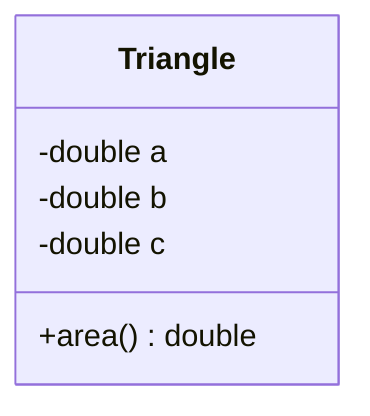

Comparando com o código Java: o compartimento do meio (`- a : double`, `- b : double`, `- c : double`) corresponde aos três atributos da classe, e o compartimento de baixo (`+ area() : double`) corresponde ao método `area()`, que é público e retorna um `double`. O professor mencionou que vamos explorar bem mais esse tipo de projeto em UML ao longo do curso — por enquanto, o importante é reconhecer que é só **outra forma de representar a mesma estrutura** já vista em código.

---

### 7.9 Outro exemplo prático: a classe Product

**Problema:** fazer um programa que leia os dados de um produto em estoque (nome, preço e quantidade) e, em seguida:

- mostre os dados do produto (nome, preço, quantidade e valor total em estoque);
- realize uma **entrada** no estoque e mostre novamente os dados;
- realize uma **saída** no estoque e mostre novamente os dados.

Seguindo o mesmo raciocínio da seção [7.2](#72-o-que-é-uma-classe), o primeiro passo é projetar a classe que representa a entidade do problema — aqui, `Product` — antes de escrever o programa principal:

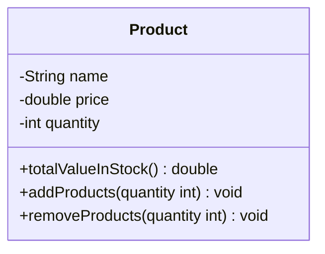

Traduzindo o projeto UML para Java:

```java
package entities;

public class Product {
    public String name;
    public double price;
    public int quantity;

    public double totalValueInStock() {
        return quantity * price;
    }

    public void addProducts(int quantity) {
        this.quantity += quantity;
    }

    public void removeProducts(int quantity) {
        this.quantity -= quantity;
    }
}
```

**A palavra-chave `this`:** repare em `addProducts` e `removeProducts` — ambos recebem um parâmetro chamado `quantity`, só que a classe **já tem** um atributo com esse mesmo nome. Dentro do método, `quantity` sozinho passaria a se referir ao **parâmetro**, escondendo o atributo. `this` é a palavra reservada que representa uma **autorreferência ao próprio objeto** onde ela é usada — `this.quantity` diz explicitamente "o atributo `quantity` deste objeto", desambiguando o atributo do parâmetro de mesmo nome.

> 💡 **Analogia:** imagine duas pessoas conversando e ambas se chamam "Alex". Se alguém disser apenas "Alex fez isso", fica ambíguo qual dos dois. Dizer "**eu**, Alex, fiz isso" (o equivalente a `this.quantity`) deixa claro que você está falando de si mesmo, e não da outra pessoa com o mesmo nome (o parâmetro).

**O programa principal, numa primeira versão:**

```java
package application;

import java.util.Scanner;
import java.util.Locale;

import entities.Product;

public class Program {

    public static void main(String[] args) {
        Locale.setDefault(Locale.US);
        Scanner sc = new Scanner(System.in);

        Product product = new Product();

        IO.println("Enter product data:");
        IO.print("Name: ");
        product.name = sc.nextLine();

        IO.print("Price: ");
        product.price = sc.nextDouble();

        IO.print("Quantity: ");
        product.quantity = sc.nextInt();

        IO.println(product.toString());
    }
}
```

Só que, ao rodar esse código, a última linha imprime algo bem inesperado, em vez dos dados do produto:

```
entities.Product@4554617c
```

Por que isso acontece — e como resolver — é o assunto da próxima seção.

### 7.10 A superclasse Object e o método toString()

Em Java, **toda classe é, por baixo dos panos, uma subclasse de `Object`** — mesmo que você nunca escreva isso explicitamente. É por isso que qualquer objeto, mesmo um `Product` criado do zero, já "nasce" com alguns métodos prontos, herdados de `Object`:

| Método | O que faz |
|---|---|
| `getClass()` | Retorna o tipo (a classe) do objeto |
| `equals(Object)` | Compara se o objeto é igual a outro |
| `hashCode()` | Retorna um código hash do objeto |
| `toString()` | Converte o objeto para uma representação em `String` |

Por enquanto, o foco é só no `toString()`. O texto estranho `entities.Product@4554617c` visto na seção anterior é exatamente a implementação **padrão** de `toString()` herdada de `Object`: por padrão, ela não sabe nada sobre o que faz sentido mostrar de um `Product` — ela só devolve o nome do pacote + classe (`entities.Product`) seguido do endereço do objeto no Heap, em hexadecimal (`@4554617c`). É técnica, mas não é útil para ler.

> 💡 **Analogia:** é como se toda pessoa, ao nascer, já ganhasse um crachá padrão só com um número de identificação genérico. Esse crachá funciona, mas não diz nada de útil sobre a pessoa. Para o crachá realmente representar alguém (mostrar nome, preço, quantidade...), é preciso **personalizá-lo** — e é exatamente isso que "sobrescrever" o `toString()` faz.

A solução é **sobrescrever** (*override*) o `toString()` dentro da própria classe `Product`, dizendo explicitamente como ela deve se converter em texto:

```java
package entities;

public class Product {
    public String name;
    public double price;
    public int quantity;

    public double totalValueInStock() {
        return quantity * price;
    }

    public void addProducts(int quantity) {
        this.quantity += quantity;
    }

    public void removeProducts(int quantity) {
        this.quantity -= quantity;
    }

    public String toString() {
        return name
            + ", $ "
            + String.format("%.2f", price)
            + ", "
            + quantity
            + " units, Total: $ "
            + String.format("%.2f", totalValueInStock());
    }
}
```

Repare que o retorno já vem formatado — inclusive as casas decimais dos valores `double`, usando `String.format("%.2f", ...)` (o mesmo `%.2f` visto lá em [3.5](#35-saída-de-dados-systemout), só que aqui aplicado a uma string em vez de impresso direto).

Com o `toString()` sobrescrito, `IO.println(product.toString())` passa a imprimir a saída formatada corretamente. Mais que isso: **não é nem preciso chamar `toString()` explicitamente** — `IO.println(product)` sozinho já produz o mesmo resultado, porque o Java chama `toString()` automaticamente sempre que um objeto precisa virar texto (por exemplo, ao ser impresso ou concatenado com `+`):

```
Enter product data:
Name: TV
Price: 900.00
Quantity: 10
TV, $ 900.00, 10 units, Total: $ 9000.00
```

**O programa completo, já usando `addProducts`/`removeProducts` para simular entrada e saída de estoque:**

```java
package application;

import java.util.Locale;
import java.util.Scanner;

import entities.Product;

public class Program {
    public static void main(String[] args) {
        Locale.setDefault(Locale.US);
        Scanner sc = new Scanner(System.in);

        Product product = new Product();

        IO.println("Enter product data: ");

        IO.print("Name: ");
        product.name = sc.nextLine();

        IO.print("Price: ");
        product.price = sc.nextDouble();

        IO.print("Quantity in stock: ");
        product.quantity = sc.nextInt();

        IO.println();
        IO.println("Product data: " + product);

        IO.println();
        IO.print("Enter the number of products to be added in stock: ");
        int quantity = sc.nextInt();
        product.addProducts(quantity);

        IO.println();
        IO.println("Updated data: " + product);

        IO.println();
        IO.print("Enter the number of products to be removed from stock: ");
        quantity = sc.nextInt();
        product.removeProducts(quantity);

        IO.println();
        IO.println("Updated data: " + product);

        sc.close();
    }
}
```

**Saída:**

```
Enter product data:
Name: Tv
Price: 900.00
Quantity in stock: 10

Product data: Tv, $ 900.00, 10 units, Total: $ 9000.00

Enter the number of products to be added in stock: 5

Updated data: Tv, $ 900.00, 15 units, Total: $ 13500.00

Enter the number of products to be removed from stock: 2

Updated data: Tv, $ 900.00, 13 units, Total: $ 11700.00
```

Note como `product + string` (a concatenação em `"Product data: " + product`) também aciona o `toString()` sobrescrito automaticamente — reforçando por que sobrescrever esse método é tão útil: qualquer lugar do código que precisar "mostrar" o objeto já se beneficia, sem esforço extra.

### 7.11 Membros estáticos

Este é o tópico que mais gera confusão no início — então antes de qualquer código, vale fixar a **pergunta-chave** que resolve 90% da dúvida:

> ❓ **Essa informação (ou comportamento) pertence a UM objeto específico, ou é a mesma coisa não importa quem pergunte?**
>
> - Se depende de **qual objeto** você está olhando → é um **membro de instância** (o que já vínhamos usando: `x.a`, `product.price`, `employee.grossSalary`...).
> - Se é igual **independente de qualquer objeto** → é um **membro estático** (também chamado de **membro de classe**).

**Definição:** um membro estático (atributo ou método marcado com `static`) pertence **à classe em si**, não a nenhuma instância dela. Por isso, ele não precisa — e nem pede — que você crie um objeto (`new`) para usá-lo: ele é chamado diretamente pelo **nome da classe**.

> 💡 **Analogias do dia a dia:**
> - **Uma constante universal**, tipo a velocidade da luz ou o valor de PI: não faz sentido perguntar "qual é o PI *deste* círculo" — PI é o mesmo para todo círculo que existe. Ele não é uma característica de *um* objeto, é um fato compartilhado por todos.
> - **Uma calculadora de bolso**: quando você aperta `√` (raiz quadrada), o resultado não depende de "qual calculadora" fez a conta — é sempre o mesmo cálculo, universal. É por isso que `Math.sqrt(9)` não exige `new Math()`: a operação matemática não pertence a nenhum objeto específico, ela só *existe*.
> - **Um contador de senha de atendimento**: o painel eletrônico que mostra "última senha chamada: 042" não pertence a nenhum cliente — pertence ao sistema da fila como um todo. Todo cliente que olha vê o mesmo número, e ele é atualizado independente de qual cliente está sendo atendido.

**Onde isso aparece na prática (as duas aplicações mais comuns):**

| Uso comum | Exemplo |
|---|---|
| Classes utilitárias — funções que não dependem do estado de nenhum objeto | `Math.sqrt(x)`, `Math.pow(x, y)` |
| Declaração de constantes — valores fixos, iguais para todo mundo que usa a classe | `public static final double PI = 3.14159;` |

> 💡 **Sobre o `final`:** o modificador `final` (visto pela primeira vez aqui) significa "não pode ser reatribuído depois de inicializado" — ou seja, declara uma **constante**. Sozinho, `final` já impede que o valor mude; combinado com `static`, você ganha um valor **único, compartilhado e imutável** para toda a classe — exatamente o que uma constante como `PI` precisa ser.

**Um esclarecimento importante:** uma classe pode ter **quantos membros estáticos quiser**, livremente misturados com membros de instância — não existe limite de "só um". O que é verdade é o oposto: **basta um único membro estático** para que ele, individualmente, já possa ser chamado sem depender de instância — os demais membros da classe (estáticos ou não) não são afetados por isso.

#### O problema exemplo: circunferência e volume a partir do raio

**Enunciado:** ler um valor numérico (raio) e mostrar a circunferência e o volume de uma esfera daquele raio, além do valor de PI com duas casas decimais.

```
Enter radius: 3.0
Circumference: 18.85
Volume: 113.10
PI value: 3.14
```

O professor resolveu esse problema em **três versões**, e é exatamente essa progressão que revela onde o `static` se encaixa de verdade.

**Versão 1 — tudo dentro do `Program` (funciona, mas no lugar errado):**

```java
package application;

import java.util.Locale;
import java.util.Scanner;

public class Program {
    public static final double PI = 3.14159;

    public static void main(String[] args) {
        Locale.setDefault(Locale.US);
        Scanner sc = new Scanner(System.in);

        System.out.print("Enter radius: ");
        double radius = sc.nextDouble();

        double c = circumference(radius);
        double v = volume(radius);

        System.out.printf("Circumference: %.2f%n", c);
        System.out.printf("Volume: %.2f%n", v);
        System.out.printf("PI value: %.2f%n", PI);

        sc.close();
    }

    public static double circumference(double radius) {
        return 2.0 * PI * radius;
    }

    public static double volume(double radius) {
        return 4.0 * PI * radius * radius * radius / 3.0;
    }
}
```

> ⚠️ **Por que `circumference` e `volume` também precisam ser `static` aqui?** Porque `main` é `static`, e um método estático **não consegue chamar membros de instância da própria classe diretamente** — só consegue chamar outros membros estáticos. Faz sentido: um método estático roda sem nenhum objeto "dono" em mãos, então ele não tem como saber *de qual instância* pegar um atributo ou método de instância. Ele só enxerga o que pertence à classe como um todo.

Essa versão funciona, mas mistura, na mesma classe `Program`, a lógica de "rodar o programa" com a lógica de "calcular fórmulas geométricas" — o mesmo problema de domínio errado já visto lá em [7.1](#71-motivação-o-problema-sem-orientação-a-objetos) e [7.6](#76-criando-métodos-reaproveitamento-e-delegação): quem deveria saber calcular circunferência e volume não é o `Program`.

**Versão 2 — delegando para uma classe `Calculator`, com membros de instância:**

```java
package util;

public class Calculator {
    public final double PI = 3.14159;

    public double circumference(double radius) {
        return 2.0 * PI * radius;
    }

    public double volume(double radius) {
        return 4.0 * PI * radius * radius * radius / 3.0;
    }
}
```

```java
Calculator calc = new Calculator();

System.out.print("Enter radius: ");
double radius = sc.nextDouble();

double c = calc.circumference(radius);
double v = calc.volume(radius);

System.out.printf("Circumference: %.2f%n", c);
System.out.printf("Volume: %.2f%n", v);
System.out.printf("PI value: %.2f%n", calc.PI);
```

Agora a responsabilidade está no lugar certo (delegação, igual seção [7.6](#76-criando-métodos-reaproveitamento-e-delegação)) — mas repare que precisamos criar `calc = new Calculator()` mesmo sem nenhum motivo real para isso: `PI`, `circumference()` e `volume()` **nunca variam de uma instância de `Calculator` para outra**. Criar dez objetos `Calculator` diferentes não muda em nada o resultado de `circumference(3.0)`. Esse é exatamente o sinal de alerta de que esses membros deveriam ser **estáticos**, não de instância.

**Versão 3 — `Calculator` com membros estáticos (a versão "correta"):**

```java
package util;

public class Calculator {
    public static final double PI = 3.14159;

    public static double circumference(double radius) {
        return 2.0 * PI * radius;
    }

    public static double volume(double radius) {
        return 4.0 * PI * radius * radius * radius / 3.0;
    }
}
```

```java
System.out.print("Enter radius: ");
double radius = sc.nextDouble();

double c = Calculator.circumference(radius);
double v = Calculator.volume(radius);

System.out.printf("Circumference: %.2f%n", c);
System.out.printf("Volume: %.2f%n", v);
System.out.printf("PI value: %.2f%n", Calculator.PI);
```

Essa é a melhor combinação das duas versões anteriores: a lógica continua **delegada** para `Calculator` (não mistura com `Program`), mas agora é chamada direto por `Calculator.circumference(radius)` — sem a cerimônia de `new Calculator()` para algo que nunca dependeu de estado nenhum de objeto.

| | Instância (`x.metodo()`) | Estático (`Classe.metodo()`) |
|---|---|---|
| Precisa de `new`? | Sim | Não |
| Faz sentido quando... | o resultado depende dos dados **daquele objeto específico** (`triangle.area()` depende de `a`, `b`, `c` *daquele* triângulo) | o resultado é **sempre igual**, para qualquer chamada, e não depende de estado nenhum guardado num objeto |

> 💬 **Sobre "classe estática":** as anotações mencionam que uma classe só com membros estáticos "pode ser uma classe estática, que não pode ser instanciada". Vale um ajuste fino: em Java, `static` não é uma palavra-chave válida para uma classe de nível superior como `Calculator` (isso existe para classes *aninhadas*, um assunto futuro) — o que existe, na prática, é um **padrão de projeto** chamado **classe utilitária**: uma classe que, por convenção, só tem membros estáticos e nunca é pensada para ser instanciada (exatamente o papel que `Calculator` e a própria `Math` do Java cumprem).

### 7.12 Construtores

> 🧭 Entramos aqui num novo bloco dentro de Orientação a Objetos — **construtores, `this`, sobrecarga e encapsulamento** — que aprofunda o que uma classe pode fazer além de atributos e métodos simples (voltando ao teaser da seção [7.2](#72-o-que-é-uma-classe)). Este tópico cobre o primeiro deles: o **construtor**.

Um **construtor** é uma operação especial da classe que executa automaticamente **no exato momento em que o objeto é instanciado** (no `new`). Os dois usos mais comuns:

- **Inicializar os atributos** do objeto já na criação, em vez de precisar setá-los um por um depois.
- **Obrigar (ou permitir) que o objeto receba dados/dependências logo na instanciação** — um mecanismo conhecido como *injeção de dependência*, que veremos melhor mais adiante.

> 💡 **Analogia:** pense num formulário de admissão de funcionário — a empresa **exige** nome e CPF já no ato do cadastro; não existe "funcionário cadastrado sem nome". O construtor faz exatamente isso com um objeto: define quais dados são obrigatórios *já no nascimento* dele, em vez de deixar o objeto existir num estado incompleto para só depois preencher os campos.

**Retomando o exemplo do `Product`** (visto em [7.9](#79-outro-exemplo-prático-a-classe-product)/[7.10](#710-a-superclasse-object-e-o-método-tostring)): até agora, criar um produto exigia três passos separados — `new Product()` e depois `product.name = ...`, `product.price = ...`, `product.quantity = ...`, um de cada vez. Nada impedia esquecer de preencher um deles. Com um construtor, os três valores passam a ser exigidos **juntos**, no próprio `new`:

```java
package entities;

public class Product {
    public String name;
    public double price;
    public int quantity;

    public Product(String name, double price, int quantity) {
        this.name = name;
        this.price = price;
        this.quantity = quantity;
    }

    public double totalValueInStock() {
        return quantity * price;
    }

    public void addProducts(int quantity) {
        this.quantity += quantity;
    }

    public void removeProducts(int quantity) {
        this.quantity -= quantity;
    }

    public String toString() {
        return name
            + ", $ "
            + String.format("%.2f", price)
            + ", "
            + quantity
            + " units, Total: $ "
            + String.format("%.2f", totalValueInStock());
    }
}
```

Repare que o construtor usa **`this`** exatamente pelo mesmo motivo já visto em [7.9](#79-outro-exemplo-prático-a-classe-product): os parâmetros (`name`, `price`, `quantity`) têm o mesmo nome dos atributos da classe, e `this.name` desambigua "o atributo deste objeto" do parâmetro recebido.

**O `Program` agora cria o produto já com os dados prontos:**

```java
package application;

import java.util.Locale;
import java.util.Scanner;

import entities.Product;

public class Program {
    public static void main(String[] args) {
        Locale.setDefault(Locale.US);
        Scanner sc = new Scanner(System.in);

        IO.println("Enter product data: ");

        IO.print("Name: ");
        String name = sc.nextLine();

        IO.print("Price: ");
        double price = sc.nextDouble();

        IO.print("Quantity in stock: ");
        int quantity = sc.nextInt();

        Product product = new Product(name, price, quantity);

        IO.println();
        IO.println("Product data: " + product);

        IO.println();
        IO.print("Enter the number of products to be added in stock: ");
        quantity = sc.nextInt();
        product.addProducts(quantity);

        IO.println();
        IO.println("Updated data: " + product);

        IO.println();
        IO.print("Enter the number of products to be removed from stock: ");
        quantity = sc.nextInt();
        product.removeProducts(quantity);

        IO.println();
        IO.println("Updated data: " + product);

        sc.close();
    }
}
```

A saída é idêntica à da versão anterior (seção [7.10](#710-a-superclasse-object-e-o-método-tostring)) — o que mudou foi **como** o objeto nasce, não o que ele faz depois.

**O construtor padrão:** se uma classe não declara nenhum construtor próprio, o Java disponibiliza automaticamente um **construtor padrão** sem parâmetros — é o que permitia escrever `Product p = new Product();` nas versões anteriores deste material. Mas atenção a uma pegadinha comum: **assim que você declara qualquer construtor próprio** (como o `Product(String name, double price, int quantity)` acima), **o construtor padrão deixa de existir** — `new Product()` sem argumentos passaria a dar erro de compilação, porque agora o único construtor disponível exige os três parâmetros.

> 💡 É por isso que a linha `Product p = new Product();` citada nas anotações só é válida enquanto a classe **não tiver** nenhum construtor customizado — no momento em que `Product` ganhou o construtor de três parâmetros, essa forma "vazia" deixou de compilar.

**Prévia — sobrecarga de construtores:** as anotações também adiantam que é possível declarar **mais de um construtor na mesma classe** (por exemplo, um `Product()` sem parâmetros convivendo com o `Product(String, double, int)`), desde que cada um tenha uma lista de parâmetros diferente. Isso se chama **sobrecarga** e é o próximo tópico do módulo — por enquanto, fica só o mapa de que essa porta existe.

### 7.13 A palavra-chave this

Essa aula não mexeu em código novo — o `this` já vinha aparecendo desde [7.9](#79-outro-exemplo-prático-a-classe-product) e [7.12](#712-construtores); o objetivo aqui foi **parar e consolidar o conceito** por trás do que já estávamos usando na prática.

**Definição:** `this` é a palavra reservada que **referencia o próprio objeto** — o objeto dentro do qual o código que contém o `this` está executando no momento.

**Os dois usos comuns:**

1. **Diferenciar atributos de variáveis locais** — já visto em [7.9](#79-outro-exemplo-prático-a-classe-product) e [7.12](#712-construtores): quando um parâmetro (ou variável local) tem o mesmo nome de um atributo, `this.atributo` deixa explícito que você está falando do atributo do objeto, e não do parâmetro que está "por cima" dele naquele escopo.

2. **Passar o próprio objeto como argumento** numa chamada de método ou construtor — um uso novo, que ainda não tínhamos precisado. Serve para um objeto "se entregar" (passar uma referência de si mesmo) para outro método ou objeto usar:

   ```java
   public class Pessoa {
       private String nome;

       public Pessoa(String nome) {
           this.nome = nome;
       }

       public void cumprimentar(Recepcionista recepcionista) {
           recepcionista.registrarVisita(this); // "this" = esta própria Pessoa
       }
   }

   public class Recepcionista {
       public void registrarVisita(Pessoa visitante) {
           System.out.println("Visitante registrado: " + visitante);
       }
   }
   ```

   > 💡 **Analogia:** é como um visitante, ao chegar na recepção, entregar seu próprio crachá para ser registrado — `this` é literalmente "eu mesmo", entregue como argumento para quem precisa de uma referência ao objeto que está chamando o método.

**Por baixo dos panos — o que `this` tem a ver com a memória (revendo [7.5](#75-como-objetos-vivem-na-memória-stack-e-heap)):**

Quando instanciamos `Product product = new Product("TV", 1500.0, 0);`, os valores `"TV"`, `1500.0` e `0` são recebidos pelos **parâmetros do construtor** — que, assim como os parâmetros de qualquer método, existem apenas **temporariamente**, no escopo do construtor (Stack), enquanto ele está executando.

É a linha `this.name = name;` (e as equivalentes para os outros atributos) que faz esses valores **saírem** desse espaço temporário do construtor e **entrarem de fato** no espaço de armazenamento permanente do objeto, lá no Heap. Sem esse `this.atributo = parametro`, os valores recebidos existiriam só durante a execução do construtor e desapareceriam assim que ele terminasse — o objeto ficaria com seus atributos vazios (nos valores padrão do tipo).

> 💡 **Analogia:** retomando o chaveiro/depósito de [7.5](#75-como-objetos-vivem-na-memória-stack-e-heap) — os parâmetros do construtor são como itens que um visitante traz na mão até o balcão (temporário, na Stack). `this.atributo = parametro` é o ato de efetivamente guardar esses itens dentro do armário do objeto no depósito (Heap). Se ninguém guardar, os itens ficam na mão do visitante e somem quando ele for embora (quando o construtor terminar de executar).

### 7.14 Sobrecarga

**Sobrecarga** (*overload*) é o recurso que permite uma classe oferecer **mais de uma operação — método ou construtor — com o mesmo nome**, desde que cada uma tenha uma **lista de parâmetros diferente** (em quantidade e/ou tipo). Já tínhamos deixado essa porta aberta lá na prévia da seção [7.12](#712-construtores) — agora é a vez de usá-la de verdade.

> 💡 **Analogia:** pense num mesmo formulário de cadastro que existe em duas versões — uma completa (nome, preço e quantidade) e uma simplificada (só nome e preço, pra quando ainda não se sabe o estoque inicial). É o mesmo "formulário `Product`", só que com campos obrigatórios diferentes. Quem preenche escolhe a versão que tem os dados disponíveis no momento — e o Java decide automaticamente qual construtor usar, olhando para quantos (e quais tipos de) argumentos foram passados no `new`.

**Proposta de melhoria para o `Product`:** criar um construtor **opcional**, que recebe apenas nome e preço — deixando a quantidade em estoque inicializada em `0` por padrão:

```java
package entities;

public class Product {
    public String name;
    public double price;
    public int quantity;

    public Product(String name, double price, int quantity) {
        this.name = name;
        this.price = price;
        this.quantity = quantity;
    }

    public Product(String name, double price) {
        this.name = name;
        this.price = price;
    }

    public double totalValueInStock() {
        return quantity * price;
    }

    public void addProducts(int quantity) {
        this.quantity += quantity;
    }

    public void removeProducts(int quantity) {
        this.quantity -= quantity;
    }

    public String toString() {
        return name
            + ", $ "
            + String.format("%.2f", price)
            + ", "
            + quantity
            + " units, Total: $ "
            + String.format("%.2f", totalValueInStock());
    }
}
```

Repare que o segundo construtor **não atribui nada a `this.quantity`** — e mesmo assim o atributo não fica "quebrado" ou indefinido. Isso funciona porque, em Java, todo atributo numérico que não recebe valor explícito já nasce com um **valor padrão** (`int` começa em `0`, `double` em `0.0`, `boolean` em `false`, referências como `String` em `null`). Como `quantity` é `int`, ele simplesmente começa em `0` quando esse construtor de dois parâmetros é usado.

**No `Program`, basta chamar o construtor com a quantidade de argumentos que se tem disponível:**

```java
package application;

import java.util.Locale;
import java.util.Scanner;

import entities.Product;

public class Program {
    public static void main(String[] args) {
        Locale.setDefault(Locale.US);
        Scanner sc = new Scanner(System.in);

        IO.println("Enter product data: ");

        IO.print("Name: ");
        String name = sc.nextLine();

        IO.print("Price: ");
        double price = sc.nextDouble();

        Product product = new Product(name, price);

        IO.println();
        IO.println("Product data: " + product);

        IO.println();
        IO.print("Enter the number of products to be added in stock: ");
        int quantity = sc.nextInt();
        product.addProducts(quantity);

        IO.println();
        IO.println("Updated data: " + product);

        IO.println();
        IO.print("Enter the number of products to be removed from stock: ");
        quantity = sc.nextInt();
        product.removeProducts(quantity);

        IO.println();
        IO.println("Updated data: " + product);

        sc.close();
    }
}
```

**Saída:**

```
Enter product data:
Name: Tv
Price: 900.00

Product data: Tv, $ 900.00, 0 units, Total: $ 0.00

Enter the number of products to be added in stock: 5

Updated data: Tv, $ 900.00, 5 units, Total: $ 4500.00

Enter the number of products to be removed from stock: 2

Updated data: Tv, $ 900.00, 3 units, Total: $ 2700.00
```

`new Product(name, price)` usa automaticamente o construtor de dois parâmetros — o Java escolhe qual dos dois construtores chamar **só de olhar quantos argumentos foram passados**, sem precisar de nenhuma indicação extra. Note também que, mesmo com `quantity` começando em `0`, `totalValueInStock()` continua funcionando normalmente (`0 * price = 0.00`) — nenhum outro método precisou saber que esse produto foi criado "sem estoque inicial".

### 7.15 Encapsulamento

**Encapsulamento** é o princípio de **esconder os detalhes de implementação** de uma classe, expondo para fora apenas operações seguras — operações que garantem que o objeto permaneça sempre num **estado consistente**.

> 🎯 **Regra de ouro:** o objeto deve sempre estar em um estado consistente, e é **a própria classe** — não quem a usa — a responsável por garantir isso.

A regra geral básica que coloca essa ideia em prática tem duas partes:

1. Um objeto **não deve expor nenhum atributo diretamente** — todos os atributos passam a ser `private`.
2. O acesso a esses atributos, quando necessário, acontece por meio de métodos **get** (para ler) e **set** (para alterar).

**Sintaxe geral de um get/set:**

```java
public <retorno> <nome> (<parâmetro ou não>) {
    <operação>
}
```

Get e set costumam ficar logo após os construtores, na classe. O ponto de atenção principal na hora de criá-los é o **nome**, que sempre segue o padrão *CamelCase*:

- `getName()` — sem parâmetro, retorna o valor do atributo.
- `setName(String name)` — recebe um parâmetro, altera o valor do atributo.

Nada impede de colocar alguma lógica extra dentro de um get/set, mas o padrão de mercado mais comum é eles apenas **lerem ou alterarem** o valor de um atributo, sem regra de negócio embutida — a regra de negócio (como veremos já já) fica melhor em métodos próprios, com nome que descreva a ação.

**Aplicando ao `Product`:** os três atributos passam a ser `private`, e ganham `get`/`set` (quando fizer sentido):

```java
package entities;

public class Product {
    private String name;
    private double price;
    private int quantity;

    public Product(String name, double price, int quantity) {
        this.name = name;
        this.price = price;
        this.quantity = quantity;
    }

    public Product(String name, double price) {
        this.name = name;
        this.price = price;
    }

    public String getName() {
        return name;
    }

    public void setName(String name) {
        this.name = name;
    }

    public double getPrice() {
        return price;
    }

    public void setPrice(double price) {
        this.price = price;
    }

    public int getQuantity() {
        return quantity;
    }

    public double totalValueInStock() {
        return quantity * price;
    }

    public void addProducts(int quantity) {
        this.quantity += quantity;
    }

    public void removeProducts(int quantity) {
        this.quantity -= quantity;
    }

    public String toString() {
        return name
            + ", $ "
            + String.format("%.2f", price)
            + ", "
            + quantity
            + " units, Total: $ "
            + String.format("%.2f", totalValueInStock());
    }
}
```

> 🔍 **Reparou em algo que falta?** Existe `getQuantity()`, mas **não existe** `setQuantity(int quantity)`. Isso não é esquecimento — é a "regra de ouro" do encapsulamento em ação: se qualquer código externo pudesse simplesmente fazer `product.setQuantity(-50)`, nada garantiria que o estoque continuasse fazendo sentido. Em vez disso, a *única* forma de alterar a quantidade é através de `addProducts(...)` e `removeProducts(...)` — métodos que **descrevem a intenção da mudança**, e é a própria classe `Product` quem decide como a quantidade pode variar. Expor um `get` para ler não custa nada; expor um `set` "livre" para um dado que precisa de regras é abrir mão do controle que o encapsulamento existe para proteger.
>
> 💡 **Analogia:** pense num estoque físico de verdade — ninguém entra no depósito e simplesmente risca um novo número no papel de contagem (`setQuantity`). Toda mudança passa por um processo formal: uma nota de **entrada** ou uma nota de **saída** (`addProducts`/`removeProducts`), que fica registrado e faz sentido. O encapsulamento é isso: a classe decide **quais portas de entrada** existem para mexer nos seus dados, em vez de deixar todo mundo mexer diretamente em qualquer coisa.

Um detalhe que vale comemorar: o `Program` **não precisou mudar nada** depois dessa refatoração — ele já vinha usando o construtor e os métodos `addProducts`/`removeProducts` desde as seções [7.12](#712-construtores) e [7.9](#79-outro-exemplo-prático-a-classe-product), nunca acessando `product.name` ou `product.quantity` diretamente. Isso é a delegação de responsabilidade (seção [7.6](#76-criando-métodos-reaproveitamento-e-delegação)) e o encapsulamento andando juntos: quando a classe já expõe as operações certas desde o início, torná-la mais rígida por dentro (`private`) não quebra quem já a estava usando corretamente por fora.

> 💬 O professor adiantou que, na próxima aula, o próprio ambiente de desenvolvimento (IDE) vai **gerar automaticamente** esses `get`/`set` (e até os construtores) — sem precisar digitá-los à mão como foi feito aqui.

### 7.16 Modificadores de acesso

A seção [7.15](#715-encapsulamento) já usou `private` e `public`, mas sem parar para explicar formalmente **quem enxerga o quê**. Em Java existem **quatro níveis de acesso**, do mais restrito ao mais aberto:

| Modificador | Quem pode acessar |
|---|---|
| `private` | Só a **própria classe** |
| *(nenhum — padrão)* | A própria classe **e** qualquer classe do **mesmo pacote** |
| `protected` | O mesmo que o padrão, **mais** subclasses em pacotes diferentes (assunto de herança, ainda por vir) |
| `public` | Qualquer classe, de qualquer pacote (com uma exceção rara: módulos que não exportam o pacote) |

> 💡 **Analogia — círculos de convivência:** pense nos quatro níveis como círculos sociais cada vez mais largos: `private` é o seu **diário pessoal** (só você lê); *(padrão)* é a **sua casa** (você e quem mora junto — as classes do mesmo pacote); `protected` é a **família estendida** (parentes que moram longe — subclasses em outros pacotes — ainda têm acesso, mas estranhos não); `public` é uma **publicação aberta**, qualquer um pode ler.

Repare que cada nível **inclui** o anterior — `protected` enxerga tudo que o padrão enxerga, e por aí vai. É uma escada de acesso cada vez mais permissiva: `private` → *(padrão)* → `protected` → `public`.

**A tabela oficial de acessibilidade** (a mesma do [tutorial da Oracle](https://docs.oracle.com/javase/tutorial/java/javaOO/accesscontrol.html), reproduzida aqui como referência rápida):

| Modificador | Mesma classe | Mesmo pacote | Subclasse (pacote diferente) | Qualquer lugar |
|---|:---:|:---:|:---:|:---:|
| `private` | ✅ | ❌ | ❌ | ❌ |
| *(padrão)* | ✅ | ✅ | ❌ | ❌ |
| `protected` | ✅ | ✅ | ✅ | ❌ |
| `public` | ✅ | ✅ | ✅ | ✅ |

Um jeito prático de decidir qual usar, no dia a dia: comece sempre pelo mais restrito que resolve o problema (`private`) e só abra mão de restrição (`protected`, depois `public`) quando surgir uma necessidade real de acesso vindo de fora. É a mesma mentalidade da seção [7.15](#715-encapsulamento) — quanto menos exposto, mais fácil garantir que o objeto permaneça consistente.

---

## 8. Comportamento de Memória, Arrays e Listas

### 8.1 Tipos referência vs. tipos valor

Este tópico formaliza — com nome e regra explícitos — algo que já vínhamos usando desde a seção [7.5](#75-como-objetos-vivem-na-memória-stack-e-heap): em Java, nem toda variável se comporta do mesmo jeito na memória. Existem dois grupos, com regras bem diferentes entre si: **tipos referência** (classes) e **tipos valor** (tipos primitivos).

#### Classes são tipos referência

Uma variável cujo tipo é uma classe **não deve ser entendida como uma caixa guardando um valor** — e sim como um "tentáculo" (ponteiro) que aponta para uma caixa. Esse ponteiro mora na **Stack**, e aponta para um local de memória lá no **Heap** — exatamente a distinção já vista em [7.5](#75-como-objetos-vivem-na-memória-stack-e-heap).

O ponto novo aqui é o que acontece quando **uma variável de tipo referência recebe outra**:

```java
Product p1, p2;

p1 = new Product("TV", 900.00, 0);

p2 = p1;
```

```
Stack                              Heap
┌─────────────┐                    ┌───────────────────────────┐
│ p1 ●────────┼──────────┐         │ Product (0x100358)          │
├─────────────┤          ├────────▶│ "TV", 900.00, 0              │
│ p2 ●────────┼──────────┘         └───────────────────────────┘
└─────────────┘
```

`p2 = p1;` **não cria um novo objeto**, nem copia `"TV"`, `900.00` e `0` para um segundo lugar no Heap. Ela copia apenas o **ponteiro**: `p2` passa a apontar para o **mesmo** endereço que `p1` já apontava. A partir daí, `p1` e `p2` são dois "controles remotos" diferentes para o **mesmo objeto** — mudar um atributo através de `p2` seria enxergado também através de `p1`, porque não existem dois objetos, existe um só, com duas referências apontando para ele.

> 💡 **Analogia:** retomando o chaveiro de [7.5](#75-como-objetos-vivem-na-memória-stack-e-heap) — `p2 = p1` é copiar a **chave**, não o armário. Agora existem duas chaves (`p1`, `p2`) que abrem exatamente o mesmo armário no depósito. Mexer no conteúdo usando qualquer uma das duas chaves afeta o mesmo armário.

#### O valor `null`

Tipos referência aceitam o valor especial **`null`**, que indica que a variável **não aponta para ninguém**:

```java
Product p1, p2;

p1 = new Product("TV", 900.00, 0);

p2 = null;
```

```
Stack                              Heap
┌─────────────┐                    ┌───────────────────────────┐
│ p1 ●────────┼───────────────────▶│ Product (0x100358)          │
├─────────────┤                    │ "TV", 900.00, 0              │
│ p2 = null    │                    └───────────────────────────┘
└─────────────┘
```

`p2` continua existindo como variável, mas seu "tentáculo" não está preso a nenhuma caixa no Heap — ele está, literalmente, vazio. Tentar usar `p2.algumAtributo` nesse estado (uma referência `null`) é a origem do famoso erro `NullPointerException`, que ainda veremos com mais detalhe adiante.

#### Tipos primitivos são tipos valor

Já os **tipos primitivos** (`int`, `double`, `boolean`, `char`...) funcionam de um jeito fundamentalmente diferente: eles **são** as caixas — não ponteiros para caixas. Não existe Heap envolvido, tudo acontece direto na Stack:

```java
double x, y;

x = 10;

y = x;
```

```
Stack
┌─────────────┐
│ x = 10.0     │
├─────────────┤
│ y = 10.0     │
└─────────────┘
```

Aqui, `y = x;` funciona de forma completamente diferente do `p2 = p1;` visto acima: `y` recebe uma **cópia do valor** de `x` — não um ponteiro para o mesmo lugar. A partir desse momento, `x` e `y` são duas caixas totalmente independentes; mudar `x` depois não afeta `y` em nada, porque não há nenhuma ligação entre elas além do valor que foi copiado naquele instante.

> 💡 **Analogia:** se tipo referência é copiar uma chave, tipo valor é fotocopiar um documento — `y = x` tira uma cópia idêntica do conteúdo de `x` e entrega para `y`; a partir daí, rabiscar a cópia de `y` não muda em nada o original em `x`.

**Tabela de referência dos tipos primitivos:**

| Tipo | Contém | Padrão | Tamanho | Faixa de valores |
|---|---|---|---|---|
| `boolean` | `true` ou `false` | `false` | 1 bit | N/A |
| `char` | Caractere Unicode | `\u0000` | 16 bits | `\u0000` a `\uFFFF` |
| `byte` | Inteiro com sinal | `0` | 8 bits | -128 a 127 |
| `short` | Inteiro com sinal | `0` | 16 bits | -32.768 a 32.767 |
| `int` | Inteiro com sinal | `0` | 32 bits | -2.147.483.648 a 2.147.483.647 |
| `long` | Inteiro com sinal | `0` | 64 bits | -9.223.372.036.854.775.808 a 9.223.372.036.854.775.807 |
| `float` | Ponto flutuante (IEEE 754) | `0.0` | 32 bits | ±1.4E-45 a ±3.4028235E+38 |
| `double` | Ponto flutuante (IEEE 754) | `0.0` | 64 bits | ±4.9E-324 a ±1.7976931348623157E+308 |

#### Inicialização obrigatória de tipos primitivos

Uma variável local de tipo primitivo **precisa sempre ser inicializada antes de ser acessada** ou participar de qualquer operação — a mesma regra de [4.7 (Escopo e inicialização)](#47-escopo-e-inicialização-de-variáveis), agora aplicada especificamente a tipos valor:

```java
int p;

IO.println(p); // erro de compilação: variável não inicializada
```

#### Valores padrão

Essa regra de "precisa inicializar antes de usar" vale para **variáveis locais** — mas existe uma exceção importante: quando alocamos (`new`) qualquer **tipo estruturado** (uma classe ou um array, que veremos em seguida), os elementos desse tipo **já nascem com valores padrão**, sem precisar de inicialização manual:

| Categoria | Valor padrão |
|---|---|
| Números (`int`, `double`, ...) | `0` |
| `boolean` | `false` |
| `char` | Caractere de código `0` |
| Objeto (tipo referência) | `null` |

> 💡 Isso explica, em retrospecto, algo que já tínhamos visto na prática lá em [7.14 (Sobrecarga)](#714-sobrecarga): o construtor de dois parâmetros do `Product` não define `quantity`, e mesmo assim o atributo não fica "quebrado" — ele simplesmente recebe o valor padrão do `int`, que é `0`. Agora temos a regra formal por trás daquele comportamento.

#### Resumo: tipos referência vs. tipos valor

| | Classe (tipo referência) | Tipo primitivo (tipo valor) |
|---|---|---|
| Vantagem | Usufrui de todos os recursos de OO | Mais simples e mais performático |
| Variáveis são | Ponteiros | Caixas |
| Instanciação | Precisa de `new`, ou apontar para um objeto já existente | Não instancia — uma vez declarado, já está pronto pra uso |
| Aceita `null`? | Sim | Não |
| `y = x;` significa | "`y` passa a apontar para onde `x` aponta" | "`y` recebe uma **cópia** de `x`" |
| Onde vive | Objeto instanciado no Heap (a referência fica na Stack) | "Objeto" (valor) fica direto na Stack |
| Quando é desalocado | Quando não é mais utilizado, num momento futuro, pelo *garbage collector* | Imediatamente, quando o escopo de execução onde foi declarado termina |

### 8.2 Desalocação de memória: garbage collector e escopo local

A última linha da tabela em [8.1](#81-tipos-referência-vs-tipos-valor) já adiantou que classes e primitivos são "limpos" da memória de formas diferentes. Esta seção detalha **como** isso acontece em cada caso.

#### Garbage collector

O **garbage collector** é um processo que **automatiza o gerenciamento de memória** de um programa em execução. Ele monitora os objetos alocados dinamicamente pelo programa (no **Heap**) e desaloca automaticamente aqueles que **não estão mais sendo utilizados** — ou seja, objetos para os quais não existe mais nenhuma referência apontando.

> 💡 **Analogia:** pense num depósito (o Heap) e numa equipe de limpeza que passa periodicamente verificando quais armários **não têm mais nenhuma chave** em circulação apontando para eles. Um armário sem dono é esvaziado e liberado para reuso — é exatamente isso que o garbage collector faz com objetos sem referência.

**Exemplo — um objeto perdendo sua última referência:**

```java
Product p1, p2;

p1 = new Product("TV", 900.00, 0);
p2 = new Product("Mouse", 30.00, 0);
```

```
Stack                              Heap
┌─────────────┐                    ┌───────────────────────────┐
│ p1 ●────────┼───────────────────▶│ Product "TV", 900, 0        │
├─────────────┤                    └───────────────────────────┘
│ p2 ●────────┼───────────────────▶┌───────────────────────────┐
└─────────────┘                    │ Product "Mouse", 30, 0      │
                                    └───────────────────────────┘
```

Até aqui, dois objetos distintos, cada um com sua própria referência. Agora observe o que acontece com um simples `p1 = p2;`:

```java
p1 = p2;
```

```
Stack                              Heap
┌─────────────┐                    ┌───────────────────────────┐
│ p1 ●────────┼──────────┐         │ Product "TV", 900, 0        │  ⚠ sem nenhuma referência!
├─────────────┤          │         └───────────────────────────┘     (candidato do garbage collector)
│ p2 ●────────┼──────────┼────────▶┌───────────────────────────┐
└─────────────┘          └────────▶│ Product "Mouse", 30, 0      │
                                    └───────────────────────────┘
```

`p1` (que apontava para `"TV"`) passa a apontar para o **mesmo** lugar que `p2` — a mesma mecânica de `p2 = p1` já vista em [8.1](#81-tipos-referência-vs-tipos-valor), só que na direção contrária. O objeto `"TV"` continua fisicamente no Heap, mas **nenhuma variável no programa aponta mais para ele** — ele se tornou inacessível. É exatamente esse tipo de objeto "órfão" que o garbage collector identifica e desaloca, num momento futuro que o programa não controla diretamente.

#### Desalocação por escopo local

Enquanto objetos no Heap dependem do garbage collector, **variáveis locais** (na Stack) seguem uma regra bem mais simples e imediata: elas são desalocadas **assim que o escopo onde foram declaradas termina** — sem esperar por nenhum processo externo.

```java
void method1() {
    int x = 10;
    if (x > 0) {
        int y = 20;
    }
    System.out.println(x);
}
```

Repare que `x` e `y` vivem em escopos **aninhados**: `y` só existe dentro do bloco do `if`, que por sua vez está dentro do escopo de `method1`.

```
Stack
┌────────────────────────────────┐
│ escopo de method1                │
│  x = 10                          │
│  ┌────────────────────────┐     │
│  │ escopo do if             │     │
│  │  y = 20                  │     │
│  └────────────────────────┘     │
└────────────────────────────────┘
```

Assim que a execução sai do bloco do `if` (ou seja, chega no `}` que o fecha), `y` é desalocado imediatamente — antes mesmo do `System.out.println(x)` rodar:

```
Stack
┌────────────────────────────────┐
│ escopo de method1                │
│  x = 10                          │
└────────────────────────────────┘
```

`x` continua vivo, porque o escopo de `method1` ainda está em execução. Quando `method1()` também terminar, `x` desaparece junto — não sobra nada na Stack.

> 💡 **Analogia:** pense em escopos como salas dentro de salas — ao sair de uma sala menor (o `if`) e fechar a porta atrás de você, tudo que estava só naquela sala (o `y`) já não existe mais. A sala maior (`method1`) continua de pé até você sair dela também.

#### Outro exemplo: quando um objeto "sobrevive" ao escopo que o criou

Esse exemplo conecta as duas regras acima — o que acontece quando um **método retorna um objeto**?

```java
void method1() {
    Product p = method2();
    System.out.println(p.getName());
}

Product method2() {
    Product prod = new Product("TV", 900.0, 0);
    return prod;
}
```

Enquanto `method2()` ainda está executando, existem **dois escopos aninhados na Stack** — o de `method1` (com `p`, ainda sem valor definitivo) e, dentro dele, o de `method2` (com `prod`, apontando para o objeto recém-criado no Heap):

```
Stack                                          Heap
┌─────────────────────────────────┐            ┌─────────────────────┐
│ escopo de method1                 │            │ Product               │
│  p                                │            │ "TV", 900.0, 0         │
│  ┌────────────────────────────┐  │            └─────────────────────┘
│  │ escopo de method2            │  │                     ▲
│  │  prod ●───────────────────────┼──┼─────────────────────┘
│  └────────────────────────────┘  │
└─────────────────────────────────┘
```

Quando `method2()` executa `return prod;` e termina, o **escopo de `method2` é desalocado** — a variável `prod` deixa de existir. Se essa fosse a única referência ao objeto `"TV"`, ele viraria lixo (como no exemplo do garbage collector acima). Mas não é: o `return` copiou a referência para dentro de `p`, no escopo de `method1`, que continua vivo:

```
Stack                                          Heap
┌─────────────────────────────────┐            ┌─────────────────────┐
│ escopo de method1                 │            │ Product               │
│  p ●───────────────────────────┼──────────────▶│ "TV", 900.0, 0         │
└─────────────────────────────────┘            └─────────────────────┘
```

O objeto **sobrevive** à saída de `method2()` porque, no instante em que `prod` deixou de existir, já havia outra referência (`p`) apontando para o mesmo lugar. É por isso que "retornar um objeto" de um método funciona — o objeto nunca dependeu do escopo que o criou, só das referências que apontam para ele.

#### Resumo

- Objetos alocados dinamicamente (no Heap), quando **não possuem mais nenhuma referência** apontando para eles, serão desalocados pelo **garbage collector** — num momento futuro, fora do controle direto do programa.
- Variáveis locais (na Stack) são desalocadas **imediatamente**, assim que o escopo onde foram declaradas termina — sem depender de nenhum processo externo.

### 8.3 Vetores — Parte 1

Em programação, **vetor** é o nome dado a arranjos unidimensionais. Um **arranjo** (*array*) é uma estrutura de dados com três características centrais:

- **Homogênea** — todos os elementos são do mesmo tipo.
- **Ordenada** — cada elemento é acessado por meio de uma posição (índice).
- **Alocada de uma vez só**, num bloco contíguo de memória — o tamanho é decidido na criação e não muda depois.

| Vantagens | Desvantagens |
|---|---|
| Acesso imediato a qualquer elemento pela sua posição | Tamanho fixo |
| | Dificuldade para inserir ou remover elementos |

> 💡 **Analogia:** pense num vetor como uma fileira de caixas de correio numeradas, fixadas na parede de uma vez só — você acessa a caixa `7` instantaneamente, sem precisar passar pelas outras. Mas se a fileira tem 10 caixas e você precisa de uma 11ª, não dá para simplesmente encaixar mais uma: seria preciso construir uma fileira nova, maior, e realocar tudo.

**Declaração e instanciação:**

```java
double[] vect = new double[n];
```

Assim como uma classe (seção [7.4](#74-instanciando-objetos)), um vetor **também é um tipo referência** — `vect` é um ponteiro na Stack, e o `new double[n]` aloca o bloco de `n` posições lá no Heap:

```
Stack                              Heap
┌─────────────┐                    ┌───────────────────────────┐
│ n = 3        │                    │ 0: 1.72                     │
├─────────────┤                    │ 1: 1.56                     │
│ vect ●───────┼───────────────────▶│ 2: 1.80                     │
└─────────────┘                    └───────────────────────────┘
```

Antes de qualquer valor ser atribuído, cada posição já nasce com o **valor padrão** do tipo do vetor (seção [8.1](#81-tipos-referência-vs-tipos-valor)) — no caso de `double[]`, todas as posições começam em `0.0`.

**Problema 1:** ler um número inteiro `N` e a altura de `N` pessoas, armazenar as `N` alturas num vetor e, em seguida, mostrar a altura média dessas pessoas.

```java
package application;

import java.util.Locale;
import java.util.Scanner;

public class Program {

    public static void main(String[] args) {

        Locale.setDefault(Locale.US);
        Scanner sc = new Scanner(System.in);

        double sum = 0.0;

        int n = sc.nextInt();

        double[] vect = new double[n];

        for (int i = 0; i < n; i++) {
            vect[i] = sc.nextDouble();
            sum += vect[i];
        }

        double averageHeight = sum / n;

        System.out.printf("AVERAGE HEIGHT = %.2f", averageHeight);

        sc.close();
    }
}
```

**Saída:**

```
3
1.72
1.56
1.80
AVERAGE HEIGHT = 1.69
```

> ⚠️ **Bug encontrado e corrigido:** a versão original tinha `double averageHeight = sum / 3;`, com o `3` **fixo no código** em vez de `n`. Para o exemplo do enunciado (3 pessoas) o resultado batia por pura coincidência — mas testando com `n = 4` (quatro alturas de `1.70`), o programa original devolvia `2.27` em vez de `1.70`. Trocar o `3` fixo por `n` corrigiu o cálculo para qualquer quantidade de pessoas. Fica a lição: sempre que um valor "deveria" ser o mesmo que uma variável já existente (aqui, o total de elementos somados é sempre `n`), usar a variável em vez de digitar o número — um literal fixo só continua certo enquanto o cenário de teste não mudar.

> 💬 Essa aula tem uma "Parte 2" na próxima lição, aprofundando vetores — inclusive com um vetor de objetos (tipo referência), não só de tipos primitivos como neste exemplo.

### 8.4 Vetores — Parte 2 (vetor de tipos referência)

A Parte 1 usou um vetor de **tipo valor** (`double[]`). Esta continuação mostra o que muda quando o vetor é de **tipo referência** — ou seja, um vetor de objetos — e introduz a propriedade `length`.

#### A propriedade `length`

Todo vetor tem uma propriedade `length`, que devolve a quantidade de posições que ele tem — repare que é uma **propriedade**, sem parênteses (`vect.length`), diferente de um método como `list.size()` que veremos mais adiante em Listas. Usar `vect.length` no lugar de repetir a variável `n` numa condição de laço (`i < vect.length` em vez de `i < n`) deixa o código mais seguro: o laço sempre reflete o tamanho **real** do vetor, mesmo que `n` mude ou não esteja mais disponível naquele ponto do código.

#### Um vetor de objetos é um vetor de referências

**Problema 2:** ler um número inteiro `N` e os dados (nome e preço) de `N` produtos, armazenar num vetor e mostrar o preço médio.

Para este problema, foi criada a classe `NewProduct`:

```java
package entities;

public class NewProduct {

    private String name;
    private double price;

    public NewProduct(String name, double price) {
        this.name = name;
        this.price = price;
    }
}
```

Ao declarar `NewProduct[] vect = new NewProduct[n];`, o Java aloca no Heap um bloco de `n` **posições** — mas cada posição, por si só, é apenas mais uma **referência** (exatamente como visto em [8.1](#81-tipos-referência-vs-tipos-valor)), inicialmente `null`. Só quando cada posição recebe um `new NewProduct(...)` é que ela passa a apontar para um objeto de verdade, em outro lugar do Heap:

```
Stack                          Heap
┌─────────┐                    ┌──────┐        ┌──────────────────┐
│ n = 3    │                    │ 0  ●─┼───────▶│ NewProduct         │
├─────────┤                    ├──────┤        │ "TV", 900.0         │
│ vect ●───┼───────────────────▶│ 1  ●─┼──┐     └──────────────────┘
└─────────┘                    ├──────┤  │     ┌──────────────────┐
                                │ 2  ●─┼──┼────▶│ NewProduct         │
                                └──────┘  │     │ "Fryer", 400.0      │
                                          │     └──────────────────┘
                                          │     ┌──────────────────┐
                                          └────▶│ NewProduct         │
                                                │ "Stove", 800.0      │
                                                └──────────────────┘
```

> 💡 Ou seja: um vetor de tipo referência é, na prática, um **vetor de "chaves"** — cada posição é seu próprio ponteiro independente, podendo apontar para objetos em qualquer lugar do Heap (não necessariamente lado a lado).

#### Duas soluções válidas para o mesmo problema

O material de apoio (a partir da página 15/17 do PDF) resolve o cálculo da média em **dois laços**: o primeiro popula o vetor lendo nome e preço de cada produto; o segundo percorre `vect` de novo, chamando `vect[i].getPrice()` para somar os preços. Como `price` é `private`, esse segundo laço só é possível **porque** a classe ganhou um `getPrice()` (seção [7.15 — Encapsulamento](#715-encapsulamento)).

A solução implementada aqui seguiu um caminho diferente — resolver tudo em **um único laço**:

```java
package application;

import java.util.Locale;
import java.util.Scanner;

import entities.NewProduct;

public class Program {

    public static void main(String[] args) {

        Locale.setDefault(Locale.US);
        Scanner sc = new Scanner(System.in);

        double sum = 0.0;

        int n = sc.nextInt();

        NewProduct[] vect = new NewProduct[n];

        for (int i = 0; i < vect.length; i++) {
            sc.nextLine();
            String name = sc.nextLine();
            double price = sc.nextDouble();
            vect[i] = new NewProduct(name, price);

            sum += price;
        }

        double avaregePrice = sum / vect.length;
        System.out.printf("AVERAGE PRICE = %.2f", avaregePrice);

        sc.close();
    }
}
```

**Saída:**

```
3
TV
900.00
Fryer
400.00
Stove
800.00
AVERAGE PRICE = 700.00
```

A ideia por trás dessa versão: no momento em que o produto é lido, `price` já existe como variável local, **antes mesmo** de virar atributo de um `NewProduct`. Somar `price` ali mesmo elimina a necessidade de percorrer o vetor uma segunda vez — e, como consequência direta, `NewProduct` nem precisou ganhar um `getPrice()`, já que nada fora da classe chega a perguntar o preço de um produto já criado.

> 🎯 **Os dois caminhos são válidos, com um trade-off real por trás:** a versão de um laço só é mais direta *porque*, neste problema específico, o preço já está disponível como variável solta bem na hora de montar o objeto — então por que descartar esse valor e ter que "perguntar" de volta ao objeto depois? Mas o padrão de dois laços do professor generaliza melhor para cenários onde os dados **não** chegam soltos dessa forma — por exemplo, se o vetor de produtos viesse pronto de outro lugar (um arquivo, um banco de dados, um método que só devolve `NewProduct[]`): nesse caso não existiria nenhum `price` local para somar, e um `getPrice()` seria a única forma de acessar o dado já encapsulado. Resumindo: quando o dado bruto está ali na sua mão, use-o direto; quando só o objeto está disponível, o getter é o caminho — e é exatamente por isso que o encapsulamento (7.15) existe, para deixar essa porta aberta sem expor o atributo cru.

### 8.5 Boxing, unboxing e wrapper classes

Até aqui, tipo referência e tipo valor (seção [8.1](#81-tipos-referência-vs-tipos-valor)) foram tratados como dois mundos separados. Esta seção mostra a ponte oficial entre eles.

#### Boxing

**Boxing** é o processo de converter um objeto **tipo valor** (um primitivo) para um objeto **tipo referência** compatível:

```java
int x = 20;

Object obj = x;
```

```
Stack                Heap
┌─────────┐          ┌──────┐
│ x = 20   │          │  20   │
├─────────┤          └──────┘
│ obj ●────┼─────────────▲
└─────────┘
```

`x` continua sendo uma caixa comum na Stack (tipo valor, seção [8.1](#81-tipos-referência-vs-tipos-valor)). Mas `obj` é uma **referência de verdade** — o valor `20` foi "embrulhado" (daí *boxing*, de *box*, caixa) num objeto no Heap, e `obj` aponta para ele.

#### Unboxing

**Unboxing** é o processo inverso: converter um objeto **tipo referência** de volta para um objeto **tipo valor** compatível:

```java
int x = 20;

Object obj = x;

int y = (int) obj;
```

```
Stack                Heap
┌─────────┐          ┌──────┐
│ x = 20   │          │  20   │
├─────────┤          └──────┘
│ y = 20   │             ▲
├─────────┤             │
│ obj ●────┼─────────────┘
└─────────┘
```

`y` "desembrulha" o valor guardado no objeto apontado por `obj` e o copia de volta para uma caixa comum na Stack — voltando a ser um tipo valor independente.

#### Wrapper classes

**Wrapper classes** ("classes empacotadoras") são classes equivalentes a cada tipo primitivo — é para elas que o boxing converte, e delas que o unboxing parte:

| Primitivo | Wrapper class |
|---|---|
| `byte` | `Byte` |
| `short` | `Short` |
| `int` | `Integer` |
| `long` | `Long` |
| `float` | `Float` |
| `double` | `Double` |
| `boolean` | `Boolean` |
| `char` | `Character` |

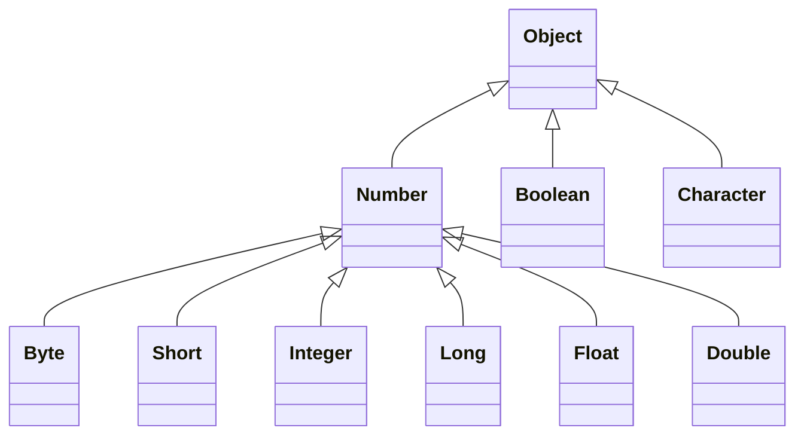

Em Java, **boxing e unboxing são automáticos** (chamados de *autoboxing*/*auto-unboxing*) — não é preciso escrever nenhuma conversão manual:

```java
Integer x = 10;   // autoboxing: o literal int 10 já "nasce" empacotado num Integer
int y = x * 2;    // auto-unboxing: x é desempacotado de volta pra int para a conta funcionar
```

> 💡 **Analogia:** pense num primitivo como um produto solto na prateleira, e o wrapper como o mesmo produto dentro de uma caixa lacrada, pronta para envio (só objetos — coisas "embaladas" — podem entrar no sistema de encomendas/correios, que aqui representa tudo que exige um tipo referência). *Boxing* é embalar o produto; *unboxing* é abrir a caixa para usar o produto direto de novo. Java faz essa embalagem/desembalagem sozinho, sempre que o contexto exige um tipo ou outro.

**Uso comum — campos de entidades em sistemas de informação:** este é o motivo prático mais importante para usar wrapper classes, segundo o próprio material do curso. Como tipos referência aceitam `null` e usufruem dos recursos de OO, é comum ver campos de entidade declarados assim:

```java
public class Product {
    public String name;
    public Double price;
    public Integer quantity;
    // ...
}
```

Em vez de `double price` e `int quantity`. A diferença na prática:

#### Exemplos consolidando o uso real

1. **Distinguir "não informado" de "zero":** com `int quantity`, não existe forma de representar "esse produto ainda não teve a quantidade preenchida" — o valor padrão já é `0` (seção [8.1](#81-tipos-referência-vs-tipos-valor)), então `0` e "não informado" ficam indistinguíveis. Com `Integer quantity`, o campo pode ser `null` (verdadeiramente vazio) **ou** `0` (preenchido, e o valor é zero mesmo) — dois estados diferentes, representáveis sem gambiarra.

   ```java
   Integer quantity = null; // ainda não sabemos quantas unidades existem
   // ...
   if (quantity == null) {
       System.out.println("Quantidade ainda não cadastrada.");
   }
   ```

2. **Coleções genéricas só aceitam tipos referência:** uma `List` (que ainda veremos em detalhe) não pode ser declarada com tipo primitivo — `List<int>` nem compila. Precisa ser `List<Integer>`:

   ```java
   List<Integer> ages = new ArrayList<>();
   ages.add(25); // autoboxing: o int 25 vira Integer aqui, automaticamente
   ```

3. **Cuidado ao comparar wrappers com `==`:** como wrapper classes são tipos referência, `==` compara **se são o mesmo objeto** (o mesmo endereço no Heap, seção [8.1](#81-tipos-referência-vs-tipos-valor)) — não se os valores são iguais. Java otimiza e reaproveita objetos `Integer` para valores pequenos (entre -128 e 127), o que mascara o problema até ele aparecer com valores maiores:

   ```java
   Integer a = 100;
   Integer b = 100;
   System.out.println(a == b);        // true (valores pequenos, objeto reaproveitado)

   Integer c = 200;
   Integer d = 200;
   System.out.println(c == d);        // false! são dois objetos Integer diferentes
   System.out.println(c.equals(d));   // true — a forma correta de comparar valores
   ```

   > ⚠️ A regra prática: para comparar o **valor** de dois wrappers, use sempre `.equals(...)`, nunca `==`. O `==` só é seguro para primitivos de verdade (`int a == int b`), porque aí não existe objeto envolvido — apenas comparação direta de valores nas caixas da Stack.

### 8.6 Laço `for each`

O `for each` é uma sintaxe **opcional e simplificada** para percorrer uma coleção (um vetor, ou as listas que veremos em seguida).

**Sintaxe:**

```java
for (Tipo apelido : coleção) {
    <comando 1>
    <comando 2>
}
```

> 🎯 **Como ler um `for each` em voz alta:** *"para cada `<apelido>` em `<coleção>`, faça tal coisa"*. Esse jeito de ler o laço em palavras — em vez de pensar em índices — é o que realmente ajuda a fixar a sintaxe.

**Comparando com o `for` tradicional:**

```java
String[] vect = new String[] {"Maria", "Bob", "Alex"};

for (int i = 0; i < vect.length; i++) {
    System.out.println(vect[i]);
}

for (String obj : vect) {
    System.out.println(obj);
}
```

As duas versões imprimem exatamente a mesma coisa. A diferença está em **como** cada uma acessa os elementos: no `for` tradicional, é preciso controlar manualmente um índice `i` e usar `vect[i]` para "ir buscar" o objeto daquela posição. No `for each`, a variável declarada logo ali (`String obj`) **já é, a cada volta, o próprio objeto da coleção** — sem precisar de índice nenhum nem de `vect[i]` para chegar até ele. Ler `for (String obj : vect)` já é, literalmente, "para cada `obj` contido em `vect`, faça...".

> 💡 O `for each` é a opção mais simples sempre que o objetivo é apenas **percorrer** todos os elementos, um a um. Quando o índice em si é necessário para algo (por exemplo, usar a posição como número do quarto, como no exercício da seção 9, ou percorrer dois vetores em paralelo pela mesma posição), o `for` tradicional continua sendo a ferramenta certa — o `for each` não expõe nenhum índice para usar.

### 8.7 Listas — Parte 1

Depois de vetores, entra em cena uma segunda estrutura para guardar coleções de dados: a **lista**. Esta primeira aula é conceitual — o uso prático (métodos, manipulação) vem na Parte 2.

#### O que é uma lista

Assim como um vetor (seção [8.3](#83-vetores--parte-1)), uma lista é uma estrutura de dados:

- **Homogênea** — todos os elementos são do mesmo tipo.
- **Ordenada** — os elementos são acessados por meio de posições.

Mas com diferenças importantes em relação ao vetor:

- **Começa vazia**, e seus elementos são alocados **sob demanda** (um de cada vez, conforme são adicionados) — não existe um "tamanho" fixado de antemão como em `new double[n]`.
- Cada elemento ocupa um **"nó"** (ou *nodo*) da lista.

**Desenho conceitual** (cada nó guarda o valor **e** uma ligação para o próximo nó):

```
myList
┌───────┐    ┌───────┐    ┌───────┐
│ (0)     │    │ (1)     │    │ (2)     │
│ 1.72 ●──┼───▶│ 1.56 ●──┼───▶│ 1.80 X  │
└───────┘    └───────┘    └───────┘
```

**Desenho simplificado** (o jeito mais comum de visualizar no dia a dia, parecido com um vetor indexado):

```
myList
0 │ 1.72
1 │ 1.56
2 │ 1.80
```

#### `List` é uma interface, não uma classe concreta

O tipo usado para declarar uma lista é `List` — mas `List` é uma **interface**, e quem de fato implementa o comportamento são classes como `ArrayList`, `LinkedList`, entre outras. *(Interfaces ainda são um assunto formal mais à frente no curso — mas `List` já serve como primeiro contato prático com a ideia: existe um "contrato" — `List` — que descreve **o que** uma lista sabe fazer, e diferentes classes concretas decidem **como** fazer isso por baixo dos panos.)*

> 📚 **Referência oficial:** [`java.util.List`](https://docs.oracle.com/javase/10/docs/api/java/util/List.html), na documentação da Oracle.

**Vantagens e desvantagens em relação a um vetor:**

| Vantagens | Desvantagens |
|---|---|
| Tamanho **variável** (cresce e encolhe sob demanda) | Acesso sequencial aos elementos * |
| Facilidade para realizar inserções e remoções | |

> ⚠️ **Sobre o `*` da desvantagem:** o material do curso marca "acesso sequencial aos elementos" como desvantagem — coerente com o desenho conceitual de nós ligados acima, onde para chegar ao elemento da posição `5` seria preciso "andar" nó por nó a partir do início. **Mas essa desvantagem depende de qual classe concreta implementa a lista.** Ela é real para uma `LinkedList` (que de fato usa nós ligados por baixo dos panos). Já numa `ArrayList` — a implementação mais usada no dia a dia —, os elementos ficam guardados internamente num array de verdade, então o acesso por posição é **direto**, igual ao "desenho simplificado" acima — não sequencial. Ou seja: a desvantagem é do **conceito geral** de lista, mas pode deixar de valer dependendo de qual implementação (`ArrayList`, `LinkedList`, ...) é escolhida.

#### O que vem a seguir

O checklist do material lista alguns assuntos ainda pendentes, que vão aparecer formalmente mais à frente no curso: **interfaces**, **generics** e **predicados (lambda)**. `List<Tipo>` já é um primeiro contato com *generics* (o `<Tipo>` entre os sinais de menor/maior, dizendo qual tipo de elemento aquela lista guarda) — mesmo sem entrar no formalismo ainda.

### 8.8 Listas — Parte 2 (operações, predicados e expressões lambda)

Esta aula colocou a `List` da seção [8.7](#87-listas--parte-1) em prática. Antes das operações, vale reforçar a declaração:

```java
List<String> list = new ArrayList<>();
```

Repare: a variável é declarada com o **tipo da interface** (`List`), mas instanciada com uma **classe concreta** (`ArrayList`) — a mesma ideia de "contrato vs. implementação" da seção [8.7](#87-listas--parte-1). Isso é considerado boa prática em Java: o resto do código só depende de `List` (o que a lista sabe fazer), nunca de `ArrayList` especificamente — trocar para `LinkedList` no futuro exigiria mudar só essa linha.

#### Principais operações

| Operação | O que faz |
|---|---|
| `list.size()` | Retorna a quantidade de elementos na lista |
| `list.get(posicao)` | Retorna o elemento numa posição específica |
| `list.add(obj)` | Adiciona um elemento ao **final** da lista |
| `list.add(posicao, obj)` | Insere um elemento numa posição específica, empurrando os demais |
| `list.remove(obj)` | Remove a **primeira ocorrência** do objeto informado |
| `list.remove(posicao)` | Remove o elemento de uma posição específica |
| `list.removeIf(predicado)` | Remove **todos** os elementos que satisfazem uma condição |
| `list.indexOf(obj)` | Retorna a posição da **primeira** ocorrência do objeto (ou `-1` se não existir) |
| `list.lastIndexOf(obj)` | Retorna a posição da **última** ocorrência do objeto (ou `-1` se não existir) |

#### Predicados e expressões lambda (resumo)

Os métodos `removeIf` e as operações de *stream* abaixo têm algo em comum: todos recebem, como argumento, **uma condição** a ser testada em cada elemento — não um valor pronto. Dois conceitos tornam isso possível:

- **Predicado (`Predicate`):** representa, de forma abstrata, "uma pergunta de sim/não sobre um elemento" — um teste que recebe um valor e devolve `true` ou `false`. É o "molde" do que pode ser passado para `removeIf`, `filter`, etc.
- **Expressão lambda:** a forma compacta de escrever essa pergunta **na hora**, sem precisar criar uma classe ou método separado para isso. Sintaxe básica: `parametro -> expressão`.

```java
list.removeIf(x -> x.charAt(0) == 'M');
```

Lendo em voz alta: *"remova de `list` todo `x` cujo primeiro caractere seja `'M'`"*. O trecho `x -> x.charAt(0) == 'M'` é a expressão lambda: `x` é o parâmetro (representa, um de cada vez, cada elemento da lista), e `x.charAt(0) == 'M'` é o teste — o predicado propriamente dito, avaliado para cada `x`.

> 💬 Interfaces, *generics* e o formalismo por trás de `Predicate` ainda serão vistos em detalhe mais à frente no curso — este resumo serve só para o código abaixo não parecer "mágica" enquanto isso não chega.

#### Demo completo

```java
package application;

import java.util.ArrayList;
import java.util.List;
import java.util.stream.Collectors;

public class Program {
    public static void main(String[] args) {
        List<String> list = new ArrayList<>();

        list.add("Maria");
        list.add("Alex");
        list.add("Bob");
        list.add("Anna");
        list.add(2, "Marco");

        System.out.println(list.size());
        for (String x : list) {
            System.out.println(x);
        }

        System.out.println("---------------------");
        list.removeIf(x -> x.charAt(0) == 'M');
        for (String x : list) {
            System.out.println(x);
        }

        System.out.println("---------------------");
        System.out.println("Index of Bob: " + list.indexOf("Bob"));
        System.out.println("Index of Marco: " + list.indexOf("Marco"));

        System.out.println("---------------------");
        List<String> result = list.stream().filter(x -> x.charAt(0) == 'A').toList();
        for (String x : result) {
            System.out.println(x);
        }

        System.out.println("---------------------");
        String name = list.stream().filter(x -> x.charAt(0) == 'J').findFirst().orElse(null);
        System.out.println(name);
    }
}
```

**Saída:**

```
5
Maria
Alex
Marco
Bob
Anna
---------------------
Alex
Bob
Anna
---------------------
Index of Bob: 1
Index of Marco: -1
---------------------
Alex
Anna
---------------------
null
```

Percorrendo a lógica do `Demo`:

1. `list.add(2, "Marco")` insere `"Marco"` na posição `2`, empurrando `"Bob"` e `"Anna"` uma casa para frente — por isso a ordem final da primeira impressão é `Maria, Alex, Marco, Bob, Anna`.
2. `list.removeIf(x -> x.charAt(0) == 'M')` remove **todos** os elementos que começam com `'M'` — tanto `"Maria"` quanto `"Marco"` somem de uma vez.
3. Depois da remoção, `"Marco"` não existe mais na lista, então `list.indexOf("Marco")` retorna `-1`.
4. `list.stream().filter(x -> x.charAt(0) == 'A').toList()` percorre a lista, mantém só quem começa com `'A'` (`"Alex"`, `"Anna"`) e devolve uma **nova lista** com esse resultado — a lista original (`list`) não é alterada.
5. `list.stream().filter(x -> x.charAt(0) == 'J').findFirst().orElse(null)` procura o primeiro elemento começando com `'J'`; como não existe nenhum, `findFirst()` não encontra nada e `.orElse(null)` devolve `null` como valor padrão.

> ⚠️ **Uma diferença em relação ao material de apoio:** o professor converteu o resultado do `filter` de volta para lista com `.collect(Collectors.toList())`. Nesta implementação, o próprio IntelliJ sugeriu `.toList()` no final da cadeia — mais curto, e o programa funciona identicamente. A diferença real entre os dois (sutil, mas vale saber): `.toList()` (adicionado na API de Streams a partir do Java 16) sempre devolve uma lista **imutável** (tentar `result.add(...)` depois lançaria erro); já `Collectors.toList()` não dá nenhuma garantia formal sobre o tipo devolvido — na prática costuma ser uma lista mutável, mas isso é detalhe de implementação, não uma garantia da API. Para este exercício (onde `result` só é lido, nunca alterado), os dois se comportam exatamente igual.

### 8.9 Matrizes (teoria)

Esta aula cobriu só a **teoria** de matrizes — a prática (declaração, instanciação, acesso aos elementos e a propriedade `length`) fica para a próxima aula.

Em programação, **matriz** é o nome dado a arranjos **bidimensionais**. Vale já guardar uma forma de pensar sobre ela: uma matriz é, essencialmente, um **"vetor de vetores"** — cada posição de uma dimensão poderia ser vista como um vetor à parte na outra dimensão.

Assim como o vetor (seção [8.3](#83-vetores--parte-1)), uma matriz é uma estrutura de dados:

- **Homogênea** — todos os elementos são do mesmo tipo.
- **Ordenada** — os elementos são acessados por posição, agora com **dois índices** (linha e coluna) em vez de um só.
- **Alocada de uma vez só**, num bloco contíguo de memória.

| Vantagens | Desvantagens |
|---|---|
| Acesso imediato a qualquer elemento pela sua posição (linha, coluna) | Tamanho fixo |
| | Dificuldade para inserir ou remover elementos |

> 💡 Repare que são **exatamente as mesmas** vantagens e desvantagens do vetor (seção [8.3](#83-vetores--parte-1)) — faz sentido, já que uma matriz é estruturalmente a mesma ideia, apenas estendida para duas dimensões.

**Exemplo conceitual — uma matriz `myMat` de 3 linhas por 4 colunas:**

| | 0 | 1 | 2 | 3 |
|---|---|---|---|---|
| **0** | 3.5 | 17.0 | 12.3 | 8.2 |
| **1** | 4.1 | 6.2 | 7.5 | 2.9 |
| **2** | 11.0 | 9.5 | 14.8 | 21.7 |

Cada elemento de `myMat` é localizado por um par (linha, coluna) — por exemplo, o valor `7.5` está na linha `1`, coluna `2`.

### 8.10 Matrizes na prática: linhas, colunas e um exemplo simples

Antes mesmo da aula prática oficial do curso, um exercício próprio ajudou a fixar o conceito: um programa para ler `id`, nome e email de `N` usuários, guardando tudo numa matriz.

#### O que de fato são "linha" e "coluna" em `[][]`

A convenção universal (a mesma da matemática) é: **o primeiro índice é sempre a linha, o segundo é sempre a coluna** — `mat[linha][coluna]`.

```java
String[][] mat = new String[u][3];
```

Isso cria uma matriz com `u` **linhas** e `3` **colunas**.

> 💡 **Analogia:** pense numa planilha. Cada **linha** é um registro completo — aqui, **um usuário**. Cada **coluna** é um campo daquele registro — aqui, **id, nome, email** (colunas `0`, `1` e `2`). `mat[i][j]` é "vá até a linha `i`, depois ande até a coluna `j`" — exatamente como apontar para uma célula específica de uma planilha.

Duas propriedades derivam direto disso:

- `mat.length` → quantidade de **linhas** (quantos usuários existem).
- `mat[i].length` → quantidade de **colunas daquela linha** (aqui, sempre `3`).

#### O programa

```java
package application;

import java.util.Locale;
import java.util.Scanner;

public class Program {
    public static void main(String[] args) {
        Scanner sc = new Scanner(System.in);
        Locale.setDefault(Locale.US);

        System.out.print("Informe a quantidade de usuarios: ");
        int u = sc.nextInt();
        sc.nextLine();

        String[][] mat = new String[u][3];

        for (int i = 0; i < mat.length; i++) {
            System.out.println();
            System.out.println("Usuario #" + (i + 1));

            System.out.print("Id: ");
            mat[i][0] = sc.nextLine();

            System.out.print("Nome: ");
            mat[i][1] = sc.nextLine();

            System.out.print("Email: ");
            mat[i][2] = sc.nextLine();
        }

        System.out.println();
        System.out.println("Usuarios cadastrados:");
        for (int i = 0; i < mat.length; i++) {
            for (int j = 0; j < mat[i].length; j++) {
                System.out.print(mat[i][j] + " | ");
            }
            System.out.println();
        }

        sc.close();
    }
}
```

**Saída (exemplo com 2 usuários):**

```
Informe a quantidade de usuarios: 2

Usuario #1
Id: 1
Nome: Joao Silva
Email: joao@gmail.com

Usuario #2
Id: 2
Nome: Maria Souza
Email: maria@gmail.com

Usuarios cadastrados:
1 | Joao Silva | joao@gmail.com |
2 | Maria Souza | maria@gmail.com |
```

Repare que **preencher** e **percorrer** a matriz pedem abordagens diferentes: para preencher, já se sabe exatamente quais são as 3 colunas (`mat[i][0]`, `mat[i][1]`, `mat[i][2]`), então um único `for` (das linhas) resolve. Para **imprimir tudo**, sem saber de antemão quantas colunas existem em cada linha, um `for` de dentro do outro — percorrendo `mat[i].length` — é o que garante passar por cada célula, seja qual for o tamanho da matriz.

#### Os erros da primeira tentativa

A primeira versão desse programa tinha três bugs, todos instrutivos:

```java
for (int j = 0; j < mat[i].length; i++) {  // ❌ incrementa 'i', não 'j'
    mat[i][j] = sc.nextLine();
    break;                                   // ❌ sai do laço logo na 1ª volta
}
```

1. **`break` incondicional** dentro do laço de colunas — ele executava sempre, na primeira volta, então o laço nunca passava da primeira posição: só `mat[i][0]` (o id) era preenchido, nome e email nunca eram lidos.
2. **Incremento errado** (`i++` em vez de `j++`) — mesmo sem o `break`, isso bagunçaria tudo: `j` nunca mudaria, e o `i` do laço de fora (que já estava sendo controlado por ele mesmo) levaria incrementos indevidos vindos de dentro.
3. Na hora de **imprimir**, os índices apareciam **invertidos** (`mat[j][i]` em vez de `mat[i][j]`) — uma confusão fácil de acontecer bem no momento em que "linha" e "coluna" ainda não estão automáticos na cabeça.

> 💡 Também faltava um `sc.nextLine();` logo depois do `sc.nextInt()` que lê `u` — o mesmo problema clássico do `Scanner` já documentado na seção [3.7](#37-entrada-de-dados-scanner): sem esse "descarte", o primeiro `nextLine()` do laço consumiria a quebra de linha pendente e leria o primeiro campo como vazio.

---

## 10. Tópicos Especiais em Java

### 10.1 Data-Hora — Introdução: local, global e duração

Ao trabalhar com datas e horários em código, existem **três conceitos diferentes** por trás do que parece, à primeira vista, ser "só uma data":

| Conceito | Definição |
|---|---|
| **Data-[hora] local** | ano-mês-dia-[hora], **sem** fuso horário — a hora é opcional |
| **Data-hora global** | ano-mês-dia-hora, **com** fuso horário |
| **Duração** | tempo decorrido **entre** duas data-horas |

> 💡 **Analogia rápida para os três:** escrever "reunião às 15h" num calendário de parede, dentro de um único escritório, é **data-hora local** — ninguém ali precisa se perguntar "15h de onde?", está implícito. Já marcar uma videochamada com pessoas em três países é **data-hora global** — é preciso fixar um instante universal exato, que cada participante depois converte pro seu próprio horário. E medir "quanto tempo essa chamada durou" é **duração** — não importa em que fuso ela começou, só importa o intervalo decorrido.

#### Quando usar cada uma

**Data-[hora] local** — quando o momento exato **não** interessa a pessoas de outro fuso horário. Uso comum: sistemas de região única, planilhas (Excel).

- *"Data de nascimento: `15/06/2001`"*
- *"Data-hora da venda: `13/08/2022 às 15:32`"* (presumindo que o fuso não importa aqui)

**Data-hora global** — quando o momento exato **interessa** a pessoas de outro fuso horário. Uso comum: sistemas multi-região, aplicações web.

- *"Quando será o sorteio? `21/08/2022 às 20h (horário de São Paulo)`"*
- *"Quando o comentário foi postado? `há 17 minutos`"*
- *"Quando foi realizada a venda? `13/08/2022 às 15:32 (horário de São Paulo)`"*
- *"Início e fim do evento? `21/08/2022 às 14h até 16h (horário de São Paulo)`"*

#### Exemplo — o mesmo instante, exibido diferente por fuso horário

Este é o ponto-chave de data-hora **global**: existe **um único instante real** no universo, mas cada pessoa o enxerga formatado no seu próprio horário local. O instante `2022-07-23T14:30:00Z` (`Z` = UTC, fuso zero), por exemplo, dispara a mesma notificação — *"A live começa:"* — com horários diferentes para cada usuário:

| Local do usuário | Fuso horário | Horário exibido |
|---|---|---|
| Londres / UTC | GMT+0 | 14:30 |
| Portugal | GMT+1 | 15:30 |
| São Paulo | GMT-3 | 11:30 |

O dado salvo (no banco de dados, numa API) é sempre o mesmo instante universal — só a **apresentação** muda, calculada a partir do fuso de quem está olhando.

### 10.2 Entendendo timezone (fuso horário)

- **GMT** (*Greenwich Mean Time*) — o horário de Londres.
- **UTC** (*Coordinated Universal Time*) — o padrão universal, também chamado de **"Z"** ou *Zulu time*. Na prática, equivalente ao GMT para a maioria dos usos.
- Todo outro fuso horário é definido **em relação** ao GMT/UTC:
  - São Paulo: `GMT-3`
  - Manaus: `GMT-4`
  - Portugal: `GMT+1`
- Muitas linguagens e tecnologias também identificam fusos por **nome**, em vez de só o deslocamento numérico — por exemplo, `"US/Pacific"`, `"America/Sao_Paulo"`.

### 10.3 Padrão ISO 8601

É o formato de texto padrão para representar data-hora, usado pela maioria das linguagens e APIs. A letra `T` separa a parte da data da parte da hora.

**Data-[hora] local** (sem indicação de fuso):

```
2022-07-21                 // ano-mês-dia
2022-07-21T14:52           // ano-mês-dia + hora:minuto
2022-07-22T14:52:09        // ano-mês-dia + hora:minuto:segundo
2022-07-22T14:52:09.4073   // ano-mês-dia + hora:minuto:segundo.fração-de-segundo
```

**Data-hora global** (sempre com indicação de fuso — `Z` para UTC, ou um deslocamento explícito):

```
2022-07-23T14:52:09Z             // ano-mês-dia + hora:minuto:segundo, fuso UTC ("Z")
2022-07-23T14:52:09.254935Z      // ano-mês-dia + hora:minuto:segundo.fração-de-segundo, fuso UTC ("Z")
2022-07-23T14:52:09-03:00        // ano-mês-dia + hora:minuto:segundo, fuso GMT-3 (deslocamento explícito)
```

> 💡 Repare no padrão: quanto mais preciso o momento, mais coisa aparece à direita (frações de segundo) — e a única diferença estrutural entre local e global é o **sufixo de fuso** no final (`Z` ou `±HH:MM`).

### 10.4 Instanciando data-hora em Java

Na prática, Java representa os conceitos da seção [10.1](#101-data-hora--introdução-local-global-e-duração) com classes específicas do pacote `java.time`:

- **`LocalDate`** / **`LocalDateTime`** → data-[hora] **local** (sem fuso).
- **`Instant`** → data-hora **global** (sempre um instante universal, internamente em UTC).

Existem quatro formas diferentes de **instanciar** uma dessas classes, cada uma resolvendo um problema real diferente:

| Forma de instanciar | Exemplo | O que faz | Caso de uso real |
|---|---|---|---|
| **Momento atual** | `LocalDate.now()`<br>`LocalDateTime.now()`<br>`Instant.now()` | Captura o instante exato em que o código está rodando | Registrar quando um registro foi criado (`createdAt`), timestamp de um log, "comentário postado agora" |
| **Texto ISO 8601** | `LocalDate.parse("2022-07-20")`<br>`LocalDateTime.parse("2022-07-20T01:30:26")`<br>`Instant.parse("2022-07-20T01:30:26Z")` | Converte um texto já no padrão ISO 8601 (seção [10.3](#103-padrão-iso-8601)) direto para o objeto de data-hora | Converter uma data-hora recebida de uma API/JSON — que quase sempre chega em ISO 8601 — para um objeto manipulável em Java |
| **Texto em formato customizado** | `LocalDate.parse("20/07/2022", fmt1)`, com `fmt1 = DateTimeFormatter.ofPattern("dd/MM/yyyy")` | Converte um texto num formato **não-ISO**, desde que se informe o padrão exato daquele formato | Ler uma data digitada num formulário brasileiro (`dd/MM/yyyy`), ou importar uma planilha/CSV com datas fora do padrão ISO |
| **Componentes separados** | `LocalDate.of(2022, 7, 20)`<br>`LocalDateTime.of(2022, 7, 20, 1, 30)` | Monta a data-hora diretamente a partir de dia, mês, ano (e hora/minuto) — sem nenhum texto envolvido | Montar uma data a partir de três campos separados de um formulário (dia/mês/ano em `<select>`s distintos), ou gerar datas de teste no código |

> 📚 **Referência oficial** citada no material da aula: [`DateTimeFormatter`](https://docs.oracle.com/en/java/javase/17/docs/api/java.base/java/time/format/DateTimeFormatter.html), na documentação da Oracle — é lá que se consulta o significado de cada letra de um padrão customizado (`dd`, `MM`, `yyyy`, `HH`, `mm`, etc.).

**O programa completo, testando as quatro formas:**

```java
package application;

import java.time.Instant;
import java.time.LocalDate;
import java.time.LocalDateTime;
import java.time.format.DateTimeFormatter;

public class Program {

    public static void main(String[] args) {

        // https://docs.oracle.com/en/java/javase/17/docs/api/java.base/java/time/format/DateTimeFormatter.html
        DateTimeFormatter fmt1 = DateTimeFormatter.ofPattern("dd/MM/yyyy");
        DateTimeFormatter fmt2 = DateTimeFormatter.ofPattern("dd/MM/yyyy HH:mm");

        LocalDate d01 = LocalDate.now();
        LocalDateTime d02 = LocalDateTime.now();
        Instant d03 = Instant.now();

        LocalDate d04 = LocalDate.parse("2022-07-20");
        LocalDateTime d05 = LocalDateTime.parse("2022-07-20T01:30:26");
        Instant d06 = Instant.parse("2022-07-20T01:30:26Z");
        Instant d07 = Instant.parse("2022-07-20T01:30:26-03:00");

        LocalDate d08 = LocalDate.parse("20/07/2022", fmt1);
        LocalDateTime d09 = LocalDateTime.parse("20/07/2022 01:30", fmt2);

        LocalDate d10 = LocalDate.of(2022, 07, 20);
        LocalDateTime d11 = LocalDateTime.of(2022, 07, 20, 1, 30);

        System.out.println("d01 = " + d01.toString());
        System.out.println("d02 = " + d02.toString());
        System.out.println("d03 = " + d03.toString());
        System.out.println("d04 = " + d04.toString());
        System.out.println("d05 = " + d05.toString());
        System.out.println("d06 = " + d06.toString());
        System.out.println("d07 = " + d07.toString());
        System.out.println("d08 = " + d08.toString());
        System.out.println("d09 = " + d09.toString());
        System.out.println("d10 = " + d10.toString());
        System.out.println("d11 = " + d11.toString());
    }
}
```

**Saída (`d01`/`d02`/`d03` variam conforme o momento em que o programa roda — os demais são fixos):**

```
d01 = 2026-09-26
d02 = 2026-09-26T07:52:45.289931601
d03 = 2026-09-26T10:52:45.289961937Z
d04 = 2022-07-20
d05 = 2022-07-20T01:30:26
d06 = 2022-07-20T01:30:26Z
d07 = 2022-07-20T04:30:26Z
d08 = 2022-07-20
d09 = 2022-07-20T01:30
d10 = 2022-07-20
d11 = 2022-07-20T01:30
```

> 💡 **Reparando em `d07`:** o texto de entrada foi `"2022-07-20T01:30:26-03:00"` (01:30:26 no fuso `-03:00`), mas o `Instant` impresso mostra `2022-07-20T04:30:26Z`. Isso não é erro — é a prova concreta do conceito da seção [10.1](#101-data-hora--introdução-local-global-e-duração): um `Instant` representa **sempre** o mesmo ponto universal no tempo, e por padrão é exibido em UTC (`Z`), não importa qual fuso foi usado para criá-lo. `01:30:26` no fuso `-03:00` **é**, literalmente, o mesmo instante que `04:30:26Z` (`01:30 + 3h = 04:30`) — só a forma de escrever mudou, o momento real é idêntico.

### 10.5 Convertendo data-hora para texto

Se a aula anterior foi "texto → data-hora" (instanciação), esta é o caminho inverso: **data-hora → texto**, usando o mesmo `DateTimeFormatter` de [10.4](#104-instanciando-data-hora-em-java), agora no sentido de formatação.

| Técnica | Exemplo | O que faz | Quando usar |
|---|---|---|---|
| **`.format(formatter)`** (chamando pela data) | `d04.format(fmt1)` | Converte a data-hora para texto, aplicando as regras do `formatter` recebido | Forma mais comum — "formate esta data com este padrão" |
| **`formatter.format(date)`** (chamando pelo formatter) | `fmt1.format(d04)` | Mesmo resultado de `.format`, só invertendo quem chama quem | Útil quando o formatter já está em mãos e vai ser reaplicado a várias datas diferentes (ex: num laço) |
| **Formatter inline, sem variável** | `d04.format(DateTimeFormatter.ofPattern("dd/MM/yyyy"))` | Cria o `DateTimeFormatter` direto na própria chamada, sem guardá-lo numa variável | Formatação pontual, usada uma única vez — não compensa nomear uma variável só para isso |
| **Formatter com fuso — `.withZone(...)`** | `DateTimeFormatter.ofPattern("dd/MM/yyyy HH:mm").withZone(ZoneId.systemDefault())` | Anexa um fuso horário ao formatter, fazendo-o **converter** um `Instant` (global) para o horário local daquele fuso antes de formatar | Exibir, no fuso do usuário, uma data-hora global salva no banco — ex: horário de criação de um pedido, mostrado já convertido pro fuso de quem está vendo |
| **Formatters pré-definidos** | `DateTimeFormatter.ISO_DATE_TIME`, `DateTimeFormatter.ISO_INSTANT` | Constantes prontas da própria classe para os formatos ISO 8601 mais comuns, sem escrever o padrão manualmente | Gerar/consumir datas em ISO 8601 — o formato universal de troca de dados entre sistemas (APIs, JSON) — sem risco de errar o padrão na mão |
| **`toString()` padrão (sem formatter)** | `d06.toString()` | `LocalDate`, `LocalDateTime` e `Instant` já sabem se converter para texto sozinhos, no padrão ISO 8601, sem precisar de nenhum `DateTimeFormatter` | Quando o ISO 8601 puro já resolve — logs internos, chaves de cache, depuração |

#### `.format(formatter)` vs. `formatter.format(date)` — duas sintaxes, mesmo resultado

```java
System.out.println(d04.format(fmt1));   // chamando o format() a partir da data
System.out.println(fmt1.format(d04));   // chamando o format() a partir do formatter
```

As duas linhas imprimem exatamente a mesma coisa — Java só oferece o método `format` dos dois lados (na data-hora e no formatter) para dar flexibilidade em como o código fica mais natural de ler, dependendo do contexto. Não existe um "certo" ou "errado" aqui, só preferência de estilo.

#### O ponto central da aula: `.withZone(ZoneId.systemDefault())`

Este é o detalhe mais importante — e o que realmente diferencia formatar um `LocalDate`/`LocalDateTime` de formatar um `Instant`.

Um `Instant` **não tem** noção própria de "dia", "mês" ou "hora local" — ele é só um ponto puro na linha do tempo universal (seção [10.1](#101-data-hora--introdução-local-global-e-duração)). Então, o que acontece se tentarmos formatá-lo com um padrão que pede esses campos, sem informar nenhum fuso?

```java
Instant d06 = Instant.parse("2022-07-20T01:30:26Z");
DateTimeFormatter fmt2 = DateTimeFormatter.ofPattern("dd/MM/yyyy HH:mm");

System.out.println(fmt2.format(d06));
```

```
Exception in thread "main" java.time.temporal.UnsupportedTemporalTypeException: Unsupported field: DayOfMonth
```

**Erro de verdade** (testei para confirmar) — porque "dia do mês" só existe depois que o instante universal é "quebrado" segundo **algum** calendário/fuso específico, e o `Instant` sozinho não sabe qual fuso usar para fazer essa quebra. É exatamente essa informação que falta e que o `.withZone(...)` fornece:

```java
DateTimeFormatter fmt3 = DateTimeFormatter
        .ofPattern("dd/MM/yyyy HH:mm")
        .withZone(ZoneId.systemDefault());

System.out.println(fmt3.format(d06));
```

`ZoneId.systemDefault()` pega o fuso horário configurado na **máquina onde o programa está rodando**. Com o formatter "sabendo" qual fuso usar, ele consegue converter o instante universal para uma data e hora de calendário de verdade, e só então aplicar o padrão `dd/MM/yyyy HH:mm`.

> 💡 **Na prática, rodando numa máquina configurada para `America/Sao_Paulo` (GMT-3):** `d06` é o instante `2022-07-20T01:30:26Z` (01:30:26 em UTC). Convertido para GMT-3 (3 horas **atrás** de UTC), esse mesmo instante cai em `19/07/2022 22:30` — **um dia antes** do que aparece no texto ISO original! Isso mostra bem por que a conversão de fuso importa de verdade: sem ela, um sistema poderia mostrar a data errada para o usuário, não só a hora errada.

#### Formatters pré-definidos e o `toString()` padrão

`DateTimeFormatter.ISO_DATE_TIME` e `DateTimeFormatter.ISO_INSTANT` são constantes já prontas na própria classe, para quando o formato desejado já é um dos padrões ISO 8601 — evita ter que escrever o *pattern* na mão e arriscar errar um detalhe.

E vale lembrar: `LocalDate`, `LocalDateTime` e `Instant` **já vêm** com um `toString()` próprio, que devolve o texto no padrão ISO 8601 sem precisar de nenhum `DateTimeFormatter` — foi isso que já tínhamos usado, sem perceber, em toda a seção [10.4](#104-instanciando-data-hora-em-java).

#### O programa completo

```java
package application;

import java.time.Instant;
import java.time.LocalDate;
import java.time.LocalDateTime;
import java.time.ZoneId;
import java.time.format.DateTimeFormatter;

public class Program {

    public static void main(String[] args) {

        LocalDate d04 = LocalDate.parse("2022-07-20");
        LocalDateTime d05 = LocalDateTime.parse("2022-07-20T01:30:26");
        Instant d06 = Instant.parse("2022-07-20T01:30:26Z");

        DateTimeFormatter fmt1 = DateTimeFormatter.ofPattern("dd/MM/yyyy");
        DateTimeFormatter fmt2 = DateTimeFormatter.ofPattern("dd/MM/yyyy HH:mm");
        DateTimeFormatter fmt3 = DateTimeFormatter.ofPattern("dd/MM/yyyy HH:mm").withZone(ZoneId.systemDefault());
        DateTimeFormatter fmt4 = DateTimeFormatter.ISO_DATE_TIME;
        DateTimeFormatter fmt5 = DateTimeFormatter.ISO_INSTANT;

        System.out.println("d04 = " + d04.format(fmt1));
        System.out.println("d04 = " + fmt1.format(d04));
        System.out.println("d04 = " + d04.format(DateTimeFormatter.ofPattern("dd/MM/yyyy")));

        System.out.println("d05 = " + d05.format(fmt1));
        System.out.println("d05 = " + d05.format(fmt2));
        System.out.println("d05 = " + d05.format(fmt4));

        System.out.println("d06 = " + fmt3.format(d06));
        System.out.println("d06 = " + fmt5.format(d06));
        System.out.println("d06 = " + d06.toString());
    }
}
```

**Saída (rodando numa máquina no fuso `America/Sao_Paulo`, GMT-3):**

```
d04 = 20/07/2022
d04 = 20/07/2022
d04 = 20/07/2022
d05 = 20/07/2022
d05 = 20/07/2022 01:30
d05 = 2022-07-20T01:30:26
d06 = 19/07/2022 22:30
d06 = 2022-07-20T01:30:26Z
d06 = 2022-07-20T01:30:26Z
```

> ⚠️ **A saída de `d06` depende do fuso da máquina:** rodar esse mesmo código em outra máquina, com outro fuso configurado (`ZoneId.systemDefault()` seria diferente), mudaria o resultado da primeira linha de `d06` (`fmt3.format(d06)`) — as outras duas (`fmt5`/`toString()`) continuariam iguais, porque não dependem de fuso nenhum, sempre mostram o instante em UTC.

### 10.6 Convertendo data-hora global para local, e obtendo componentes

Esta aula junta duas operações da lista de [10.1](#101-data-hora--introdução-local-global-e-duração): **converter** uma data-hora global em local (de verdade, virando um novo objeto — não só formatando um texto, como em [10.5](#105-convertendo-data-hora-para-texto)), e **extrair** pedaços (dia, mês, ano, hora...) de uma data-hora já existente.

#### Convertendo `Instant` (global) em `LocalDate`/`LocalDateTime` (local)

| Técnica | Exemplo | O que faz | Caso de uso real |
|---|---|---|---|
| `LocalDate.ofInstant(instant, zoneId)` | `LocalDate.ofInstant(d06, ZoneId.systemDefault())` | Converte um `Instant` (global) para uma **data local de verdade**, aplicando o fuso informado | Exibir só a data (sem hora) de um evento global, já convertida para o fuso do usuário |
| `LocalDateTime.ofInstant(instant, zoneId)` | `LocalDateTime.ofInstant(d06, ZoneId.of("Portugal"))` | Mesma conversão, preservando também o horário | Mostrar data **e** hora completas de um evento, já no fuso de quem está vendo |

A diferença para a seção [10.5](#105-convertendo-data-hora-para-texto) é importante: lá, `.withZone(...)` só mudava **como o texto aparecia** (a data-hora continuava sendo, por baixo dos panos, o mesmo `Instant`). Aqui, `ofInstant(...)` gera um **objeto novo**, de um tipo diferente (`LocalDate`/`LocalDateTime`) — de fato local, sem mais nenhuma pegada de fuso horário nele.

**Duas formas de indicar o fuso:**

```java
ZoneId.systemDefault()   // o fuso configurado na máquina onde o programa roda
ZoneId.of("Portugal")    // um fuso específico, indicado pelo nome
```

> 💡 Como saber quais nomes são aceitos em `ZoneId.of(...)`? O próprio Java expõe essa lista: `ZoneId.getAvailableZoneIds()` devolve todos os identificadores válidos (`"America/Sao_Paulo"`, `"Portugal"`, `"US/Pacific"`, e centenas de outros). É comum, numa aula assim, rodar um `for` só pra imprimir essa lista inteira e conferir o nome exato antes de usá-lo no código.

**Exemplo prático, convertendo o mesmo `Instant` para dois fusos diferentes:**

```java
Instant d06 = Instant.parse("2022-07-20T01:30:26Z");

LocalDate r1 = LocalDate.ofInstant(d06, ZoneId.systemDefault());  // fuso da máquina (GMT-3, neste caso)
LocalDate r2 = LocalDate.ofInstant(d06, ZoneId.of("Portugal"));   // GMT+1

LocalDateTime r3 = LocalDateTime.ofInstant(d06, ZoneId.systemDefault());
LocalDateTime r4 = LocalDateTime.ofInstant(d06, ZoneId.of("Portugal"));
```

**Saída (rodando numa máquina no fuso `America/Sao_Paulo`, GMT-3):**

```
r1 = 2022-07-19
r2 = 2022-07-20
r3 = 2022-07-19T22:30:26
r4 = 2022-07-20T02:30:26
```

> 💡 **Mesmo instante, datas diferentes — de novo:** `01:30:26Z` (UTC) em GMT-3 vira `22:30:26` do dia **anterior** (`r1`/`r3` caem em `19/07`); o mesmo instante em GMT+1 (Portugal) vira `02:30:26` do **mesmo** dia (`r2`/`r4` ficam em `20/07`). É a mesma lição de [10.5](#105-convertendo-data-hora-para-texto) reforçada: a diferença entre os dois fusos (GMT-3 para GMT+1 é uma diferença de 4 horas) é grande o bastante pra empurrar `01:30` da madrugada para o dia anterior num fuso, mas não no outro.

#### Obtendo componentes de uma data-hora local

| Método | Exemplo | Retorna | Caso de uso real |
|---|---|---|---|
| `.getDayOfMonth()` | `d04.getDayOfMonth()` | O dia do mês (1 a 31) | Validar regras de negócio por dia (ex: "só aceita pedidos até o dia 5") |
| `.getMonthValue()` | `d04.getMonthValue()` | O mês, como número (1 a 12) | Agrupar registros por mês num relatório |
| `.getYear()` | `d04.getYear()` | O ano | Calcular idade a partir de uma data de nascimento, filtrar registros por ano |
| `.getHour()` | `d05.getHour()` | A hora (0 a 23) | Aplicar uma regra que só vale em certo horário (ex: "desconto entre 18h e 20h") |
| `.getMinute()` | `d05.getMinute()` | O minuto (0 a 59) | Exibir separadamente "Hora: X Minuto: Y" num formulário de edição |

```java
LocalDate d04 = LocalDate.parse("2022-07-20");
LocalDateTime d05 = LocalDateTime.parse("2022-07-20T01:30:26");

System.out.println("d04 dia = " + d04.getDayOfMonth());
System.out.println("d04 mês = " + d04.getMonthValue());
System.out.println("d04 ano = " + d04.getYear());

System.out.println("d05 hora = " + d05.getHour());
System.out.println("d05 minutos = " + d05.getMinute());
```

**Saída:**

```
d04 dia = 20
d04 mês = 7
d04 ano = 2022
d05 hora = 1
d05 minutos = 30
```

> 💡 Repare que esses métodos só existem em `LocalDate`/`LocalDateTime` (tipos **locais**) — fazem todo sentido aí, porque "dia", "mês" e "hora" só existem depois que uma data-hora já foi quebrada segundo um calendário/fuso específico. Um `Instant` puro não tem `getDayOfMonth()` — é exatamente por isso que a conversão da primeira parte desta seção (`ofInstant(...)`) precisa acontecer **antes** de tentar extrair qualquer componente de uma data-hora que nasceu global.

### 10.7 Calculando com data-hora

Última das operações previstas em [10.1](#101-data-hora--introdução-local-global-e-duração): fazer **cálculos** com data-hora — somar/subtrair um período, e medir a **duração** entre duas data-horas.

#### Somando e subtraindo um período

| Técnica | Exemplo | Quando usar |
|---|---|---|
| `.plusDays(n)` / `.minusDays(n)` | `d04.minusDays(7)` (em `LocalDate` ou `LocalDateTime`) | Calcular uma data no passado/futuro em relação a uma data local — ex: "data de vencimento = hoje + 30 dias" |
| `.plus(n, unidade)` / `.minus(n, unidade)` | `d06.minus(7, ChronoUnit.DAYS)` (em `Instant`) | Mesma ideia, mas para um `Instant` — a unidade (`ChronoUnit.DAYS`, `HOURS`, `MINUTES`...) é informada explicitamente |

```java
LocalDate pastWeekDate = d04.minusDays(7);
LocalDate nextWeekDate = d04.plusDays(7);

LocalDateTime pastWeekLocalDate = d05.minusDays(7);
LocalDateTime nextWeekLocalDate = d05.plusDays(7);

Instant pastWeekInstant = d06.minus(7, ChronoUnit.DAYS);
Instant nextWeekInstant = d06.plus(7, ChronoUnit.DAYS);
```

> 💡 **Por que `Instant` usa `.minus(7, ChronoUnit.DAYS)` em vez de um `.minusDays(7)` direto, se ele nem tem `getDayOfMonth()` (seção [10.6](#106-convertendo-data-hora-global-para-local-e-obtendo-componentes))?** A diferença é sutil, mas importante: **extrair** "dia do mês" exige saber em que calendário/fuso aquele instante cai — por isso `Instant` não tem esse getter. Mas **somar uma duração fixa de tempo** (7 dias = exatamente 7 × 24h = 604.800 segundos) não depende de calendário nenhum, é matemática pura sobre a linha do tempo. É por isso que `Instant` aceita `plus`/`minus` com uma unidade de tempo (`ChronoUnit`), mesmo sem ter os getters de calendário.

#### Medindo a duração entre duas data-horas

`Duration.between(inicio, fim)` calcula o tempo decorrido entre duas data-horas — o terceiro conceito da seção [10.1](#101-data-hora--introdução-local-global-e-duração), finalmente em código.

```java
Duration t1 = Duration.between(pastWeekDate.atStartOfDay(), d04.atStartOfDay());
Duration t2 = Duration.between(pastWeekLocalDate, d05);
Duration t3 = Duration.between(pastWeekInstant, d06);
Duration t4 = Duration.between(d06, pastWeekInstant);
```

**Saída:**

```
pastWeekDate = 2022-07-13
nextWeekDate = 2022-07-27
pastWeekLocalDate = 2022-07-13T01:30:26
nextWeekLocalDate = 2022-07-27T01:30:26
pastWeekInstant = 2022-07-13T01:30:26Z
nextWeekInstant = 2022-07-27T01:30:26Z
t1 dias = 7
t2 dias = 7
t3 dias = 7
t4 dias = -7
```

Dois detalhes que valem atenção:

> ⚠️ **Por que `t1` precisou de `.atStartOfDay()`?** `Duration` mede tempo **exato** (horas, minutos, segundos) — e um `LocalDate` puro não tem nenhum componente de horário, só data. Por isso, `Duration.between` não aceita dois `LocalDate` diretamente: é preciso primeiro convertê-los para um ponto no tempo com horário, e `.atStartOfDay()` faz exatamente isso — transforma a data em `LocalDateTime` na meia-noite daquele dia (`2022-07-13T00:00:00`), viabilizando o cálculo. `t2` (com `LocalDateTime`) e `t3` (com `Instant`) não precisam desse truque, porque os dois já têm horário embutido.

> ⚠️ **A ordem dos argumentos importa — e muito:** `t3` é `Duration.between(pastWeekInstant, d06)` (passado → presente) e dá `7`; `t4` é `Duration.between(d06, pastWeekInstant)` (presente → passado, argumentos invertidos) e dá `-7`. `Duration.between(inicio, fim)` calcula sempre `fim - início` — inverter a ordem inverte o sinal do resultado. Isso não é bug nem acaso: é assim que se representa, por exemplo, "quanto tempo falta" (positivo) versus "quanto tempo já passou" (negativo), dependendo de qual dos dois instantes é passado primeiro.

> 💡 `.toDays()` converte a `Duration` (que internamente guarda segundos/nanossegundos) para um número inteiro de dias, **truncando** qualquer resto — `Duration.between(...).toDays()` com um intervalo de "6 dias e 20 horas", por exemplo, retornaria `6`, não `7`. Nos exemplos acima o intervalo é sempre exatamente 7 dias completos, então não há truncamento visível.

---

## 12. Enumerações e Composição

### 12.1 Enumerações

#### O que é um enum, de forma simples

Um **enum** (de *enumeration*) é um tipo especial que serve para representar **um conjunto fechado de valores possíveis** — uma lista fixa de opções, conhecida de antemão, onde nada além daquelas opções é um valor válido.

> 💡 **Analogia:** pense nos dias da semana. Existem exatamente 7 opções válidas — "Segunda", "Terça", ..., "Domingo" — e nenhuma outra coisa faz sentido nesse espaço (não existe "Sextou-feira" ou "Blursday"). Um enum é exatamente isso, aplicado ao código: uma lista fechada de valores válidos, e só.

A palavra-chave em Java é `enum`. A vantagem central de usá-lo, segundo o próprio material do curso, é **semântica** — código mais legível, e com uma rede de segurança extra: **o compilador passa a ajudar a garantir que só um valor válido seja usado**.

> 📚 **Referência oficial:** [tutorial de `enum`](https://docs.oracle.com/javase/tutorial/java/javaOO/enum.html), na documentação da Oracle.

#### O problema que o enum resolve

Imagine representar o status de um pedido (`Order`) sem enum — por exemplo, usando uma `String`:

```java
private String status; // "PENDING_PAYMENT", "PROCESSING", "SHIPPED", "DELIVERED"?
```

Nada impede alguém de digitar `"shipped"` (minúsculo), `"Shiped"` (com erro de digitação), ou até `"bananas"` — o compilador não tem como saber que só quatro textos específicos fazem sentido ali. Esses erros só apareceriam **em tempo de execução** (ou nem apareceriam, silenciosamente corrompendo dados).

Com um `enum`, os valores válidos passam a fazer parte do **tipo** em si:

```java
package entities.enums;

public enum OrderStatus {
    PENDING_PAYMENT,
    PROCESSING,
    SHIPPED,
    DELIVERED;
}
```

Agora, `OrderStatus` só pode valer uma dessas quatro coisas — tentar atribuir qualquer outra coisa a uma variável `OrderStatus` é **erro de compilação**, não um bug escondido esperando pra acontecer.

#### Exemplo do curso: ciclo de vida de um pedido

```java
package entities;

import entities.enums.OrderStatus;

import java.util.Date;

public class Order {
    private Integer id;
    private final Date moment;
    private final OrderStatus status;

    public Order(Integer id, Date moment, OrderStatus status) {
        this.id = id;
        this.moment = moment;
        this.status = status;
    }

    public Integer getId() {
        return id;
    }

    public Date getMoment() {
        return moment;
    }

    public OrderStatus getStatus() {
        return status;
    }

    @Override
    public String toString() {
        return "Order{" +
                "id=" + id +
                ", moment=" + moment +
                ", status=" + status +
                '}';
    }
}
```

```java
package application;

import entities.Order;
import entities.enums.OrderStatus;

import java.util.Date;

public class Program {

    public static void main(String[] args) {
        Order order = new Order(1080, new Date(), OrderStatus.DELIVERED);

        System.out.print(order);
    }
}
```

**Saída:**

```
Order{id=1080, moment=Mon Sep 28 05:23:56 GMT-03:00 2026, status=DELIVERED}
```

> 💬 Repare que `moment` usa `java.util.Date` — uma classe **anterior** ao `java.time` que estudamos inteiro na seção [10](#10-tópicos-especiais-em-java). `Date` ainda aparece bastante em código mais antigo, mas hoje em dia o próprio `java.time` (com `LocalDateTime`/`Instant`) é a escolha recomendada para código novo.

#### A palavra-chave `final` em atributos de instância

O IntelliJ sugeriu adicionar `final` a `moment` e `status`. Isso é uma inspeção de qualidade de código chamada, em geral, *"Field may be 'final'"* — ela dispara sempre que um atributo é atribuído **só uma vez** (no construtor, ou já na própria declaração) e **nunca mais** é reatribuído em nenhum outro lugar da classe.

```java
private final Date moment;
private final OrderStatus status;
```

**O que `final` garante:** depois de atribuído (aqui, dentro do construtor), aquele campo **nunca mais pode ser reatribuído** — nem por um método da própria classe. Tentar fazer isso é erro de compilação, não um aviso.

**Para que serve, na prática:**

1. **Documenta a intenção** — quem lê a classe já sabe, só olhando a declaração, que `moment` e `status` de um `Order` nunca mudam depois de criado. Não é preciso vasculhar a classe inteira atrás de algum método escondido que os altere.
2. **O compilador garante isso de verdade** — se, no futuro, alguém tentar adicionar um método que reatribui `status`, o código simplesmente não compila. Vira impossível introduzir esse bug por acidente.
3. **É a base de objetos imutáveis** — uma classe onde todo atributo é `final` (e não exposto para alteração de outra forma) é um objeto cujo estado nunca muda depois de criado. Isso é especialmente valioso quando o mesmo objeto é acessado de vários lugares ao mesmo tempo, mas mesmo em código simples já ajuda a raciocinar sobre o programa com mais confiança.

> 💡 **Não confundir com o `static final` da seção [7.11](#711-membros-estáticos):** lá, `public static final double PI` era uma **única constante, compartilhada por todos** — o mesmo valor pra qualquer instância. Aqui, `final` sozinho (sem `static`) significa algo mais restrito: **cada objeto `Order` tem seu próprio `moment`/`status`**, e cada um é fixado assim que aquele objeto específico é criado — dois pedidos diferentes têm valores `final` diferentes entre si, só que cada um imutável dentro de si mesmo.

> 🔍 **Um detalhe pra reparar:** `id` **não** ganhou `final`, mesmo também sendo atribuído só uma vez no construtor e nunca mais alterado nesta classe — estruturalmente, se qualificaria para a mesma sugestão. Vale conferir se o IntelliJ também sinalizou `id` e ele passou despercebido, ou se foi uma escolha deliberada de deixá-lo mutável (por exemplo, prevendo que um id gerado pelo banco de dados possa ser atribuído depois da criação do objeto — um padrão comum em sistemas reais).

#### Conversão de `String` para `enum`

```java
OrderStatus os1 = OrderStatus.DELIVERED;
OrderStatus os2 = OrderStatus.valueOf("DELIVERED");
```

`valueOf(String)` é um método que **todo enum já ganha automaticamente**, sem precisar escrever nada — ele converte um texto no valor correspondente do enum, desde que o texto bata **exatamente** (letra por letra, maiúsculas/minúsculas incluídas) com o nome de uma constante.

> ⚠️ **Case-sensitive de verdade — testei para confirmar:** `OrderStatus.valueOf("delivered")` (minúsculo) não retorna `DELIVERED` nem `null` — lança uma exceção:
> ```
> java.lang.IllegalArgumentException: No enum constant ...OrderStatus.delivered
> ```
> Na prática, isso importa muito quando o valor vem de fora do programa — por exemplo, lido de um banco de dados, de um JSON de uma API, ou digitado por um usuário. Vale sempre garantir que o texto está exatamente no formato esperado antes de chamar `valueOf`, ou tratar essa exceção.

#### Representação UML de um enum

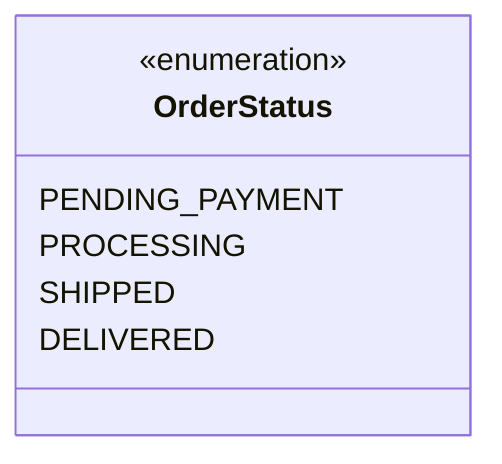

O estereótipo `<<enumeration>>` no topo da caixa é o que sinaliza, em UML, que aquilo não é uma classe comum — é um enum. Embaixo dele, em vez de atributos e métodos (como nos diagramas de classe já vistos na seção [7.8](#78-representando-classes-em-uml)), aparecem só os **valores possíveis**.

### 12.2 Composição

Esta aula foi mais sobre **design** do que sobre código novo: como organizar e representar a relação entre classes de um sistema maior.

#### Categorias de classes

Num sistema orientado a objetos, "tudo" tecnicamente é objeto — mas, por questões de organização, flexibilidade, reuso e delegação, é comum separar as classes em **categorias**, cada uma com uma responsabilidade própria:

| Categoria | Papel típico |
|---|---|
| **Entities** | Representam os dados/conceitos centrais do domínio — é a categoria que praticamente todo este material já usou (`Product`, `Order`, `Employee`...) |
| **Services** | Concentram a lógica de negócio — as regras e operações que atuam sobre as entidades |
| **Controllers** | Recebem uma solicitação externa (ex: de uma tela ou de uma requisição web) e acionam o serviço certo pra tratá-la |
| **Repositories** | Responsáveis por buscar e persistir entidades (tipicamente, acesso a banco de dados) |
| **Views** | Responsáveis pela apresentação/exibição dos dados para quem usa o sistema |

> 💬 Essas descrições de papel são um resumo geral de mercado sobre o que cada categoria costuma significar — o material do curso, neste ponto, apenas nomeia as cinco categorias, sem detalhar cada uma ainda.

#### O que é composição

**Composição** é um tipo de associação que permite que um objeto **contenha** outro — uma relação **"tem-um"** ou **"tem-vários"**.

**Vantagens:**

- **Organização** — divisão de responsabilidades entre classes menores e mais focadas.
- **Coesão** — cada classe cuida só daquilo que é seu.
- **Flexibilidade** e **reuso** — uma "parte" bem definida pode, em tese, ser reaproveitada ou trocada sem afetar o "todo" inteiro.

> 💡 **Analogia:** pense num carro e seu motor. O carro (o "todo") **tem-um** motor (a "parte") — o motor existe como uma peça própria, com sua própria responsabilidade, e o carro só delega pra ele a tarefa de gerar força. É mais fácil entender, manter e até trocar um motor sozinho do que lidar com um carro-motor-tudo-junto, indivisível.

#### Como a composição é representada em UML

A forma de representar composição num diagrama de classes é uma **seta ligando duas entidades**, com um **losango preto** numa das pontas: o losango fica do lado de quem é o **todo** da composição, e a outra ponta aponta para quem é a **parte**.

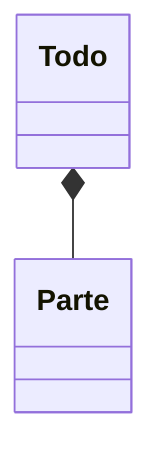

> 💬 Esse diagrama usa `Todo`/`Parte` como nomes-placeholder, só para ilustrar a notação em si (o losango preto do lado do "todo"). O material da aula também mostrou essa mesma notação aplicada a um caso real envolvendo uma classe de **Service** — bem provavelmente um `Service` (o todo) compondo um `Repository` ou uma `Entity` (a parte), já que é comum uma classe de serviço guardar, como atributo, uma referência ao repositório que ela usa para persistir dados. Não consegui renderizar a imagem exata desse slide neste ambiente — se puder confirmar os nomes das duas classes do diagrama, eu ajusto esse exemplo para refletir exatamente o que foi mostrado.

**O ponto mais importante da aula, porém, foi este:**

> ⚠️ **Composição não depende do losango estar desenhado.** O próprio material é explícito: mesmo **sem** o losango preto no diagrama, uma relação ainda pode — e deve — ser chamada de composição, desde que a entidade "todo" contenha, como atributo, algo que vem de outra entidade. Ou seja: o que define uma composição não é o desenho, é o **código** — uma classe `A` que tem um atributo do tipo `B` já é, na prática, `A` "tem-um" `B`, com ou sem diamante no papel.

Isso conecta direto com algo que o material já vinha fazendo sem nomear: em [12.1](#121-enumerações), a classe `Order` tem um atributo do tipo `OrderStatus` — isso já é, tecnicamente, uma composição (`Order` "tem-um" `OrderStatus`), mesmo sem nenhum diagrama ter sido desenhado para essa relação específica.

---

## 14. Herança e Polimorfismo

### 14.1 Herança

**Herança** é um tipo de associação que permite que uma classe herde **todos** os dados e comportamentos de outra.

> 💡 **Analogia — a diferença entre "é-um" e "tem-um":** até agora, todas as relações entre classes vistas (seção [12.2](#122-composição)) eram do tipo **"tem-um"** — um `Order` *tem-um* `Client`. Herança é uma relação completamente diferente: **"é-um"**. Uma conta empresarial **é uma** conta (só que com um pouco mais). É a diferença entre dizer "meu carro **tem um** motor" (composição) e "meu carro **é um** veículo" (herança) — no segundo caso, tudo que vale para "veículo" já vale automaticamente para "meu carro", sem precisar redizer nada.

**Sintaxe:**

```java
class A extends B
```

Lendo em voz alta: *"`A` estende `B`"*, ou *"`A` é um `B`"*.

#### Definições importantes

| Termo | Significado |
|---|---|
| **Relação "é-um"** | O tipo de relação que a herança representa — a subclasse **é um tipo** da superclasse |
| **Generalização / especialização** | A superclasse é a versão **geral**; a subclasse é uma versão **mais específica**, que herda o geral e adiciona (ou ajusta) detalhes próprios |
| **Superclasse** (ou *classe base*) | A classe "de cima", mais geral — a que é estendida |
| **Subclasse** (ou *classe derivada*) | A classe "de baixo", mais específica — a que usa `extends` |
| **Herança / extensão** | O próprio mecanismo de uma classe herdar de outra |

> ⚠️ **Um detalhe conceitual importante:** herança é uma associação entre **classes**, não entre **objetos**. Isso é diferente da composição (seção [12.2](#122-composição)), que é uma relação entre **objetos em tempo de execução** (um objeto `Order` guardando uma referência para um objeto `Client`). Herança já existe **em tempo de compilação**, no próprio desenho do tipo — não há "um objeto guardando outro" aqui, existe um tipo que é definido como uma extensão de outro tipo.

**Vantagens:** o material do curso destaca duas, sendo a segunda um assunto ainda por vir:

- **Reuso** — atributos e métodos escritos uma vez, na superclasse, ficam disponíveis em todas as subclasses, sem copiar código.
- **Polimorfismo** — próximo tópico deste módulo.

#### Exemplo — conta comum vs. conta empresarial

**Cenário:** um banco tem uma conta comum (`Account`) e uma conta para empresas (`BusinessAccount`). A conta empresarial possui **todos** os membros da conta comum, mais um limite de empréstimo e uma operação de realizar empréstimo.

```java
package entities;

public class Account {
    private Integer number;
    private String holder;
    protected Double balance;

    public Account(Integer number, String holder, Double balance) {
        this.number = number;
        this.holder = holder;
        this.balance = balance;
    }

    public Integer getNumber() {
        return number;
    }

    public String getHolder() {
        return holder;
    }

    public Double getBalance() {
        return balance;
    }

    public void withDraw(Double mount) {
        balance -= mount;
    }

    public void deposit(Double mount) {
        balance += mount;
    }
}
```

```java
package entities;

public class BusinessAccount extends Account {
    private final Double loanLimit;

    public BusinessAccount(Integer number, String holder, Double balance, Double loanLimit) {
        super(number, holder, balance);
        this.loanLimit = loanLimit;
    }

    public Double getLoanLimit() {
        return loanLimit;
    }

    public void loan(Double mount) {
        if (mount <= loanLimit) {
            balance += mount - 10;
        }
    }
}
```

Repare que `BusinessAccount` **não redeclara** `number`, `holder`, `balance`, `getNumber()`, `getHolder()`, `getBalance()`, `withDraw()` nem `deposit()` — tudo isso já vem de graça, herdado de `Account`, graças ao `extends`. A subclasse só precisa escrever o que é **novo** ou **diferente**: o atributo `loanLimit` e o método `loan(...)`.

> 💬 **`super(number, holder, balance)`:** essa chamada, sempre a primeira linha do construtor da subclasse, invoca o **construtor da superclasse** — é assim que `number`, `holder` e `balance` (que pertencem a `Account`) são de fato inicializados, mesmo o construtor de `BusinessAccount` só recebendo esses valores para repassar adiante.

**Testando na prática** (o `Program.java` do projeto ainda está vazio neste ponto da aula — o teste abaixo é ilustrativo, para confirmar o comportamento):

```java
Account acc = new Account(1001, "Alex", 1000.0);
acc.deposit(200.0);
acc.withDraw(50.0);
System.out.println("Account balance: " + acc.getBalance());

BusinessAccount bAcc = new BusinessAccount(2002, "Bob", 500.0, 400.0);
bAcc.deposit(100.0);
bAcc.loan(300.0);
System.out.println("BusinessAccount balance after loan(300): " + bAcc.getBalance());
bAcc.loan(500.0);
System.out.println("BusinessAccount balance after loan(500, exceeds limit): " + bAcc.getBalance());
```

**Saída:**

```
Account balance: 1150.0
BusinessAccount balance after loan(300): 890.0
BusinessAccount balance after loan(500, exceeds limit): 890.0
```

`bAcc.deposit(100.0)` usa um método **herdado**, nunca escrito em `BusinessAccount` (500 → 600). `loan(300.0)` está dentro do limite (`300 <= 400`), então soma `300 - 10` (uma taxa fixa de empréstimo) ao saldo (600 → 890). `loan(500.0)` excede o limite (`500 > 400`), então o `if` nem executa — o saldo permanece em 890.

#### O reencontro com modificadores de acesso: por que `private` não bastava

Ao escrever `loan(...)`, que precisa alterar `balance`, apareceu um problema: `balance` tinha sido declarado `private` em `Account`. Pela tabela oficial de acessibilidade já vista em [7.16](#716-modificadores-de-acesso), `private` só é visível **dentro da própria classe** — nem uma subclasse enxerga um atributo `private` da superclasse. A correção foi trocar para `protected`:

```java
protected Double balance;
```

Olhando de novo a tabela de [7.16](#716-modificadores-de-acesso):

| Modificador | Mesma classe | Mesmo pacote | Subclasse (pacote diferente) | Qualquer lugar |
|---|:---:|:---:|:---:|:---:|
| `private` | ✅ | ❌ | ❌ | ❌ |
| *(padrão)* | ✅ | ✅ | ❌ | ❌ |
| `protected` | ✅ | ✅ | ✅ | ❌ |
| `public` | ✅ | ✅ | ✅ | ✅ |

`protected` é exatamente o primeiro nível que inclui a coluna **"Subclasse (pacote diferente)"** — é a linha da tabela feita sob medida para este cenário: um atributo que a própria classe usa, que classes do mesmo pacote também podem usar, e que **subclasses quaisquer** (mesmo em outro pacote) também precisam enxergar para herdar o comportamento de verdade.

> 🔍 **Um detalhe que vale notar:** neste exemplo específico, `Account` e `BusinessAccount` estão no **mesmo pacote** (`entities`) — então, tecnicamente, o modificador **padrão** (nenhum, sem palavra-chave) já teria resolvido o problema aqui, já que a coluna "Mesmo pacote" também é `✅` para o padrão. A vantagem de usar `protected` em vez de confiar no padrão é a **intenção**: `protected` deixa explícito "isto foi pensado para subclasses usarem", e continua funcionando mesmo se um dia `BusinessAccount` for movida para outro pacote — o padrão quebraria nesse cenário, `protected` não.

### 14.2 Upcasting e downcasting

Esta aula apresenta dois movimentos possíveis dentro de uma hierarquia de herança — "subir" para a superclasse (*upcasting*) e "descer" de volta para a subclasse (*downcasting*). O cenário ganhou mais uma subclasse de `Account`, para ter duas "especializações" diferentes para comparar:

```java
package entities;

public class SavingsAccount extends Account {
    private final Double interestRate;

    public SavingsAccount(Integer number, String holder, Double balance, Double interestRate) {
        super(number, holder, balance);
        this.interestRate = interestRate;
    }

    public Double getInterestRate() {
        return interestRace;
    }

    public void updateBalance() {
        balance += balance * interestRate;
    }
}
```


#### Upcasting — subir na hierarquia

**Upcasting** é o *casting* de uma subclasse para sua superclasse — guardar um objeto mais específico numa variável de um tipo mais genérico:

```java
Account acc1 = bacc;                                          // bacc é BusinessAccount
Account acc2 = new BusinessAccount(1003, "Bob", 0.0, 200.0);
Account acc3 = new SavingsAccount(1004, "Anna", 0.0, 0.01);
```

Isso é sempre **seguro** e acontece **automaticamente**, sem precisar de nenhum cast explícito — porque, pela relação "é-um" vista em [14.1](#141-herança), todo `BusinessAccount` **já é** um `Account`. Subir na hierarquia nunca perde nada que a superclasse garanta; só deixa temporariamente "fora de vista" as habilidades extras da subclasse (`loan(...)`, `updateBalance()`...).

> 💡 **Analogia:** é como guardar uma maçã numa caixa etiquetada "Fruta". Toda maçã já é uma fruta — não tem erro nenhum, nem surpresa, em tratá-la como fruta genérica. Só que, enquanto ela estiver "vista" apenas como fruta, não dá pra pedir algo específico de maçã (tipo "contar as sementes") sem antes confirmar que, de fato, aquela fruta específica é uma maçã.

> 💬 **Uso comum (segundo o material):** é a base do **polimorfismo** — próximo tópico do módulo. Conseguir tratar `BusinessAccount` e `SavingsAccount` como "apenas `Account`" é o que permite, por exemplo, guardar os dois tipos numa mesma lista (`List<Account>`), mesmo sendo objetos de classes diferentes.

#### Downcasting — descer de volta na hierarquia

**Downcasting** é o caminho inverso: pegar uma referência do tipo mais genérico (superclasse) e reafirmar que aquele objeto específico é, na verdade, de um tipo mais específico (subclasse) — para então acessar os membros exclusivos dela.

Ao contrário do upcasting, isso **não é automático**. Tentar sem um cast explícito nem compila:

```java
BusinessAccount acc4 = acc2; // erro de compilação
```

```
error: incompatible types: Account cannot be converted to BusinessAccount
```

O porquê disso, bem explicado (achei a explicação que ficou registrada no próprio código muito boa, vale reproduzir): o compilador **não tem como garantir**, só olhando o tipo declarado da variável (`Account`), que o objeto que `acc2` aponta é *realmente* um `BusinessAccount` — isso só vai ser conhecido **em tempo de execução**. Por isso, é preciso um cast explícito, assumindo a responsabilidade por essa afirmação:

```java
BusinessAccount acc4 = (BusinessAccount) acc2; // agora compila
```

**Mas aqui mora o perigo real do downcasting** — e é exatamente o tipo de problema concreto que faltava pra esse assunto "clicar": o cast explícito faz o código **compilar**, mas não garante que ele vai **funcionar**. Testei forçando esse cast quando `acc2` era, na verdade, um `SavingsAccount`:

```java
Account acc2 = new SavingsAccount(1003, "Anna", 0.0, 0.01);
BusinessAccount acc4 = (BusinessAccount) acc2; // compila...
```

```
Exception in thread "main" java.lang.ClassCastException: class entities.SavingsAccount cannot be cast to class entities.BusinessAccount
```

**Erro em tempo de execução, de verdade** — o programa compila perfeitamente, mas quebra na hora de rodar. O cast é uma **promessa** que o programador faz ao compilador ("confia em mim, isso aqui é um `BusinessAccount`"); se a promessa for falsa, o preço é pago depois, em produção, na forma de uma exceção.

#### `instanceof` — verificando antes de arriscar o downcasting

É exatamente para evitar esse `ClassCastException` que existe o operador `instanceof`: ele pergunta, em tempo de execução, *"este objeto é, de fato, uma instância deste tipo?"*, devolvendo `true`/`false` — permitindo fazer o downcasting só quando for seguro:

```java
if (acc2 instanceof BusinessAccount) {
    BusinessAccount acc4 = (BusinessAccount) acc2;
    acc4.loan(200.0);
    System.out.println("Loan!");
}
if (acc2 instanceof SavingsAccount) {
    SavingsAccount acc4 = (SavingsAccount) acc2;
    acc4.updateBalance();
    System.out.println("Update!");
}
```

**O programa completo:**

```java
package application;

import entities.Account;
import entities.BusinessAccount;
import entities.SavingsAccount;

import java.util.Locale;
import java.util.Scanner;

public class Program {

    public static void main(String[] args) {
        Scanner sc = new Scanner(System.in);
        Locale.setDefault(Locale.US);

        Account acc = new Account(1001, "Alex", 0.0);

        // Upcasting

        Account acc1 = new BusinessAccount(1002, "Maria", 0.0, 500.00);
        Account acc2 = new SavingsAccount(1003, "Anna", 0.0, 0.01);

        // Downcasting, com verificação usando 'instanceof'

        if (acc2 instanceof BusinessAccount) {
            BusinessAccount acc4 = (BusinessAccount) acc2;
            acc4.loan(200.0);
            System.out.println("Loan!");
        }
        if (acc2 instanceof SavingsAccount) {
            SavingsAccount acc4 = (SavingsAccount) acc2;
            acc4.updateBalance();
            System.out.println("Update!");
        }

        sc.close();
    }
}
```

**Saída:**

```
Update!
```

Só `"Update!"` aparece — porque `acc2` é, de fato, um `SavingsAccount`. O primeiro `if` (`acc2 instanceof BusinessAccount`) dá `false`, então aquele bloco nem executa; o segundo `if` dá `true`, libera o downcasting pra `SavingsAccount` e chama `updateBalance()` com segurança.

#### Onde isso aparece "pra valer" (a aplicação prática que ainda faltava)

É justo sentir que falta um problema real por trás disso — o material, até aqui, mostrou só a mecânica. Um cenário bem comum onde upcasting + downcasting aparecem juntos, na prática: imagine um banco com uma única lista, `List<Account> allAccounts`, vinda de um banco de dados — contendo uma mistura de `Account`, `BusinessAccount` e `SavingsAccount`, todos guardados ali graças ao upcasting (todos "são" `Account`). Uma rotina mensal que percorre essa lista processando cada conta de forma diferente dependendo do tipo real dela — aplicando juros só nas poupanças, oferecendo empréstimo só nas contas empresariais — precisaria, pra cada conta, perguntar "`instanceof SavingsAccount`? então `updateBalance()`. `instanceof BusinessAccount`? então ofereça o empréstimo." — exatamente o padrão `if/instanceof/cast` visto nesta aula, só que num laço, sobre uma coleção.

> 💬 **A outra pista do material:** downcasting também é comum em "métodos que recebem parâmetros genéricos" — o exemplo citado é `equals`. Isso vai ficar mais concreto na próxima aula do módulo (sobreposição, `super`, `@Override`), quando sobrescrever `equals(Object obj)` exigir, dentro do método, descobrir se o `Object` recebido é realmente do tipo esperado antes de comparar.

### 14.3 Sobreposição, a palavra `super`, e `@Override`

**Sobreposição** (ou *sobrescrita*) é a implementação, **na subclasse**, de um método que já existe na superclasse — substituindo o comportamento herdado por um comportamento próprio daquele tipo mais específico.

> 💬 **Por que sempre usar `@Override`:** essa anotação já tinha aparecido lá em [7.10](#710-a-superclasse-object-e-o-método-tostring), quando sobrescrevemos `toString()`. Agora, com herança de verdade em cena, o motivo fica ainda mais evidente: `@Override` facilita a leitura (quem lê já sabe, de cara, "isto está substituindo um comportamento herdado") e avisa o compilador — se o nome ou os parâmetros do método não baterem **exatamente** com algum método da superclasse, o compilador acusa erro na hora, em vez de deixar passar um método novo por engano (que nunca seria chamado no lugar do original).

#### O problema motivador

**Cenário:** a operação de saque cobra uma taxa de `5.0`. Porém, se a conta for do tipo poupança (`SavingsAccount`), essa taxa **não** deve ser cobrada. Como resolver isso sem duplicar toda a lógica de saque? Resposta: **sobrescrevendo** o método `withDraw` na subclasse.

```java
package entities;

public class Account {
    private Integer number;
    private String holder;
    protected Double balance;

    public Account(Integer number, String holder, Double balance) {
        this.number = number;
        this.holder = holder;
        this.balance = balance;
    }

    public Integer getNumber() {
        return number;
    }

    public String getHolder() {
        return holder;
    }

    public Double getBalance() {
        return balance;
    }

    public void withDraw(Double mount) {
        balance -= mount + 5.0;
    }

    public void deposit(Double mount) {
        balance += mount;
    }
}
```

```java
package entities;

public class SavingsAccount extends Account {
    private final Double interestRate;

    public SavingsAccount(Integer number, String holder, Double balance, Double interestRate) {
        super(number, holder, balance);
        this.interestRate = interestRate;
    }

    public Double getInterestRate() {
        return interestRate;
    }

    public void updateBalance() {
        balance += balance * interestRate;
    }

    @Override
    public void withDraw(Double mount) {
        balance -= mount;
    }
}
```

`SavingsAccount` declara um `withDraw` com **exatamente** a mesma assinatura do `withDraw` de `Account` — isso é o que caracteriza a sobreposição. A partir de agora, chamar `withDraw(...)` num objeto `SavingsAccount` executa **esta** versão (sem a taxa de `5.0`), não a da superclasse.

> 🔍 Repare que `interestRate` já está sem o typo (`interestRace`) visto na seção [14.2](#142-upcasting-e-downcasting) — foi corrigido entre uma aula e outra.

#### A palavra-chave `super` chamando um método (não só um construtor)

Já conhecíamos `super(...)` para chamar o **construtor** da superclasse (seção [14.1](#141-herança)). Mas `super` também serve para chamar a **implementação original de um método**, de dentro de uma versão sobrescrita dele — útil quando a subclasse não quer **substituir** o comportamento herdado, só **complementá-lo**.

**Cenário:** em `BusinessAccount`, a regra de saque é realizar o saque normalmente (igual a `Account`, taxa de `5.0` incluída) e, além disso, descontar mais `2.0`.

```java
package entities;

public class BusinessAccount extends Account {
    private final Double loanLimit;

    public BusinessAccount(Integer number, String holder, Double balance, Double loanLimit) {
        super(number, holder, balance);
        this.loanLimit = loanLimit;
    }

    public Double getLoanLimit() {
        return loanLimit;
    }

    public void loan(Double amount) {
        if (amount <= loanLimit) {
            balance += amount - 10;
        }
    }

    @Override
    public void withDraw(Double amount) {
        super.withDraw(amount);
        balance -= 2.0;
    }
}
```

`super.withDraw(amount)` executa a versão **original** de `withDraw` — a de `Account`, com a taxa de `5.0` — e só depois disso a linha seguinte desconta os `2.0` extras. Sem `super`, seria preciso reescrever a lógica de `Account.withDraw` inteira dentro de `BusinessAccount`, duplicando código à toa.

> 💡 **Analogia:** pense em `super.metodo(...)` como dizer "faça primeiro do jeito que a família sempre fez, e *depois* eu adiciono o meu toque pessoal" — em vez de reinventar o processo inteiro do zero.

#### O programa completo

```java
package application;

import entities.Account;
import entities.BusinessAccount;
import entities.SavingsAccount;

import java.util.Locale;
import java.util.Scanner;

public class Program {

    public static void main(String[] args) {
        Scanner sc = new Scanner(System.in);
        Locale.setDefault(Locale.US);

        Account acc1 = new Account(1001, "Alex", 1000.0);
        acc1.withDraw(200.0);
        System.out.println(acc1.getBalance());

        Account acc2 = new SavingsAccount(1002, "Maria", 1000.00, 0.01);
        acc2.withDraw(200.00);
        System.out.println(acc2.getBalance());

        Account acc3 = new BusinessAccount(1003, "Bob", 1000.00, 500.00);
        acc3.withDraw(200.00);
        System.out.println(acc3.getBalance());

        sc.close();
    }
}
```

**Saída:**

```
795.0
800.0
793.0
```

- `acc1` (`Account` puro): `1000 - (200 + 5.0) = 795.0` — a taxa normal de saque.
- `acc2` (`SavingsAccount`): `1000 - 200 = 800.0` — sem taxa nenhuma, graças à sobreposição.
- `acc3` (`BusinessAccount`): `super.withDraw(200)` desconta `200 + 5.0` (`→ 795.0`), e depois mais `2.0` (`→ 793.0`).

> 🎯 **O detalhe mais importante de toda essa demo:** as três variáveis (`acc1`, `acc2`, `acc3`) são **todas declaradas como `Account`** — nenhuma delas é declarada como `SavingsAccount` ou `BusinessAccount` na assinatura. Mesmo assim, a mesma chamada `.withDraw(...)`, escrita de forma idêntica nas três linhas, executa um comportamento **diferente** em cada uma, dependendo do tipo **real** do objeto por trás da referência. Esse comportamento — o mesmo código chamando implementações diferentes, decidido em tempo de execução — é a essência do **polimorfismo**, o próximo tópico do módulo (já adiantado em [14.2](#142-upcasting-e-downcasting)), mesmo sem esse nome ainda ter aparecido formalmente nesta aula.

### 14.4 Classes e métodos `final`

Até aqui, a herança foi vista como algo que sempre pode ser estendido: qualquer classe pode ter subclasses, e qualquer método pode ser sobrescrito. A palavra-chave `final` permite **bloquear** essas duas possibilidades.

- **Em uma classe**, `final` impede que ela seja herdada (ninguém pode fazer `extends` nela).
- **Em um método**, `final` impede que ele seja sobreposto (ninguém pode reescrevê-lo numa subclasse, como fizemos em [14.3](#143-sobreposição-a-palavra-super-e-override)).

#### Exemplo — classe `final`

Suponha que você queira impedir que existam subclasses de `SavingsAccount`:

```java
public final class SavingsAccount extends Account {
    // ...
}
```

Testei o que acontece ao tentar estender uma classe marcada assim:

```java
public class Poupanca2 extends SavingsAccount { ... }
```

```
error: cannot inherit from final SavingsAccount
```

O compilador impede a herança **antes** de o programa rodar, sem precisar de nenhum teste extra.

#### Exemplo — método `final`

Suponha agora que a classe continue podendo ser herdada, mas você **não** queira que o método `withDraw` de `SavingsAccount` seja sobreposto:

```java
public class SavingsAccount extends Account {
    // ...

    @Override
    public final void withDraw(Double amount) {
        balance -= amount;
    }
}
```

Tentando sobrescrevê-lo numa subclasse:

```java
public class Sub2 extends SavingsAccount {
    @Override
    public void withDraw(Double mount) { ... }
}
```

```
error: withDraw(Double) in Sub2 cannot override withDraw(Double) in SavingsAccount
  overridden method is final
```

> 💡 Repare que, **mesmo com `@Override` na versão `final`**, a anotação e a palavra `final` têm papéis diferentes: `@Override` diz "isto substitui algo da superclasse" (verificado pelo compilador, como em [14.3](#143-sobreposição-a-palavra-super-e-override)); `final` diz "isto **não pode** ser substituído por ninguém". São duas coisas independentes que podem aparecer juntas.

#### Para que serve

O material do curso lista três motivos para usar `final`:

1. **Segurança** — dependendo das regras de negócio, às vezes é desejável garantir que uma classe **não** seja herdada, ou que um método **não** seja sobreposto. Por exemplo: se a regra de uma conta poupança exige que o saque nunca cobre taxa, deixar `withDraw` `final` garante que nenhuma subclasse futura quebre essa regra por engano.
2. **Consistência** — o material recomenda, de forma geral, acrescentar `final` em métodos sobrescritos, pois **sobreposições em cadeia** (uma subclasse sobrescrevendo, outra sobrescrevendo de novo, e assim por diante) podem virar uma porta de entrada para inconsistências difíceis de rastrear.
3. **Desempenho** — segundo o material, classes `final` podem ser analisadas de forma mais rápida em tempo de execução, já que o compilador/JVM sabe que o tipo nunca será estendido.

> 💬 **Exemplo clássico do próprio Java:** a classe `String` é `final`. Ninguém pode criar uma "subclasse de texto" com comportamento alterado — e isso protege o próprio funcionamento da linguagem, já que `String` aparece em praticamente todo programa.

#### `final` em atributos de instância

Além de classes e métodos, `final` também pode marcar **atributos**, como em `private final Double additionalCharge;` (usado no exercício de funcionários terceirizados da seção 15). Nesse caso, o `final` restringe a **referência** guardada no campo, e não o objeto que ela aponta:

- **Atribuição única:** o campo precisa receber valor exatamente uma vez, na declaração ou em **todo** construtor da classe.
- **Não pode ser reatribuído depois:** nenhum método pode fazer `this.campo = ...` depois disso.

Testei os três casos típicos:

```java
public class A {
    private final Double charge;
    public A(Double charge) { this.charge = charge; }
    public void change() { this.charge = 5.0; }   // erro
}
```

```
error: cannot assign a value to final variable charge
```

```java
public class B {
    private final Double charge;
    public B() { }   // construtor não atribui nada
}
```

```
error: variable charge might not have been initialized
```

```java
public class C {
    private final Double charge;
    public C(Double c) { this.charge = c; this.charge = 2.0; }   // atribui duas vezes
}
```

```
error: variable charge might already have been assigned
```

No caso de `OutsourcedEmployee`, `additionalCharge` só é atribuído no construtor, e por isso não existe `setAdditionalCharge`: o valor fica fixo para aquele objeto.

> ⚠️ **O `final` trava a referência, não o objeto apontado.** Para tipos mutáveis isso faz diferença: `private final List<String> log = new ArrayList<>();` impede `log = outraLista`, mas `log.add("x")` continua funcionando. Com `Double`, que é imutável, o efeito prático é que o valor não muda depois de criado.

> 💡 Não confundir com o `static final` de [7.11](#711-membros-estáticos): lá, `PI` era uma constante única da classe, compartilhada por todos os objetos. Aqui, cada objeto tem seu próprio `additionalCharge`, fixado no construtor.

### 14.5 Introdução a polimorfismo

**Polimorfismo** é um dos três pilares da programação orientada a objetos (ao lado de **encapsulamento**, visto em [7.15](#715-encapsulamento), e **herança**, visto em [14.1](#141-herança)). Segundo o material, é o recurso que permite que **variáveis de um mesmo tipo genérico possam apontar para objetos de tipos específicos diferentes**, e assim ter **comportamentos diferentes** conforme o tipo específico de cada objeto.

> 💡 **Em uma frase:** o mesmo nome de método, chamado pela mesma variável de tipo genérico, pode fazer coisas diferentes — porque quem decide *qual* versão roda é o **objeto real** por trás da referência, não o tipo declarado da variável.

#### O exemplo do material

```java
Account x = new Account(1020, "Alex", 1000.0);
Account y = new SavingsAccount(1023, "Maria", 1000.0, 0.01);

x.withdraw(50.0);
y.withdraw(50.0);
```

As duas variáveis são declaradas como `Account`, mas:

- `x` aponta para um objeto `Account` de verdade, cujo `withdraw` cobra a taxa de `5.0` → saldo `1000 - 50 - 5 = 945.0`.
- `y` aponta para um objeto `SavingsAccount`, cujo `withdraw` (sobrescrito, seção [14.3](#143-sobreposição-a-palavra-super-e-override)) **não** cobra taxa → saldo `1000 - 50 = 950.0`.

Mesma linha de código escrita para os dois, comportamentos diferentes.

#### O que acontece na memória

```
Stack                                   Heap
┌──────────────┐                        ┌──────────────────────────┐
│ x ●──────────┼───────────────────────▶│ Account                  │
├──────────────┤                        │ 1020 | Alex | 1000.0      │
│ y ●──────────┼───────────────────────▶┌──────────────────────────┐
└──────────────┘                        │ SavingsAccount            │
                                        │ 1023 | Maria | 1000.0 | 0.01 │
                                        └──────────────────────────┘
```

As duas referências são do tipo `Account` (o tipo genérico declarado), mas cada uma aponta para um objeto de um tipo específico diferente no Heap. É exatamente o **upcasting** de [14.2](#142-upcasting-e-downcasting) acontecendo: o objeto `SavingsAccount` foi "visto" como um `Account` ao ser guardado em `y`.

#### Quando a decisão acontece: tempo de execução

> ⚠️ **O ponto central do polimorfismo:** a associação entre o tipo específico do objeto e a chamada do método é feita **em tempo de execução**. O compilador **não sabe** para qual tipo específico a chamada `.withdraw(...)` vai — ele só sabe que `x` e `y` são do tipo `Account`, e que `Account` tem um método `withdraw`. Quem decide qual versão roda, na hora, é o objeto real apontado por cada referência.

#### Aplicado ao projeto

Esse exato comportamento já está acontecendo no `Program.java` do projeto — as três variáveis `acc1`, `acc2` e `acc3` são todas declaradas como `Account`, mas apontam para objetos `Account`, `SavingsAccount` e `BusinessAccount`:

```java
Account acc1 = new Account(1001, "Alex", 1000.0);
acc1.withDraw(200.0);
System.out.println(acc1.getBalance());   // 795.0 — versão de Account (com taxa de 5.0)

Account acc2 = new SavingsAccount(1002, "Maria", 1000.00, 0.01);
acc2.withDraw(200.00);
System.out.println(acc2.getBalance());   // 800.0 — versão de SavingsAccount (sem taxa)

Account acc3 = new BusinessAccount(1003, "Bob", 1000.00, 500.00);
acc3.withDraw(200.00);
System.out.println(acc3.getBalance());   // 793.0 — versão de BusinessAccount (super + taxa de 2.0)
```

Testado aqui: a saída é exatamente `795.0`, `800.0` e `793.0`, como visto em [14.3](#143-sobreposição-a-palavra-super-e-override) — o polimorfismo já estava em ação, mesmo antes de ter sido nomeado como tal.

---

## 15. Exercícios Resolvidos

### Estrutura Sequencial

Exercícios práticos de fixação da **estrutura sequencial**, escritos no repositório de prática `java-estudos` (código-fonte à parte deste material teórico):

<details>
<summary><strong>Exercício — Soma de dois valores inteiros</strong></summary>

```java
int value1 = sc.nextInt();
int value2 = sc.nextInt();
int soma = value1 + value2;
System.out.printf("SOMA = %d", soma);
```
</details>

<details>
<summary><strong>Exercício — Área do círculo</strong></summary>

```java
double raio = sc.nextDouble();
double pi = 3.14159;
double area = pi * Math.pow(raio, 2.0);
System.out.printf("Value = %.4f", area);
```
</details>

<details>
<summary><strong>Exercício — Diferença entre produtos de pares</strong></summary>

```java
int value1 = sc.nextInt();
int value2 = sc.nextInt();
int value3 = sc.nextInt();
int value4 = sc.nextInt();
int diferenca = value1 * value2 - value3 * value4;
System.out.println("DIFERENCA = " + diferenca);
```
</details>

<details>
<summary><strong>Exercício — Cálculo de salário</strong></summary>

```java
int horasTrabalhadas = sc.nextInt();
double valorHora = sc.nextDouble();
double salario = horasTrabalhadas * valorHora;

System.out.printf("HORAS = %d%n", horasTrabalhadas);
System.out.printf("SALARIO = %.2f", salario);
```
</details>

<details>
<summary><strong>Exercício — Nota fiscal de dois produtos</strong></summary>

Combina **entrada** (código, quantidade e valor de duas peças), **processamento** (cálculo do total) e **saída** (valor formatado como moeda) — o ciclo completo da seção 3.4.

```java
System.out.println("Informe os valores do produto 01");
int pecaCode1 = sc.nextInt();
int pecaNumber1 = sc.nextInt();
double pecaValue1 = sc.nextDouble();

System.out.println("Informe os valores do produto 02");
int pecaCode2 = sc.nextInt();
int pecaNumber2 = sc.nextInt();
double pecaValue2 = sc.nextDouble();

double total = pecaNumber1 * pecaValue1 + pecaNumber2 * pecaValue2;

System.out.printf("VALOR A PAGAR: R$ %.2f", total);
```
</details>

### Orientação a Objetos

Exercícios práticos do módulo de **Orientação a Objetos** (seção [7](#7-orientação-a-objetos)), escritos e mantidos diretamente neste projeto Maven local (`entities/` + `application/Program.java`).

<details>
<summary><strong>Exercício 1 — Área, perímetro e diagonal de um retângulo</strong></summary>

**Enunciado:** ler os valores da largura e altura de um retângulo. Em seguida, mostrar na tela o valor de sua área, perímetro e diagonal.

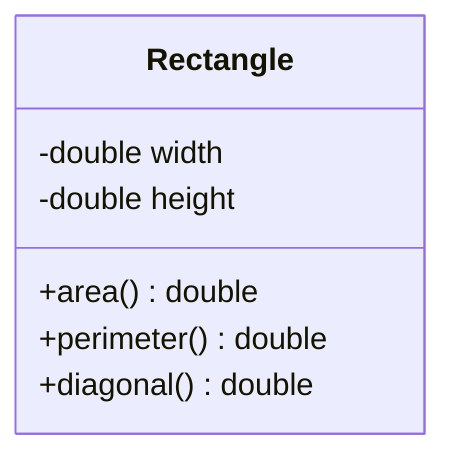

```java
package entities;

public class Rectangle {
    public double width;
    public double height;

    public double area() {
        return width * height;
    }

    public double perimeter() {
        return 2 * (width + height);
    }

    public double diagonal() {
        return Math.sqrt(Math.pow(width, 2.0) + Math.pow(height, 2.0));
    }

    public String toString() {
        String quebra = System.lineSeparator();
        return "AREA = "
                + String.format("%.2f", area())
                + quebra
                + "PERIMETER = "
                + String.format("%.2f", perimeter())
                + quebra
                + "DIAGONAL = "
                + String.format("%.2f", diagonal());
    }
}
```

```java
package application;

import java.util.Locale;
import java.util.Scanner;

import entities.Rectangle;

public class Program {
    public static void main(String[] args) {
        Locale.setDefault(Locale.US);
        Scanner sc = new Scanner(System.in);

        Rectangle rectangle = new Rectangle();

        IO.println("Enter rectangle width and height:");
        rectangle.width = sc.nextDouble();
        rectangle.height = sc.nextDouble();

        IO.println(rectangle);

        sc.close();
    }
}
```

**Saída:**

```
Enter rectangle width and height:
3.00
4.00
AREA = 12.00
PERIMETER = 14.00
DIAGONAL = 5.00
```

> 💡 **Método novo — `System.lineSeparator()`:** dentro do `toString()`, a quebra de linha entre `AREA`, `PERIMETER` e `DIAGONAL` usa `System.lineSeparator()` em vez de simplesmente `"\n"`. A diferença é que `"\n"` é sempre o caractere de nova linha do estilo Unix, enquanto `System.lineSeparator()` retorna **o separador de linha correto do sistema operacional onde o programa está rodando** (`\n` no Linux/Mac, `\r\n` no Windows) — deixando o código portável entre sistemas, em vez de fixar um único padrão.
</details>

<details>
<summary><strong>Exercício 2 — Salário líquido e reajuste de funcionário</strong></summary>

**Enunciado:** ler os dados de um funcionário (nome, salário bruto e imposto). Em seguida, mostrar os dados do funcionário (nome e salário líquido). Em seguida, aumentar o salário do funcionário com base em uma porcentagem dada (somente o salário bruto é afetado pela porcentagem) e mostrar novamente os dados do funcionário.

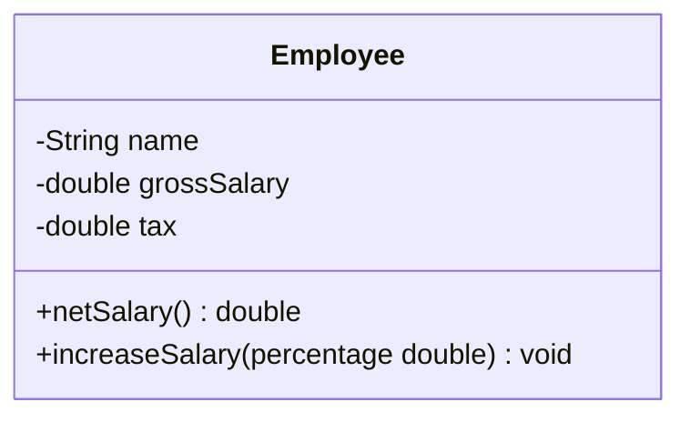

```java
package entities;

public class Employee {
    public String name;
    public double grossSalary;
    public double tax;

    public double netSalary() {
        return grossSalary - tax;
    }

    public void increaseSalary(double percentage) {
        double increaseValue = this.grossSalary * percentage / 100;
        this.grossSalary += increaseValue;
    }

    public String toString() {
        return name
                + ", $ "
                + String.format("%.2f", netSalary());
    }
}
```

```java
package application;

import java.util.Locale;
import java.util.Scanner;

import entities.Employee;

public class Program {
    public static void main(String[] args) {
        Locale.setDefault(Locale.US);
        Scanner sc = new Scanner(System.in);

        Employee employee = new Employee();

        IO.print("Name: ");
        employee.name = sc.nextLine();

        IO.print("Gross salary: ");
        employee.grossSalary = sc.nextDouble();

        IO.print("Tax: ");
        employee.tax = sc.nextDouble();

        IO.println();
        IO.println("Employee: " + employee);

        IO.println();
        IO.print("Which percentage to increase salary? ");
        double percentage = sc.nextDouble();
        employee.increaseSalary(percentage);

        IO.println();
        IO.println("Updated data: " + employee);

        sc.close();
    }
}
```

**Saída:**

```
Name: Joao Silva
Gross salary: 6000.00
Tax: 1000.00

Employee: Joao Silva, $ 5000.00

Which percentage to increase salary? 10.0

Updated data: Joao Silva, $ 5600.00
```

> 💡 **Ponto de atenção:** a porcentagem afeta somente `grossSalary` (o bruto) — o `tax` permanece fixo. Por isso, ao recalcular `netSalary()` (`grossSalary - tax`) depois do reajuste, o líquido sobe de `5000.00` para `5600.00`: o aumento de 10% incidiu sobre os `6000.00` originais (`+600.00`), e não sobre o líquido já calculado.
</details>

<details>
<summary><strong>Exercício 3 — Nota final e situação de aprovação de um aluno</strong></summary>

**Enunciado:** ler o nome de um aluno e as três notas que ele obteve nos três trimestres do ano (primeiro trimestre vale 30 e o segundo e terceiro valem 35 cada). Ao final, mostrar qual a nota final do aluno no ano. Dizer também se o aluno está aprovado (`PASS`) ou não (`FAILED`) e, em caso negativo, quantos pontos faltam para o aluno obter o mínimo para ser aprovado (que é 60% da nota).

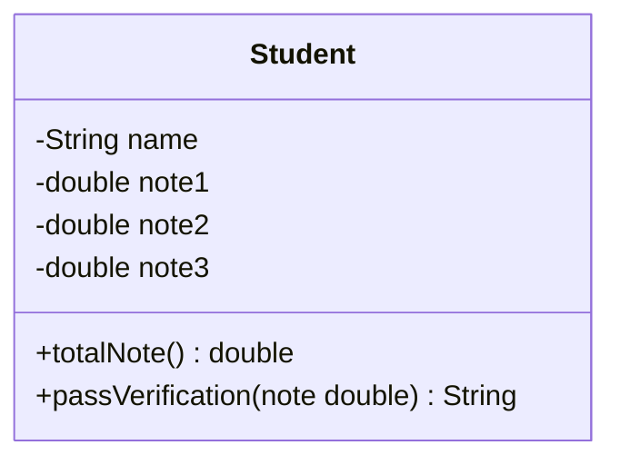

```java
package entities;

public class Student {
    public String name;
    public double note1;
    public double note2;
    public double note3;

    public double totalNote() {
        return note1 + note2 + note3;
    }

    public String passVerification(double note) {
        if (note >= 60) {
            return "PASS";
        } else {
            double missing = 60 - note;
            return "FAILED"
                    + System.lineSeparator()
                    + "MISSING "
                    + String.format("%.2f", missing)
                    + " POINTS";
        }
    }
}
```

```java
package application;

import java.util.Locale;
import java.util.Scanner;

import entities.Student;

public class Program {
    public static void main(String[] args) {
        Locale.setDefault(Locale.US);
        Scanner sc = new Scanner(System.in);

        Student student = new Student();

        IO.println("Entrada:");
        student.name = sc.nextLine();
        student.note1 = sc.nextDouble();
        student.note2 = sc.nextDouble();
        student.note3 = sc.nextDouble();

        IO.println("Saida:");
        IO.println("FINAL GRADE = " + String.format("%.2f", student.totalNote()));
        IO.println(student.passVerification(student.totalNote()));

        sc.close();
    }
}
```

**Saída (exemplo 1 — aprovado):**

```
Entrada:
Alex Green
27.00
31.00
32.00
Saida:
FINAL GRADE = 90.00
PASS
```

**Saída (exemplo 2 — reprovado):**

```
Entrada:
Alex Green
17.00
20.00
15.00
Saida:
FINAL GRADE = 52.00
FAILED
MISSING 8.00 POINTS
```

> 💡 **Por que `totalNote()` só soma as três notas, sem multiplicar pelos pesos?** Porque os pesos (30/35/35) já definem a **pontuação máxima de cada trimestre**, e não um multiplicador — ou seja, cada nota digitada já é o número de pontos conquistados naquele trimestre (de um total de 30 ou 35 possíveis). Somando os três valores diretamente, o resultado já cai naturalmente numa escala de 0 a 100, que é o que os exemplos confirmam (`27 + 31 + 32 = 90`).
</details>

<details>
<summary><strong>Exercício 4 — Conversão de dólar para real, com IOF</strong></summary>

**Enunciado:** ler a cotação do dólar e um valor em dólares a ser comprado por uma pessoa em reais. Informar quantos reais a pessoa vai pagar pelos dólares, considerando ainda que a pessoa terá que pagar 6% de IOF sobre o valor em dólar. Criar uma classe `CurrencyConverter` para ser responsável pelos cálculos.

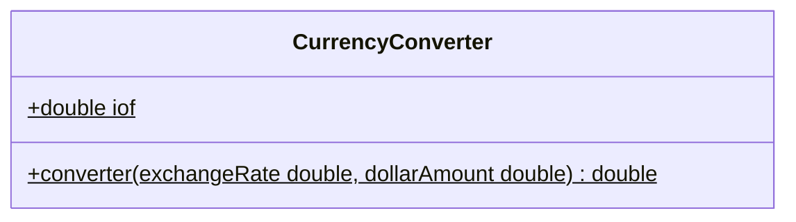

```java
package entities;

public class CurrencyConverter {
    public static double iof = 1.06;

    public static double converter(double exchangeRate, double dollarAmount) {
        return (exchangeRate * dollarAmount * iof);
    }
}
```

```java
package application;

import entities.CurrencyConverter;

import java.util.Locale;
import java.util.Scanner;

public class Program {
    public static void main(String[] args) {
        Locale.setDefault(Locale.US);
        Scanner sc = new Scanner(System.in);

        IO.print("What is the dollar price? ");
        double exchangeRate = sc.nextDouble();

        IO.print("How many dollars will be bought? ");
        double dollarAmount = sc.nextDouble();

        System.out.printf("Amount to be paid in reais = %.2f", CurrencyConverter.converter(exchangeRate, dollarAmount));

        sc.close();
    }
}
```

**Saída:**

```
What is the dollar price? 3.10
How many dollars will be bought? 200.00
Amount to be paid in reais = 657.20
```

> 💡 Esse exercício também é uma boa reafirmação da seção [7.11 (Membros estáticos)](#711-membros-estáticos): nem `iof` nem `converter()` dependem de qual "conversor" está sendo usado — o resultado é sempre o mesmo para os mesmos números —, por isso fazem sentido como `static`, chamados direto por `CurrencyConverter.converter(...)`, sem precisar de `new`.
</details>

<details>
<summary><strong>Exercício 5 — Cadastro de conta bancária, com depósito e saque</strong></summary>

**Enunciado:** em um banco, para se cadastrar uma conta bancária, é necessário informar o número da conta, o nome do titular, e o valor de depósito inicial (opcional — se não houver, o saldo inicial é zero). O número da conta nunca pode ser alterado depois de aberta; o nome do titular pode. O saldo não pode ser alterado livremente: só aumenta por depósito, e só diminui por saque — e cada saque cobra uma taxa fixa de $ 5.00 (a conta pode ficar negativa, se o saldo não for suficiente para cobrir saque + taxa). Fazer um programa que cadastre a conta (com depósito inicial opcional), realize um depósito e depois um saque, mostrando os dados da conta após cada operação.

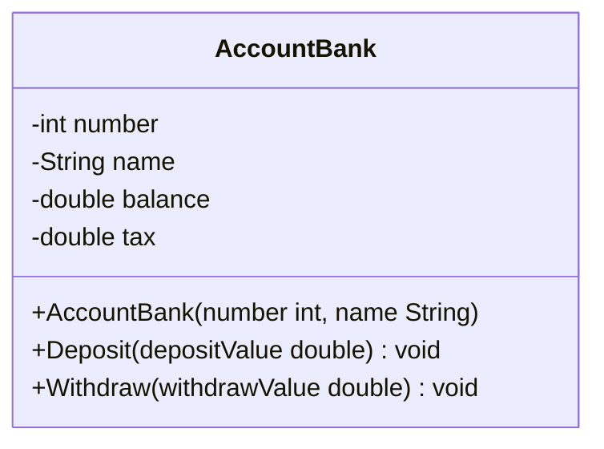

```java
package entities;

public class AccountBank {
    private int number;
    private String name;
    private double balance;
    private double tax = 5.00;

    public AccountBank(int number, String name) {
        this.number = number;
        this.name = name;
    }

    @Override
    public String toString() {
        return "Account " + number +
                ", Holder: " + name +
                ", Balance: $ " + String.format("%.2f", balance);
    }

    public void Deposit(double depositValue) {
        this.balance += depositValue;
    }

    public void Withdraw(double withdrawValue) {
        this.balance -= withdrawValue + tax;
    }
}
```

```java
package application;

import java.util.Locale;
import java.util.Scanner;

import entities.AccountBank;

public class Program {
    public static void main(String[] args) {
        Locale.setDefault(Locale.US);
        Scanner sc = new Scanner(System.in);

        char deposit;
        double depositValue = 0.0;

        IO.print("Enter account number: ");
        int number = sc.nextInt();
        sc.nextLine();
        IO.print("Enter account holder: ");
        String name = sc.nextLine();

        IO.print("Is there na initial deposit (y/n)? ");
        deposit = sc.next().charAt(0);

        if (deposit == 'y') {
            IO.print("Enter initial deposit value: ");
            depositValue = sc.nextDouble();
        }

        AccountBank account = new AccountBank(number, name);
        account.Deposit(depositValue);

        IO.println(" ");
        IO.println("Account data:");
        IO.println(account.toString());

        IO.println(" ");
        IO.print("Enter a deposit value: ");
        double newDeposit = sc.nextDouble();

        account.Deposit(newDeposit);
        IO.println("Updated account data:");
        IO.println(account.toString());

        IO.println(" ");
        IO.print("Enter a withdraw value: ");
        double withdraw = sc.nextDouble();

        account.Withdraw(withdraw);
        IO.println("Updated account data:");
        IO.println(account.toString());

        sc.close();
    }
}
```

**Saída (exemplo 1 — com depósito inicial):**

```
Enter account number: 8532
Enter account holder: Alex Green
Is there na initial deposit (y/n)? y
Enter initial deposit value: 500.00

Account data:
Account 8532, Holder: Alex Green, Balance: $ 500.00

Enter a deposit value: 200.00
Updated account data:
Account 8532, Holder: Alex Green, Balance: $ 700.00

Enter a withdraw value: 300.00
Updated account data:
Account 8532, Holder: Alex Green, Balance: $ 395.00
```

**Saída (exemplo 2 — sem depósito inicial, terminando negativo):**

```
Enter account number: 7801
Enter account holder: Maria Brown
Is there na initial deposit (y/n)? n

Account data:
Account 7801, Holder: Maria Brown, Balance: $ 0.00

Enter a deposit value: 200.00
Updated account data:
Account 7801, Holder: Maria Brown, Balance: $ 200.00

Enter a withdraw value: 198.00
Updated account data:
Account 7801, Holder: Maria Brown, Balance: $ -3.00
```

> 💡 **`@Override` — uma anotação nova:** o `toString()` já tinha sido sobrescrito antes (seção [7.10](#710-a-superclasse-object-e-o-método-tostring)), mas agora aparece com `@Override` logo acima. Essa anotação não muda o comportamento do método — ela é uma instrução **para o compilador**, avisando "este método pretende sobrescrever um método da superclasse". Se por engano o nome ou os parâmetros não baterem exatamente com o método original de `Object`, o compilador acusa erro na hora, em vez de você criar sem querer um método novo (que nunca seria chamado no lugar do original). É uma rede de segurança de baixo custo, e o padrão de mercado é sempre usá-la ao sobrescrever um método.
>
> ⚠️ **Convenção de nomes:** `Deposit` e `Withdraw` estão com a primeira letra maiúscula — mas a convenção Java (a mesma citada para get/set na seção [7.15](#715-encapsulamento)) é *camelCase* para métodos, começando sempre com letra minúscula: `deposit`/`withdraw`. Maiúscula no começo (`PascalCase`) é a convenção reservada para **nomes de classe** (`AccountBank`, `Product`...). O código funciona normalmente do mesmo jeito — Java não obriga essa convenção —, mas seguir o padrão evita estranhar (ou estranhar em código de terceiros) mais adiante.
</details>

### Comportamento de Memória, Arrays e Listas

Exercícios práticos do módulo de **Comportamento de Memória, Arrays e Listas** (seção [8](#8-comportamento-de-memória-arrays-e-listas)).

<details>
<summary><strong>Exercício — Números negativos de um vetor</strong></summary>

**Enunciado:** fazer um programa que leia um número inteiro positivo `N` (máximo = 10) e depois `N` números inteiros, armazenando-os em um vetor. Em seguida, mostrar na tela todos os números negativos lidos.

```java
package application;

import java.util.Locale;
import java.util.Scanner;

public class Program {

    public static void main(String[] args) {

        Locale.setDefault(Locale.US);
        Scanner sc = new Scanner(System.in);

        System.out.print("Quantos numeros voce vai digitar? ");
        int n = sc.nextInt();

        if (n > 10) {
            System.out.println("Numero max permitido e 10");
            sc.close();
            return;
        }

        int[] vect = new int[n];

        for (int i = 0; i < n; i++) {
            System.out.print("Digite um numero: ");
            vect[i] = sc.nextInt();
        }

        System.out.println("NUMEROS NEGATIVOS:");

        for (int j = 0; j < vect.length; j++) {
            if (vect[j] < 0) {
                System.out.println(vect[j]);
            }
        }

        sc.close();
    }
}
```

**Saída:**

```
Quantos numeros voce vai digitar? 6
Digite um numero: 8
Digite um numero: -2
Digite um numero: 9
Digite um numero: 10
Digite um numero: -3
Digite um numero: -7
NUMEROS NEGATIVOS:
-2
-3
-7
```

> 💡 Repare no `if (n > 10) { ... return; }` logo no início — uma *guard clause* que encerra o programa cedo quando a entrada é inválida, documentada em detalhe na seção [4.3 (`return` dentro de um `if`)](#return-dentro-de-um-if--encerrando-cedo).
</details>

<details>
<summary><strong>Exercício — Altura média e percentual de menores de 16 anos</strong></summary>

**Enunciado:** ler nome, idade e altura de `N` pessoas. Depois, mostrar a altura média das pessoas, a porcentagem de pessoas com menos de 16 anos, e os nomes dessas pessoas (caso houver).

```java
package entities;

public class People {
    private String name;
    private int age;
    private double height;

    public People(String name, int age, double height) {
        this.name = name;
        this.age = age;
        this.height = height;
    }

    public String getName() {
        return name;
    }

    public int getAge() {
        return age;
    }

    public double getHeight() {
        return height;
    }
}
```

```java
package application;

import entities.People;

import java.util.Locale;
import java.util.Scanner;

public class Program {

    public static void main(String[] args) {

        Locale.setDefault(Locale.US);
        Scanner sc = new Scanner(System.in);

        System.out.print("Quantas pessoas serao digitadas? ");
        int qnt = sc.nextInt();

        People[] people = new People[qnt];

        for (int i = 0; i < people.length; i++) {
            int position = i + 1;
            System.out.println("Dados da " + position + "º" + " pessoa:");

            sc.nextLine();
            System.out.print("Nome: ");
            String name = sc.nextLine();

            System.out.print("Idade: ");
            int age = sc.nextInt();
            sc.nextLine();

            System.out.print("Altura: ");
            double height = sc.nextDouble();

            people[i] = new People(name, age, height);
        }

        double averageHeight = 0.0;
        int smallerCounter = 0;

        for (int i = 0; i < people.length; i++) {
            averageHeight += people[i].getHeight();

            if (people[i].getAge() < 16) {
                smallerCounter++;
            }
        }

        System.out.println();
        System.out.printf("Altura média: %.2f%n", averageHeight / people.length);

        double percentAge = ((double) smallerCounter / people.length) * 100;
        System.out.printf("Pessoas com menos de 16 anos: %.1f%%%n", percentAge);

        for (int i = 0; i < people.length; i++) {
            if (people[i].getAge() < 16) {
                System.out.println(people[i].getName());
            }
        }

        sc.close();
    }
}
```

**Saída:**

```
Quantas pessoas serao digitadas? 5
Dados da 1º pessoa:
Nome: Joao
Idade: 15
Altura: 1.82
Dados da 2º pessoa:
Nome: Maria
Idade: 16
Altura: 1.60
Dados da 3º pessoa:
Nome: Teresa
Idade: 14
Altura: 1.58
Dados da 4º pessoa:
Nome: Carlos
Idade: 21
Altura: 1.65
Dados da 5º pessoa:
Nome: Paulo
Idade: 17
Altura: 1.78

Altura média: 1.69
Pessoas com menos de 16 anos: 40.0%
Joao
Teresa
```

> 💡 O laço acumula a **soma bruta** das alturas em `averageHeight`, e a divisão por `people.length` só acontece uma vez, na hora de formatar a saída (`averageHeight / people.length`) — o padrão mais comum para calcular uma média: soma tudo primeiro, divide no final.
</details>

<details>
<summary><strong>Exercício — Aluguel de quartos de um pensionato</strong></summary>

**Enunciado:** a dona de um pensionato possui dez quartos para alugar para estudantes, identificados pelos números 0 a 9. Fazer um programa que inicie com todos os dez quartos vazios, leia uma quantidade `N` de estudantes que vão alugar quartos (1 a 10) e registre o aluguel de cada um (nome, email e o quarto escolhido — sempre um quarto vago). Ao final, imprimir um relatório de todas as ocupações do pensionato, em ordem de quarto.

```java
package entities;

public class ClientStudent {
    private String name;
    private String email;
    private int room;

    public ClientStudent(String name, String email, int room) {
        this.name = name;
        this.email = email;
        this.room = room;
    }

    public String getName() {
        return name;
    }

    public String getEmail() {
        return email;
    }

    public int getRoom() {
        return room;
    }
}
```

```java
package application;

import entities.ClientStudent;

import java.util.Locale;
import java.util.Scanner;

public class Program {

    public static void main(String[] args) {

        Locale.setDefault(Locale.US);
        Scanner sc = new Scanner(System.in);

        System.out.print("How many rooms will be rented? ");
        int rentAmount = sc.nextInt();
        System.out.println();

        ClientStudent[] clientList = new ClientStudent[10];

        for (int i = 0; i < rentAmount; i++) {
            sc.nextLine();
            int countRent = i + 1;
            System.out.println("Rent #" + countRent);
            System.out.print("Name: ");
            String name = sc.nextLine();

            System.out.print("Email: ");
            String email = sc.nextLine();

            System.out.print("Room: ");
            int room = sc.nextInt();
            System.out.println();

            clientList[room] = new ClientStudent(name, email, room);
        }

        System.out.println();
        System.out.println("Busy rooms:");

        for (int i = 0; i < clientList.length; i++) {
            if (clientList[i] != null) {
                System.out.println(i + ": " + clientList[i].getName() + ", " + clientList[i].getEmail());
            }
        }

        sc.close();
    }
}
```

**Saída:**

```
How many rooms will be rented? 3

Rent #1
Name: Maria Green
Email: maria@gmail.com
Room: 5

Rent #2
Name: Marco Antonio
Email: marco@gmail.com
Room: 1

Rent #3
Name: Alex Brown
Email: alex@gmail.com
Room: 8

Busy rooms:
1: Marco Antonio, marco@gmail.com
5: Maria Green, maria@gmail.com
8: Alex Brown, alex@gmail.com
```

> 💡 **Dois usos de vetor que já vimos separados, agora juntos:** `clientList` tem tamanho **fixo** (10 — os dez quartos, existam ou não inquilinos), e o **índice do vetor é o próprio número do quarto** (`clientList[room] = ...`), não uma posição sequencial preenchida em ordem — por isso o relatório final já sai naturalmente ordenado por quarto, só percorrendo o vetor de `0` a `9`. E como nem todo quarto é ocupado, as posições não usadas continuam com o valor padrão de um tipo referência: `null` (seção [8.1](#81-tipos-referência-vs-tipos-valor)) — daí o `if (clientList[i] != null)` para pular os quartos vagos.
</details>

<details>
<summary><strong>Exercício — Reajuste de salário numa lista de funcionários</strong></summary>

**Enunciado:** ler um número inteiro `N` e os dados (`id`, nome e salário) de `N` funcionários. Em seguida, efetuar o aumento de `X` por cento no salário de um funcionário específico — lendo um `id` e o valor `X`. Se o `id` informado não existir, mostrar uma mensagem e **abortar a operação**. Ao final, mostrar a listagem atualizada dos funcionários. É preciso aplicar encapsulamento para que o salário não possa ser alterado livremente — só através de uma operação de aumento por porcentagem.

```java
package entities;

public class Employee {
    private Integer id;
    private String name;
    private Double salary;

    public Employee(Integer id, String name, Double salary) {
        this.id = id;
        this.name = name;
        this.salary = salary;
    }

    public Integer getId() {
        return id;
    }

    public String getName() {
        return name;
    }

    public Double getSalary() {
        return salary;
    }

    public void salaryIncrease(double percentage) {
        double discoveryIncrease = percentage / 100 + 1;
        this.salary *= discoveryIncrease;
    }

    @Override
    public String toString() {
        return id + ", " + name + ", " + String.format("%.2f", salary);
    }
}
```

**A parte que travou: encontrar o funcionário certo dentro da lista para chamar `salaryIncrease` nele.** Duas soluções válidas, usando técnicas diferentes já vistas neste material:

**Com stream/filter/findFirst (seção [8.8](#88-listas--parte-2-operações-predicados-e-expressões-lambda)) — a solução da correção:**

```java
Employee emp = list.stream().filter(x -> x.getId() == userID).findFirst().orElse(null);

if (emp == null) {
    System.out.println("This id does not exist!");
} else {
    System.out.print("Enter the percentage: ");
    double percentage = sc.nextDouble();
    emp.salaryIncrease(percentage);
}
```

**Com um `for` tradicional e uma referência declarada fora do laço (seções [4.7](#47-escopo-e-inicialização-de-variáveis) e [8.1](#81-tipos-referência-vs-tipos-valor)) — mesmo resultado:**

```java
Employee emp = null;
for (Employee x : list) {
    if (x.getId() == userID) {
        emp = x;
        break;
    }
}

if (emp == null) {
    System.out.println("This id does not exist!");
} else {
    System.out.print("Enter the percentage: ");
    double percentage = sc.nextDouble();
    emp.salaryIncrease(percentage);
}
```

A ideia central é a mesma nos dois casos: declarar `emp` **fora** do laço (ou deixar o `stream` devolver isso pronto), começando em `null` ("ainda não achei ninguém" — seção [8.1](#81-tipos-referência-vs-tipos-valor)), e só substituir por um valor de verdade quando a busca encontra o funcionário certo. Assim, depois do laço/stream, `emp == null` já responde sozinho "achei ou não achei" — e, se achou, `emp` já é a referência exata para chamar `.salaryIncrease(...)`.

**Programa completo (versão com stream, a mesma da correção):**

```java
package application;

import entities.Employee;

import java.util.ArrayList;
import java.util.List;
import java.util.Locale;
import java.util.Scanner;

public class Program {
    public static void main(String[] args) {
        Scanner sc = new Scanner(System.in);
        Locale.setDefault(Locale.US);

        List<Employee> list = new ArrayList<>();

        System.out.print("How many employees will be registered? ");
        int qntRegistered = sc.nextInt();

        for (int i = 0; i < qntRegistered; i++) {
            System.out.println();
            int count = i + 1;
            System.out.println("Emplyoee #" + count + " :");
            System.out.print("Id: ");
            int id = sc.nextInt();
            System.out.print("Name: ");
            sc.nextLine();
            String name = sc.nextLine();
            System.out.print("Salary: ");
            double salary = sc.nextDouble();

            list.add(new Employee(id, name, salary));
        }

        System.out.println();
        System.out.print("Enter the employee id that will have salary increase: ");
        int userID = sc.nextInt();

        Employee emp = list.stream().filter(x -> x.getId() == userID).findFirst().orElse(null);

        if (emp == null) {
            System.out.println("This id does not exist!");
        } else {
            System.out.print("Enter the percentage: ");
            double percentage = sc.nextDouble();
            emp.salaryIncrease(percentage);
        }

        System.out.println();
        System.out.println("List of employees:");
        for (Employee obj : list) {
            System.out.println(obj);
        }
    }
}
```

**Saída (exemplo 1 — id encontrado):**

```
How many employees will be registered? 3

Emplyoee #1 :
Id: 333
Name: Maria Brown
Salary: 4000.00

Emplyoee #2 :
Id: 536
Name: Alex Grey
Salary: 3000.00

Emplyoee #3 :
Id: 772
Name: Bob Green
Salary: 5000.00

Enter the employee id that will have salary increase: 536
Enter the percentage: 10.0

List of employees:
333, Maria Brown, 4000.00
536, Alex Grey, 3300.00
772, Bob Green, 5000.00
```

**Saída (exemplo 2 — id inexistente, operação abortada):**

```
How many employees will be registered? 2

Emplyoee #1 :
Id: 333
Name: Maria Brown
Salary: 4000.00

Emplyoee #2 :
Id: 536
Name: Alex Grey
Salary: 3000.00

Enter the employee id that will have salary increase: 776
This id does not exist!

List of employees:
333, Maria Brown, 4000.00
536, Alex Grey, 3000.00
```

> 💡 **Por que `x.getId() == userID` não cai na pegadinha da seção [8.5](#85-boxing-unboxing-e-wrapper-classes)?** `getId()` retorna um `Integer` (wrapper), mas `userID` é um `int` (primitivo). Quando um `==` compara um wrapper com um primitivo, o Java faz *auto-unboxing* do lado wrapper antes de comparar — ou seja, a comparação acaba sendo entre dois `int` de verdade, por valor. O problema do cache (`Integer == Integer` além de -128 a 127) só existe quando **os dois lados** são wrapper — aqui não é o caso.
</details>

<details>
<summary><strong>Exercício — Vizinhos de um número numa matriz (esquerda, cima, direita, abaixo)</strong></summary>

**Enunciado:** ler dois números inteiros `M` e `N`, e depois uma matriz de `M` linhas por `N` colunas contendo números inteiros (podendo haver repetições). Em seguida, ler um número inteiro `X` que pertence à matriz. Para cada ocorrência de `X`, mostrar os valores à esquerda, acima, à direita e abaixo de `X`, **quando houver**.

```java
package application;

import java.util.Locale;
import java.util.Scanner;

public class Program {
    public static void main(String[] args) {
        Scanner sc = new Scanner(System.in);
        Locale.setDefault(Locale.US);

        System.out.print("Informe o valor de L: ");
        int l = sc.nextInt();

        System.out.print("Informe o valor de C: ");
        int c = sc.nextInt();

        int[][] mat = new int[l][c];

        for (int i = 0; i < mat.length; i++) {
            for (int j = 0; j < mat[i].length; j++) {
                mat[i][j] = sc.nextInt();
            }
        }

        System.out.print("Informe algum numero da matriz: ");
        int x = sc.nextInt();
        System.out.println();

        for (int i = 0; i < mat.length; i++) {
            for (int j = 0; j < mat[i].length; j++) {
                if (mat[i][j] == x) {
                    System.out.println("Position " + i + "," + j + ":");

                    if (j > 0) {
                        System.out.println("Left: " + mat[i][j - 1]);
                    }
                    if (i > 0) {
                        System.out.println("Up: " + mat[i - 1][j]);
                    }
                    if (j < mat[i].length - 1) {
                        System.out.println("Right: " + mat[i][j + 1]);
                    }
                    if (i < mat.length - 1) {
                        System.out.println("Down: " + mat[i + 1][j]);
                    }
                }
            }
        }

        sc.close();
    }
}
```

**Saída:**

```
3
4
10 8 15 12
21 11 23 8
14 5 13 19
8

Position 0,1:
Left: 10
Right: 15
Down: 11
Position 1,3:
Left: 23
Up: 12
Down: 19
```

> 💡 **A lógica das quatro direções — cada uma com sua própria "existe?":** ao contrário de assumir que todo vizinho existe, cada direção é protegida por uma condição de limite independente:
>
> - **Esquerda** existe se `j > 0` (não está na primeira coluna).
> - **Acima** existe se `i > 0` (não está na primeira linha).
> - **Direita** existe se `j < mat[i].length - 1` (não está na última coluna).
> - **Abaixo** existe se `i < mat.length - 1` (não está na última linha).
>
> É exatamente por isso que a posição `(0,1)` (primeira linha) mostra `Left`/`Right`/`Down` mas não `Up`, e a posição `(1,3)` (última coluna) mostra `Left`/`Up`/`Down` mas não `Right` — sem essas verificações, tentar acessar `mat[i][j-1]` com `j = 0` (ou `mat[i][j+1]` com `j` na última coluna) lançaria `ArrayIndexOutOfBoundsException`.
</details>

### Enumerações e Composição

Exercícios práticos do módulo de **Enumerações e Composição** (seção [12](#12-enumerações-e-composição)).

<details>
<summary><strong>Exercício 1 — Renda mensal de um trabalhador com múltiplos contratos</strong></summary>

**Enunciado:** ler os dados de um trabalhador com `N` contratos (`N` fornecido pelo usuário). Depois, solicitar do usuário um mês e mostrar qual foi o salário do funcionário naquele mês.

Este exercício amarra os dois assuntos do módulo: `Worker` "tem-um" `Departament` e "tem-vários" `HourContract` (composição, seção [12.2](#122-composição)), além de usar `WorkLevel` como enum (seção [12.1](#121-enumerações)).

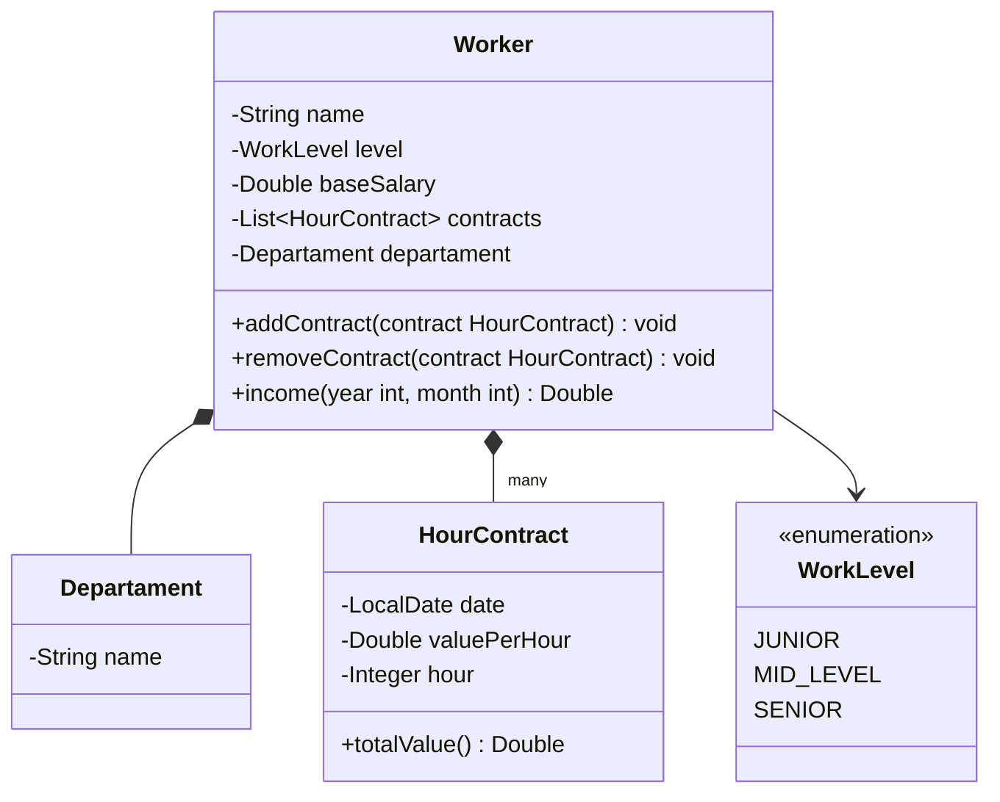

```java
package entities.enums;

public enum WorkLevel {
    JUNIOR,
    MID_LEVEL,
    SENIOR;
}
```

```java
package entities;

public class Departament {
    private String name;

    public Departament(String name) {
        this.name = name;
    }

    public String getName() {
        return name;
    }
}
```

```java
package entities;

import java.time.LocalDate;

public class HourContract {
    private LocalDate date;
    private Double valuePerHour;
    private Integer hour;

    public HourContract(LocalDate date, Double valuePerHour, Integer hour) {
        this.date = date;
        this.valuePerHour = valuePerHour;
        this.hour = hour;
    }

    public LocalDate getDate() {
        return date;
    }

    public Double getValuePerHour() {
        return valuePerHour;
    }

    public Integer getHour() {
        return hour;
    }

    public Double totalValue(){
        return valuePerHour * hour;
    }
}
```

```java
package entities;

import entities.enums.WorkLevel;

import java.util.ArrayList;
import java.util.List;

public class Worker {
    private String name;
    private WorkLevel level;
    private Double baseSalary;

    private List<HourContract> contracts = new ArrayList<>();
    private Departament departament;

    public Worker(String name, WorkLevel level, Double baseSalary, Departament departament) {
        this.name = name;
        this.level = level;
        this.baseSalary = baseSalary;
        this.departament = departament;
    }

    public String getName() {
        return name;
    }

    public WorkLevel getLevel() {
        return level;
    }

    public Double getBaseSalary() {
        return baseSalary;
    }

    public Departament getDepartament() {
        return departament;
    }

    public void addContract(HourContract contract) {
        contracts.add(contract);
    }

    public void removeContract(HourContract contract) {
        contracts.remove(contract);
    }

    public Double income(int year, int month) {
        Double sum = baseSalary;
        for (HourContract c : contracts) {
            int y = c.getDate().getYear();
            int m = c.getDate().getMonthValue();
            if (year == y && month == m) {
                sum += c.totalValue();
            }
        }
        return sum;
    }
}
```

```java
package application;

import entities.Departament;
import entities.HourContract;
import entities.Worker;
import entities.enums.WorkLevel;

import java.time.LocalDate;
import java.time.format.DateTimeFormatter;
import java.util.Locale;
import java.util.Scanner;

public class Program {

    public static void main(String[] args) {
        Scanner sc = new Scanner(System.in);
        Locale.setDefault(Locale.US);

        DateTimeFormatter dtf = DateTimeFormatter.ofPattern("dd/MM/yyyy");

        System.out.print("Enter department's name: ");
        String departament = sc.nextLine();
        System.out.println("Enter worker data: ");
        System.out.print("Name: ");
        String name = sc.nextLine();
        System.out.print("Level: ");
        WorkLevel level = WorkLevel.valueOf(sc.next());
        System.out.print("Base salary: ");
        Double baseSalary = sc.nextDouble();
        System.out.print("How many contracts to this worker? ");
        int n = sc.nextInt();

        Worker worker = new Worker(name, level, baseSalary, new Departament(departament));

        for (int i = 0; i < n; i++) {
            System.out.println("Enter contract #" + (i + 1) + " data:");
            System.out.print("Date (DD/MM/YYYY): ");
            LocalDate date = LocalDate.parse(sc.next(), dtf);
            System.out.print("Value per hour: ");
            Double valuePerHour = sc.nextDouble();
            System.out.print("Duration (hours): ");
            int duration = sc.nextInt();

            worker.addContract(new HourContract(date, valuePerHour, duration));
        }

        System.out.println();

        sc.nextLine();
        System.out.print("Enter month and year to calculate income (MM/YYYY): ");
        String calcDate = sc.nextLine();
        int calcMonth = Integer.parseInt(calcDate.substring(0, 2));
        int calcYear = Integer.parseInt(calcDate.substring(3));
        System.out.println("Name: " + worker.getName());
        System.out.println("Departament: " + worker.getDepartament().getName());
        System.out.print("Income for " + calcDate + ": " + worker.income(calcYear, calcMonth));

        sc.close();
    }
}
```

**Saída:**

```
Enter department's name: Design
Enter worker data:
Name: Alex
Level: MID_LEVEL
Base salary: 1200.00
How many contracts to this worker? 3
Enter contract #1 data:
Date (DD/MM/YYYY): 20/08/2018
Value per hour: 50.00
Duration (hours): 20
Enter contract #2 data:
Date (DD/MM/YYYY): 13/06/2018
Value per hour: 30.00
Duration (hours): 18
Enter contract #3 data:
Date (DD/MM/YYYY): 25/08/2018
Value per hour: 80.00
Duration (hours): 10

Enter month and year to calculate income (MM/YYYY): 08/2018
Name: Alex
Departament: Design
Income for 08/2018: 3000.0
```

> 💡 **A composição em ação:** `Worker` guarda um único `Departament` (`private Departament departament;` — "tem-um") e uma **lista** de `HourContract` (`private List<HourContract> contracts = new ArrayList<>();` — "tem-vários"). Repare que essa lista já nasce instanciada **na própria declaração**, nunca ficando `null` — evitando o clássico `NullPointerException` ao tentar adicionar o primeiro contrato.
>
> 💡 **Encapsulamento aplicado à lista:** não existe um `getContracts()` devolvendo a lista interna diretamente — só `addContract(...)` e `removeContract(...)`. Isso é a mesma ideia da seção [7.15](#715-encapsulamento) (lembra do `Product` sem `setQuantity`?): a classe controla exatamente como sua coleção interna pode ser alterada, em vez de entregar uma referência mutável pra qualquer código de fora mexer livremente.
>
> 💡 **A lógica de `income(year, month)`:** começa com `baseSalary` e soma o `totalValue()` de cada contrato cujo `date` bate com o mês/ano pedido — o contrato de `13/06/2018` (junho) é ignorado no cálculo de agosto, exatamente como no exemplo (`1200 + (50×20) + (80×10) = 1200 + 1000 + 800 = 3000`).
>
> ⚠️ **Pequena diferença de formatação:** o enunciado mostra `Income for 08/2018: 3000.00` (duas casas decimais); a saída real aqui é `3000.0`, porque o valor é concatenado direto (`+ worker.income(...)`) sem `String.format("%.2f", ...)` ou `printf`. O valor calculado está correto — é só a exibição que ficaria mais fiel ao exemplo com uma formatação explícita, como vista em [3.5](#35-saída-de-dados-systemout).
</details>

<details>
<summary><strong>Exercício 2 — Sumário de pedido (Client, Order, OrderItem, Product)</strong></summary>

**Enunciado:** ler os dados de um pedido com `N` itens (`N` fornecido pelo usuário). Depois, mostrar um sumário do pedido. Nota do enunciado: o instante do pedido deve ser o instante do sistema.

Esse é o exemplo clássico de composição em cadeia: `Order` "tem-um" `Client` e "tem-vários" `OrderItem`; cada `OrderItem`, por sua vez, "tem-um" `Product`.

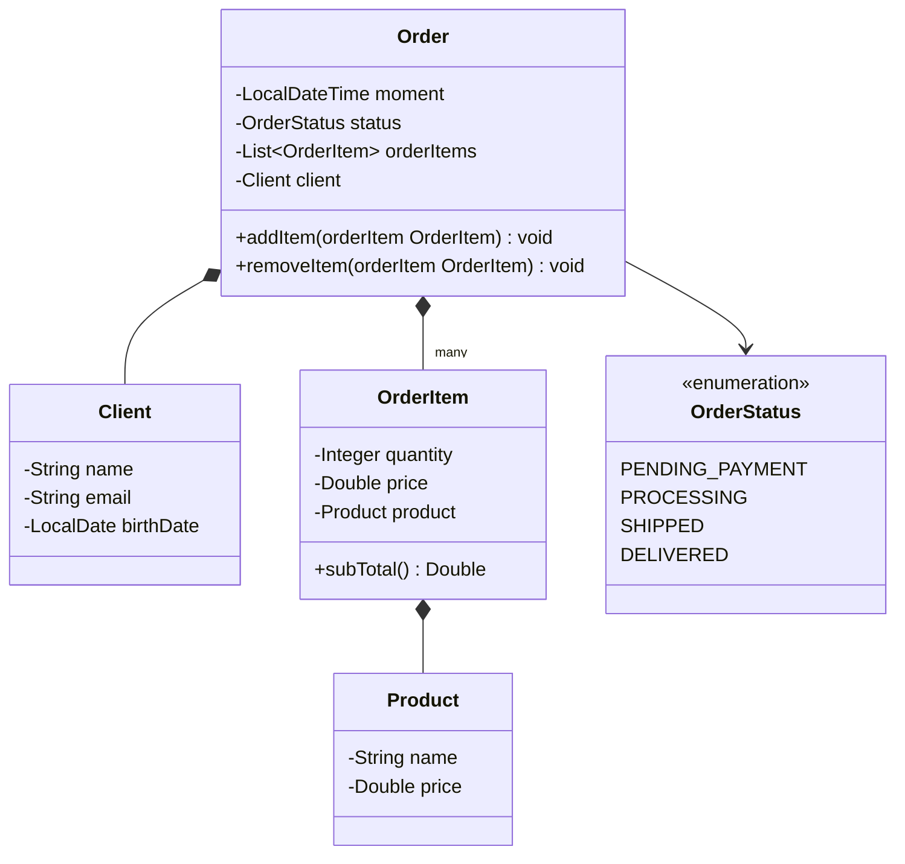

```java
package entities;

import java.time.LocalDate;

public class Client {
    private String name;
    private String email;
    private LocalDate birthDate;

    public Client(String name, String email, LocalDate birthDate) {
        this.name = name;
        this.email = email;
        this.birthDate = birthDate;
    }

    public String getName() {
        return name;
    }

    public String getEmail() {
        return email;
    }

    public LocalDate getBrithDate() {
        return birthDate;
    }
}
```

```java
package entities;

public class Product {
    private String name;
    private Double price;

    public Product(String name, Double price) {
        this.name = name;
        this.price = price;
    }

    public String getName() {
        return name;
    }

    public Double getPrice() {
        return price;
    }
}
```

```java
package entities;

public class OrderItem {
    private Integer quantity;
    private Double price;

    private Product product;

    public OrderItem(Integer quantity, Double price, Product product) {
        this.quantity = quantity;
        this.price = price;
        this.product = product;
    }

    public Integer getQuantity() {
        return quantity;
    }

    public Double getPrice() {
        return price;
    }

    public Product getProduct() {
        return product;
    }

    public Double subTotal() {
        return price * quantity;
    }
}
```

```java
package entities;

import entities.enums.OrderStatus;

import java.time.LocalDateTime;
import java.util.ArrayList;
import java.util.List;

public class Order {
    private LocalDateTime moment;
    private OrderStatus status;

    private List<OrderItem> orderItems = new ArrayList<>();
    private Client client;

    public Order() {
    }

    public Order(Client client, OrderStatus status, LocalDateTime moment) {
        this.client = client;
        this.status = status;
        this.moment = moment;
    }

    public List<OrderItem> getOrderItems() {
        return orderItems;
    }

    public OrderStatus getStatus() {
        return status;
    }

    public LocalDateTime getMoment() {
        return moment;
    }

    public Client getClient() {
        return client;
    }

    public void addItem(OrderItem orderItem) {
        orderItems.add(orderItem);
    }

    public void removeItem(OrderItem orderItem) {
        orderItems.remove(orderItem);
    }
}
```

```java
package application;

import entities.Client;
import entities.Order;
import entities.OrderItem;
import entities.Product;
import entities.enums.OrderStatus;

import java.time.LocalDate;
import java.time.LocalDateTime;
import java.time.format.DateTimeFormatter;
import java.util.Locale;
import java.util.Scanner;

public class Program {

    public static void main(String[] args) {
        Scanner sc = new Scanner(System.in);
        Locale.setDefault(Locale.US);

        DateTimeFormatter dtf = DateTimeFormatter.ofPattern("dd/MM/yyyy");

        System.out.println("Enter cliente data:");
        System.out.print("Name: ");
        String clientName = sc.nextLine();
        System.out.print("E-mail: ");
        String clientEmail = sc.nextLine();
        System.out.print("Birth date (DD/MM/YYYY): ");
        LocalDate clientBirthDate = LocalDate.parse(sc.next(), dtf);
        LocalDateTime moment = LocalDateTime.now();
        System.out.println("Enter order data:");
        System.out.print("Status: ");
        OrderStatus orderStatus = OrderStatus.valueOf(sc.next());
        System.out.print("How many items to this order? ");
        int n = sc.nextInt();
        sc.nextLine();

        Order order = new Order(new Client(clientName, clientEmail, clientBirthDate), orderStatus, moment);

        for (int i = 0; i < n; i++) {
            System.out.println("Enter #" + (i + 1) + " item data:");
            System.out.print("Product name: ");
            String productName = sc.nextLine();
            System.out.print("Product price: ");
            Double productPrice = sc.nextDouble();
            System.out.print("Quantity: ");
            int quantity = sc.nextInt();
            sc.nextLine();

            order.addItem(new OrderItem(quantity, productPrice, new Product(productName, productPrice)));
        }

        System.out.println();

        DateTimeFormatter dtf1 = DateTimeFormatter.ofPattern("dd/MM/yyyy HH:mm:ss");

        System.out.println("ORDER SUMMARY:");
        System.out.println("Order moment: " + order.getMoment().format(dtf1));
        System.out.println("Order status: " + order.getStatus());
        System.out.println("Client: " + order.getClient().getName() + " (" + order.getClient().getBrithDate().format(dtf) + ") " + " - " + order.getClient().getEmail());
        System.out.println("Order items:");
        Double sum = 0.0;
        for (OrderItem o : order.getOrderItems()) {
            System.out.println(o.getProduct().getName() + ", " + "$" + o.getProduct().getPrice() + ", " + "Quantity: " + o.getQuantity() + ", " + "Subtotal: $" + o.subTotal());
            sum += o.subTotal();
        }

        System.out.println("Total price: $" + sum);

        sc.close();
    }
}
```

**Saída (rodando aqui — o `Order moment` reflete o instante real da execução, exatamente como o enunciado pede):**

```
Enter cliente data:
Name: Alex Green
E-mail: alex@gmail.com
Birth date (DD/MM/YYYY): 15/03/1985
Enter order data:
Status: PROCESSING
How many items to this order? 2
Enter #1 item data:
Product name: TV
Product price: 1000.00
Quantity: 1
Enter #2 item data:
Product name: Mouse
Product price: 40.00
Quantity: 2

ORDER SUMMARY:
Order moment: 30/09/2026 09:20:33
Order status: PROCESSING
Client: Alex Green (15/03/1985)  - alex@gmail.com
Order items:
TV, $1000.0, Quantity: 1, Subtotal: $1000.0
Mouse, $40.0, Quantity: 2, Subtotal: $80.0
Total price: $1080.0
```

> 💡 **`new Order()` — um construtor vazio, de propósito:** repare que `Order` tem dois construtores (sobrecarga, seção [7.14](#714-sobrecarga)): um vazio (`public Order() {}`) e um completo. O vazio existe para casos em que se precisa de um objeto `Order` "em branco" para ir preenchendo aos poucos (útil, por exemplo, em frameworks que instanciam o objeto primeiro e usam *setters* depois) — aqui, porém, só o construtor completo é usado de fato.
>
> ⚠️ **Três pequenos deslizes, sem afetar o resultado:**
> 1. `getBrithDate()` — typo no nome do método (`Brith` em vez de `Birth`). Funciona normalmente, só foge da convenção de nomes clara discutida em [7.7](#77-anatomia-de-um-método).
> 2. Os valores monetários saem sem duas casas decimais (`$1000.0` em vez de `$1000.00`) — mesma causa do exercício anterior: falta um `String.format("%.2f", ...)` na hora de montar o texto.
> 3. Um espaço duplo antes do traço em `"Alex Green (15/03/1985)  - alex@gmail.com"` — a concatenação tem `") "` seguido de `" - "`, dois literais com espaço cada, resultando em dois espaços juntos.
>
> 💡 **Por que `LocalDateTime.now()` em vez do `new Date()` sugerido no enunciado?** O enunciado (de 2018) pede `new Date()`, mas o código usa `LocalDateTime.now()` — a alternativa moderna do `java.time` (seção [10.4](#104-instanciando-data-hora-em-java)), que resolve exatamente o mesmo problema ("me dê o instante atual") de forma mais segura e com API mais rica. Um bom exemplo de como material de curso mais antigo às vezes sugere uma API que a própria linguagem já superou.
</details>

### Herança e Polimorfismo

Exercícios práticos do módulo de **Herança e Polimorfismo** (seção [14](#14-herança-e-polimorfismo)).

<details>
<summary><strong>Exercício 1 — Pagamento de funcionários próprios e terceirizados</strong></summary>

**Enunciado:** uma empresa possui funcionários próprios e terceirizados. Para cada funcionário, deseja-se registrar nome, horas trabalhadas e valor por hora. Funcionários terceirizados possuem ainda uma despesa adicional. O pagamento corresponde ao valor da hora multiplicado pelas horas trabalhadas, sendo que os terceirizados ainda recebem um bônus correspondente a 110% de sua despesa adicional. Ler os dados de `N` funcionários e armazená-los numa lista. Depois, mostrar nome e pagamento de cada um, na mesma ordem em que foram digitados.

Este exercício usa **herança** (`OutsourcedEmployee` estende `Employee`, seção [14.1](#141-herança)), **sobreposição** do método `payment()` (seção [14.3](#143-sobreposição-a-palavra-super-e-override)), **`super`** para reaproveitar o cálculo base, e **`final`** no método sobreposto (seção [14.4](#144-classes-e-métodos-final)).

```java
package entities;

public class Employee {
    private String name;
    private Integer hours;
    private Double valuePerHours;

    public Employee(String name, Integer hours, Double valuePerHours) {
        this.name = name;
        this.hours = hours;
        this.valuePerHours = valuePerHours;
    }

    public String getName() {
        return name;
    }

    public Integer getHours() {
        return hours;
    }

    public Double getValuePerHours() {
        return valuePerHours;
    }

    @Override
    public String toString() {
        return name + " - " + "$ " + String.format("%.2f", payment());
    }

    public Double payment() {
        return valuePerHours * hours;
    }
}
```

```java
package entities;

public class OutsourcedEmployee extends Employee {
    private final Double additionalCharge;

    public OutsourcedEmployee(String name, Integer hours, Double valuePerHours, Double additionalCharge) {
        super(name, hours, valuePerHours);
        this.additionalCharge = additionalCharge;
    }

    public Double getAdditionalCharge() {
        return additionalCharge;
    }

    @Override
    public final Double payment() {
        double totalBonus = (additionalCharge * 110) / 100;
        return super.payment() + totalBonus;
    }
}
```

```java
package application;

import entities.Employee;
import entities.OutsourcedEmployee;

import java.util.ArrayList;
import java.util.List;
import java.util.Locale;
import java.util.Scanner;

public class Program {

    public static void main(String[] args) {
        Scanner sc = new Scanner(System.in);
        Locale.setDefault(Locale.US);

        List<Employee> list = new ArrayList<>();

        System.out.print("Enter the number of employees: ");
        int n = sc.nextInt();

        for (int i = 0; i < n; i++) {
            System.out.println("Employee #" + (i + 1) + " data");
            sc.nextLine();
            System.out.print("Outsourced (y/n)? ");
            String outsourced = sc.nextLine();
            System.out.print("Name: ");
            String name = sc.nextLine();
            System.out.print("Hours: ");
            int hours = sc.nextInt();
            System.out.print("Value Per Hours: ");
            double valuePerHours = sc.nextDouble();
            if (outsourced.equals("y")) {
                System.out.print("Additional charge: ");
                double addCharge = sc.nextDouble();
                list.add(new OutsourcedEmployee(name, hours, valuePerHours, addCharge));
            } else {
                list.add(new Employee(name, hours, valuePerHours));
            }
        }

        System.out.println();

        System.out.println("PAYMENTS:");
        for (Employee emp : list) {
            System.out.println(emp);
        }

        sc.close();
    }
}
```

**Saída:**

```
Enter the number of employees: 3
Employee #1 data
Outsourced (y/n)? n
Name: Alex
Hours: 50
Value Per Hours: 20.00
Employee #2 data
Outsourced (y/n)? y
Name: Bob
Hours: 100
Value Per Hours: 15.00
Additional charge: 200.00
Employee #3 data
Outsourced (y/n)? n
Name: Maria
Hours: 60
Value Per Hours: 20.00

PAYMENTS:
Alex - $ 1000.00
Bob - $ 1720.00
Maria - $ 1200.00
```

> 💡 **Polimorfismo na prática:** a lista é do tipo `List<Employee>`, mas cada elemento pode ser um `Employee` ou um `OutsourcedEmployee`. O laço final chama `System.out.println(emp)` sem nenhum `if`: o `toString()` herdado chama `payment()`, e a versão executada é a da subclasse quando o objeto é terceirizado (`1500 + 220 = 1720`), e a da superclasse quando não é (`50 × 20 = 1000`). Quem decide qual versão roda é o objeto real na lista, em tempo de execução (seção [14.5](#145-introdução-a-polimorfismo)).
>
> ⚠️ **Dois pontos de atenção no código:**
> 1. O nome da classe está escrito `OustsourcedEmployee` no arquivo original (falta um `t` antes do `s`, o correto é `Outsourced`). Ao final, renomeei para `OutsourcedEmployee` na documentação; no projeto, vale renomear o arquivo e a classe para manter o padrão.
> 2. `payment()` em `OutsourcedEmployee` está `final`, e isso faz sentido aqui: o cálculo do bônus não deve ser alterado por subclasses futuras, pelo mesmo motivo discutido em [14.4](#144-classes-e-métodos-final).
</details>

<details>
<summary><strong>Exercício 2 — Etiquetas de preço (produtos comuns, importados e usados)</strong></summary>

**Enunciado:** ler os dados de `N` produtos (`N` fornecido pelo usuário). Todo produto possui nome e preço. Produtos importados possuem uma taxa de alfândega, que deve ser acrescentada ao preço final. Produtos usados possuem data de fabricação. Ao final, mostrar a etiqueta de preço de cada produto, na mesma ordem em que foram digitados, com os dados específicos de cada tipo.

Este exercício usa **herança** (`ImportedProduct` e `UsedProduct` estendem `Product`), **sobreposição** de `priceTag()` com `super.priceTag()` (seção [14.3](#143-sobreposição-a-palavra-super-e-override)) e **polimorfismo** no laço final, sem nenhum `instanceof` (seção [14.5](#145-introdução-a-polimorfismo)).

```java
package entities;

public class Product {
    private final String name;
    private final Double price;

    public Product(String name, Double price) {
        this.name = name;
        this.price = price;
    }

    public String getName() {
        return name;
    }

    public Double getPrice() {
        return price;
    }

    public String priceTag() {
        return " $ " + String.format("%.2f", price);
    }
}
```

```java
package entities;

public class ImportedProduct extends Product {
    private final Double customsFee;

    public ImportedProduct(String name, Double price, Double customsFee) {
        super(name, price);
        this.customsFee = customsFee;
    }

    public Double getCustomsFee() {
        return customsFee;
    }

    @Override
    public String priceTag() {
        return " $ " + String.format("%.2f", totalPrice()) + " (Customs fee: $ " + String.format("%.2f", customsFee) + ")";
    }

    public Double totalPrice() {
        return super.getPrice() + customsFee;
    }
}
```

```java
package entities;

import java.time.LocalDate;
import java.time.format.DateTimeFormatter;

public class UsedProduct extends Product {
    private final LocalDate manufactureDate;

    public UsedProduct(String name, Double price, LocalDate manufactureDate) {
        super(name, price);
        this.manufactureDate = manufactureDate;
    }

    public LocalDate getManufactureDate() {
        return manufactureDate;
    }

    @Override
    public String priceTag() {
        return " (used) " + super.priceTag() + " (Manufacture date: " + manufactureDate.format(DateTimeFormatter.ofPattern("dd/MM/yyyy")) + ")";
    }
}
```

```java
package application;

import entities.ImportedProduct;
import entities.Product;
import entities.UsedProduct;

import java.time.LocalDate;
import java.time.format.DateTimeFormatter;
import java.util.ArrayList;
import java.util.List;
import java.util.Locale;
import java.util.Scanner;

public class Program {

    public static void main(String[] args) {
        Locale.setDefault(Locale.US);
        Scanner sc = new Scanner(System.in);

        DateTimeFormatter fmt = DateTimeFormatter.ofPattern("dd/MM/yyyy");

        List<Product> products = new ArrayList<>();

        System.out.print("Enter the number of products: ");
        int n = sc.nextInt();
        sc.nextLine();

        for (int i = 0; i < n; i++) {
            System.out.println("Product #" + (i + 1) + " data:");
            System.out.print("Common, used or imported (c/u/i)? ");
            char type = sc.next().charAt(0);
            sc.nextLine();

            System.out.print("Name: ");
            String name = sc.nextLine();
            System.out.print("Price: ");
            double price = sc.nextDouble();
            sc.nextLine();

            if (type == 'i') {
                System.out.print("Customs fee: ");
                double customsFeeValue = sc.nextDouble();
                sc.nextLine();

                products.add(new ImportedProduct(name, price, customsFeeValue));
            } else if (type == 'u') {
                System.out.print("Manufacture date (DD/MM/YYYY): ");
                String inputDate = sc.nextLine();
                LocalDate manufactureDate = LocalDate.parse(inputDate, fmt);

                products.add(new UsedProduct(name, price, manufactureDate));
            } else {
                products.add(new Product(name, price));
            }
        }

        System.out.println();
        System.out.println("PRICE TAGS:");
        for (Product prd : products) {
            System.out.println(prd.getName() + prd.priceTag());
        }

        sc.close();
    }
}
```

**Saída:**

```
Enter the number of products: 3
Product #1 data:
Common, used or imported (c/u/i)? i
Name: Tablet
Price: 260.00
Customs fee: 20.00
Product #2 data:
Common, used or imported (c/u/i)? c
Name: Notebook
Price: 1100.00
Product #3 data:
Common, used or imported (c/u/i)? u
Name: Iphone
Price: 400.00
Manufacture date (DD/MM/YYYY): 15/03/2017

PRICE TAGS:
Tablet $ 280.00 (Customs fee: $ 20.00)
Notebook $ 1100.00
Iphone (used)  $ 400.00 (Manufacture date: 15/03/2017)
```

> 💡 **Polimorfismo sem `instanceof`:** o laço final chama `prd.priceTag()` sobre uma lista de `Product`. Cada objeto usa a sua própria versão do método: o importado soma a taxa (`260 + 20 = 280`), o usado acrescenta a data de fabricação, e o comum usa a versão da superclasse. Não há nenhum `if` decidindo o tipo no laço, a escolha é feita em tempo de execução pelo objeto real.
>
> ⚠️ **Um detalhe de formatação:** na saída, o Iphone aparece com dois espaços (`(used)  $ 400.00`). Isso acontece porque `UsedProduct.priceTag()` começa com `" (used) "` (com espaço no fim) e `Product.priceTag()` também começa com espaço. A correção seria tirar o espaço final de `" (used) "`.
</details>
